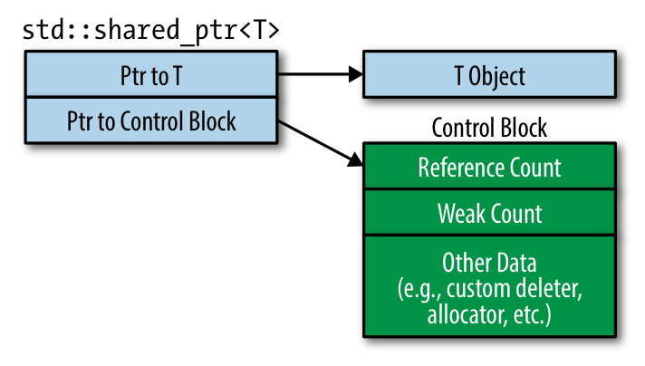
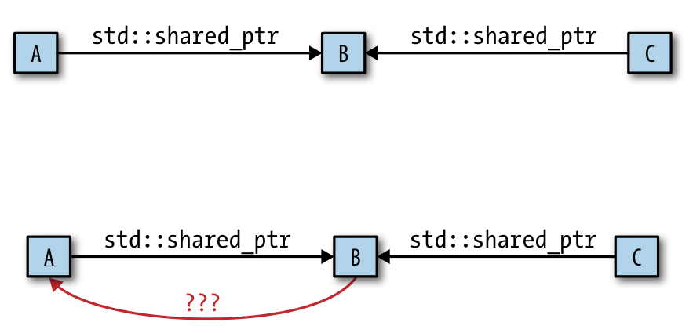

# Reading Minutes for Effective Modern C++

This is for taking the notes when reading ***Effective Modern C++*** by ***Scott Meyers***.


# Errata Page

This is the ***[Errata Page](http://www.aristeia.com/BookErrata/emc++-errata.html)***


# Words

## Vocabulary

**coax** */kəʊks/* *v.*哄，劝诱；连哄带劝地得到；小心地摆弄（机器或装置）

**turf**

**indebted**

**exasperation**

**pervasive**

**heuristic**

**variadic **

**steer clear of** 避开; 躲避; 绕开;

**tyranny** 暴虐，专横

**reason about** 推出

**all but impossible** 几乎不可能

**enigmatic** 神秘的；高深莫测的；谜一般的

**hard-pressed** 被紧紧追赶的；任务紧急而繁忙的；处境艰难的

**hazy** 雾蒙蒙的，朦胧的；记不清的，模糊的；

**a pinch of** 一撮，少许

**adornment** 装饰；装饰品（书中提到的是指一个类型的const or reference qualifiers）

**niche** *n.* 合适（称心）的工作（活动）; *adj.* （产品）针对特定小群体的

**foliage** *n.* （植物的）枝叶，叶子

**curve ball** 使其很难被击打的弧线球

**mondo** *adj.* 绝对的；完全的；（非正式）非凡的，卓绝的；相当

**stir up** 激起；煽动；搅拌；唤起

**turbidity** *n.* [分化] 浊度；浑浊；混浊度；混乱

**purview** *n.* 范围，权限；视界；条款

**as a matter of course** 理所当然的（事）；自然地

**revelation** *n.* 被揭示的真相，被揭露的内情；揭露，披露；出乎意料的事物，令人惊喜的发现；（上帝的）启示，默示；《启示录》（《圣经·新约》末卷，讲述上帝对圣约翰有关未来的启示）

**parrot** *v.* 机械地模仿，鹦鹉学舌般重复

**compilable** 可编译的

**elicit** *v.* 引出，得到；

**palatable** *adj.* 美味的，可口的；愉快的

**bedevil** *vt.* 使痛苦；虐待；使苦恼

**dutifully** *adv.* 忠实地；忠贞地；尽责地，忠诚地

**ins and outs** 复杂细节；进进出出；盛衰

**potholes**  *n.* 凹坑；坑槽；洞坑（pothole 的复数形式）

**notwithstanding** *prep.* 虽然，尽管；*adv.*尽管如此；*conj.*虽然，尽管

**amiss** *adj.* 有毛病的，有缺陷的；出差错的；*adv.*错误地

**zig** *n.* 急转；锯齿形转角 *vi.*转弯

**zag** *n.* 急转；急变；锯齿形转角 *vi.*急转；急变；急弯

**innocuous** *adj.* 无害的；无伤大雅的

**afield** *adv.* 在远方地；遥远地；远离家乡地；在田野，在野外 *adj.*远方的；遥远的；远离家乡的

**Pantheon** *n.* 万神殿；名流群

**compatriot** *n.* 同胞，同国人；同事，伙伴

**blindside** *v.* 出其不意地袭击；（使）遭受意外的打击；拦腰撞上（其他车辆）

**tip-off** *n.* 密报；警告；举报

**boast of** *v.* 吹牛，自夸

**newbie** *n.* 网络新手；新兵

**demarcate** *vt.* 划分界线；区别

**arcane** *adj.* 神秘的，晦涩难懂的

**burbling** *v.* 语无伦次地讲话；潺潺做声；（航空）产生气流（burble 的现在分词）；

​                *n.* 潺潺的水声；（诗歌）汩汩的水声；激动人心的演讲

**deliberation** *n.* 考虑，思考；从容，审慎；审议，商议；考虑，细想

**unrivaled** *adj. *无敌的；至高无上的；无比的

**waylay** *vt.* 伏击；埋伏

**concede** *v.* （通常指不情愿地）承认；认（输），承认（失败）；授予，让与；让对手得分

**consensus** *n.* 一致看法，共识

**grudge** *n.* 怨恨，嫌隙 *v.* （因不满而）不愿意给（或允许）；嫉恨，妒忌（某人）做成（某事）

**grudgingly** *adv.* 勉强地；不情愿地

**implication** *n.* 可能的影响（或作用、结果）；含意，暗指；牵连，涉及

**leeway** *n.* 余地；风压差；偏航；落后

**run-of-the-mill** *adj.* 普通的；非精选的

**run-of-the-mine** *adj.* 普通的，不突出的；（煤）未分类的

**ironclad** *adj.* 装甲的；打不破的；坚固的； *n.*装甲舰

**carpal** *n.* 腕关节；*adj.*腕关节的

**carpal tunnel syndrome** 腕管综合征

**cumbersome** *adj. *笨重的；繁琐的，复杂的；（话语或措词）冗长的

**concoct** *vt.* 编造；调制（食物或饮品）

**assortment** *n.* 各种各样，混合

**inferior** *adj.* 次的，较差的；低等的，下级的；自卑的；（法庭，特别法庭）下级的；（商品，服务）需求量在衰退期中较之繁荣期更大的，低档的；（位置）下方的，下位的，靠下的；（字母，数字，符号）下标的；低等的；*n.*下级，（地位或成就）低于他人者；下标字母，下标数字，下标符号

**belatedly** *adv.* 延迟地；延续地

**child's play** 容易干的事；轻而易举之事

**travesty** *n.* 歪曲；滑稽作品；拙劣的模仿作品；*vt.*歪曲；滑稽地模仿

**wanton** *adj.* 嬉戏的；繁茂的；荒唐的；无节制的；放纵的；*n.* 荡妇；水性杨花的女人 *vi.* 放肆；嬉戏；闲荡；*vt.* 挥霍

**enumerator** *n.* 人口普查员，计数员

**susceptible** *adj.* 易得病的，易受影响的；（人）易受感动的，易动感情的；可能有······的，容许······的；<正式>（尤指想法或陈述）能被理解（或证明、解释）的

**nonsensical** *adj.* 无意义的；荒谬的

**tuple** 美*/ˈtjʊpəl; ˈtʌpəl/*  *n.* [计] 元组，重数

**sleek ** *adj.* 光滑的，光亮的；线条流畅的，造型优美的；时髦阔气的；油嘴滑舌的；*v.*使平整光亮；掩盖；打扮整洁

**peasy** *adj.* 像豌豆的；<非正式，英>容易的，简单的 （用法：Easy, peasy.）

**supersede** *vt.* 替代，取代

**entail** *v.* 使必要，需要；<旧>遗赠（财产），限定继承；使人承担

**dissipate**  *v.* （使某事物）消散，消失；挥霍，耗费；放荡

**dishearten** *vt.* 使灰心，使沮丧，使气馁

**kvetch** *n.* （美）吹毛求疵的人；*vi.* （美）经常性地发牢骚；抱怨

**gauge** *v.* 估计，判断；测量

**ramification** *n.* 衍生物；分枝，分叉；支流；（衍生的）结果、影响

**contemplate** *v.* 沉思，深思熟虑；盘算，打算；凝视，注视；考虑接受（发生某事的可能性）

**see the light of day** 重见天日；问世；为公众所熟知come into existence; be made public, 

**halfhearted** *adj.* 不认真的；不热心的；无兴趣的

**it is anything but** not at all (used for emphasis)

**grisly** *adj.* 可怕的；厉害的；严重的

**contort** *vt.* 扭曲；曲解；*vi.* 扭曲（Use: some amount of contorting.）

**sledgehammer** *n.* （有柄的）大锤；猛烈的打击；*v.* 用大锤打；猛力打；*adj.* 手下不留情的；强力的

**eminent** *adj.* （在某领域或职业中）卓越的，出众的；突出的，明显的

**at the end of the day** 最终；到头来；不管怎么说

**temperamental** *adj.* 喜怒无常的，性情多变的；气质的，性情的；（机器、汽车等）性能不稳定的，易坏的

**dichotomy** *n.* 二分法；两分；分裂；双歧分枝

**unwind** *v.* 放松，松弛；解开，展开

**preeminent** *adj.* 卓越的；超群的

**roundabout** *adj.* 绕路的，迂回的；（说话）绕圈子的，不直截了当的

**bleak** *adj.* 不乐观的，无望的；无遮掩的，荒凉的；阴冷的，寒冷的；沮丧的，阴郁的；（人或其表情）冷漠的，冷峻的

**kindle** *v.* 点燃，开始燃烧；激起，激发；（感情）激动起来；（兔）产仔；照亮，（使）发亮；着火

**hoop** *n.* （金属、木或类似材料制成的）箍，环（尤指用于箍桶或制框架）；

**saddle** *n.* 鞍，马鞍；*v.* 使承担（责任、任务），使负重担

**nuanced** */ˈnuːˌɑːnst/* *adj.* 微妙的；具有细微差别的

**intriguing** *adj.* 非常有趣的，引人入胜的

**beefed up** 通常作**beef up** *vt.* 加强（增援，充实）；补充（人数，兵力）等

**blithely** */ˈblaɪðli/* *adv.* 快活地；无忧无虑地

**overkill** *n.* 过犹不及，过分行为；超量毁伤

**immaterial** *adj.* 非物质的；无形的；不重要的；非实质的

**parlance** *n.* 说法；用语；语调；发言

**inductee** *n.* 应召入伍的士兵；就任者

**preclude** *v.* <正式>阻止，妨碍（preclude *sb.* from）

**rationale** *n.* <正式>根本原因，逻辑依据

**sidestep** *vt.* 回避；横跨一步躲避

**blather** *v.* 喋喋不休；絮絮叨叨；啰嗦地说；*n.* 废话；胡说

**ascertain** *v.* 查明，确定

**slight** *adj.* 轻微的，少量的；（人）瘦小的，纤弱的；不深奥的，不重要的

**lapse** *n.* 过失，小失误；（两件事发生的）间隔时间；（活动的）暂停，中断；开始说，开始做；（因未继续缴费而导致的）终止，结束; *v.* （时间）流逝；（合同、协议等）失效，期满终止；（状态，活动）中止，结束；背弃，放弃（宗教信仰）；开始（以某种方式）说话、行事（lapse into）

**ostensible** *adj.* 表面的；假装的

**co-opt** *vt.* 由现会员选举；指派

**atypical** *adj.* 非典型的；不合规则的

**frolic** *v.* 嬉戏；调情；*n.* 嬉戏，嬉闹；调情；*adj.* 欢乐的，嬉戏的

**blissful** *adj.* 极乐的；使人幸福的；无忧无虑的；充满喜悦的

**veritably** *adv.* 真实地；真正地

**bliss** *n.* 极乐，天赐之福；天堂，乐园；*v.* <非正式>乐不可支，欣喜若狂

**jeer** *v.* 嘲笑；戏弄；奚落

**generality** *n.* 概论；普遍性；大部分

**bravado** *n.* 虚张声势；冒险

**akin** *adj.* 相似的，类似的；有血缘关系的

**mnemonic** */nɪˈmɑːnɪk/* *adj.* 记忆的；助记的；记忆术的

**pique** *vt.* 使愤恨，使恼怒；激起（兴趣，好奇心）； 赢（某人）三十分

**abomination** *n.* 厌恶；憎恨；令人厌恶的事物

**stylistic** *adj.* 体裁上的；格式上的；文体论的

**albeit** *conj.* 虽然，尽管

**wane** *v.* （月亮）缺，亏；衰落，减少；消逝

**annulment** */əˈnʌlmənt/* *n.* 取消；废除

**dispensation** */ˌdɪspenˈseɪʃn/* *n.* 分配；免除；豁免；天命

**contend** *v.* 声称，主张；竞争，争夺；处理，对付

**augmentation** */ˌɔːɡmenˈteɪʃ(ə)n/* *n.* 增大，增多；增加物；（主旋律的）延长；（作为殊荣而对纹章进行的）扩充

**clog** */klɑːɡ/* *v.* 阻塞，堵塞；*n.* 木底鞋，木屐；累赘，障碍；管道堵塞物

**afoul** */əˈfaʊl/* *adv.* （与法律等）相抵触，有冲突，卷入纠缠地；*adj.* 冲突的，纠缠的

**tenet** */ˈtenɪt/* *n.* 原则，信条

**bloat** */bloʊt/* *adj.* 肿胀的，鼓起的；饮食过度的，胃胀的；*v.* 使膨胀，肿胀；腌制；溢出

**conjure** */ˈkɑːndʒər/* *v.* 变魔术，使……变戏法般地出现（或消失）；想象出，设想出；使浮现于脑海，使想起；念咒召唤出（鬼魂等）；<古>恳求，祈求

**suffices** */səˈfaɪs/* *v.* 足够，足以；满足……的需求；有能力

**obviate** */ˈɑːbvieɪt/* *vt.* 排除；避免；消除

**syntactic** */sɪnˈtæktɪk/* *adj.* 句法的；语法的；依据造句法的

**vis-à-vis** */ˌviːz ɑː ˈviː/* *prep.* 关于；与……比较；与……相对；*adv.* 面对面地；共同地；*n.* 相应地位的人（或群体）；对手；面对面的会见

**bookkeeping** *n.* 记帐，簿记

**tally** */ˈtæli/* *n.* 记录，得分；账单；<史>符木；（对树或植物进行说明的）标志牌，标签；*v.* 相符，吻合；计算，合计；（在游戏或体育运动中）得分，进球

**preclude** *v.* <正式>阻止，妨碍（preclude *sb.* from）

**hitch** */hɪtʃ/* *v.* 搭便车（旅行），搭顺风车；拴住，套住，钩住；将（动物）套上车；提起，拉起（衣服）；攀上，爬上；<非正式>结婚（get hitched）；*n.* 临时故障，小问题；（某种）结；<美，非正式>一段服役，一段任职期；<美>（尤指机动车的拖杆）牵引装置；<非正式>免费搭便车；蹒跚

**whereby** *adv.* 凭此，借以

**reek** */riːk/* *v.* 散发臭味；带有令人不快（或不满）的内容；散发蒸汽（或浓烟）；*n.* 臭味；烟；蒸汽；

**bygone** */ˈbaɪɡɔːn/* *adj.* 过去的；*n.* 过去的事

**millennium** */mɪˈleniəm/* *n.* 一千年；千周年纪念日，千禧年（the millennium）；世界末日前基督治理世界的一千年（the millennium）；（作为乌托邦的）美满时期，太平盛世（the millennium）；（复数形式millennia或millenniums）

**sully** */ˈsʌli/* *vt.* 玷污；使丢脸；*n.* 污点，损伤

**metaphorical** */ˌmetəˈfɔːrɪkl/* *adj.* 隐喻的，象征的

**disparate** */ˈdɪspərət/* *adj.* 迥然不同的，无法比较的；多元的；*n.* 全异的东西，无法相比较的东西

**proverbial** */prəˈvɜːrbiəl/* *adj.* 谚语的，俗话所说的；众所周知的；*n.* （常用于委婉替代谚语或成语中未出现的词）那东西，那玩意儿

**conform** */kənˈfɔːrm/* *v.* 遵守，符合；顺从，随潮流；一致，相吻合

**din** */dɪn/* *n.* 喧嚣声，嘈杂声；宗教法律，犹太法律；（尤指伊斯兰教）宗教信仰；*v.* 再三叮嘱，反复教导；发出喧闹声

**dispense** */dɪˈspens/* *v.* 发放，分配；提供，施予；配（药），发（药）

**yucky** */ˈjʌki/* *adj.* 恶心的；讨人厌的；不愉快的


## Usages & Sentences


Usage of **contrast**

> Contrast that with what happens in the `auto`-ized declaration for ...

Usage of **see the light of day** 

> This is hardly the most encapsulated design ***that’s seen the light of day***

Usage of **it is anything but**

> Revising the code to use `const_iterator`s should be trivial, but in C++98, ***it was anything but***.
>
> This grisly ending is anything but sentimental

Usage of **tidy up**

> In C++11, it’s eminently practical, and C++14 ***tidies up*** the few bits of unfinished business that C++11 left behind.

Usage of **temper**

> I must temper your enthusiasm.

Usage of **take for granted**

> for now I’ll just say that you can’t assume that the results of `constexpr` functions are `const`, nor can you take for granted that their values are known during compilation.


Usage of **’til-death-do-us-part** （至死不渝）

> The ownership contract between a resource and the `std::shared_ptr`s that point to it is of the **’til-death-do-us-part** variety. 


Usage of **afoul of**（碰撞，同某物撞在一起；和某人发生冲突）

> Repeating types runs  **afoul** of a key tenet of software engineering


本末倒置的短语（习语）

- **put the cart before the horse** 前后颠倒
- **the tail wagging the dog** 尾巴摇狗，本末倒置
- **see the forest for the trees** 只见树木不见森林

> Twisting a function’s implementation to permit a `noexcept` declaration is **the tail wagging the dog**. Is **putting the cart before the horse**. Is not seeing the forest for the trees. Is…choose your favorite metaphor


**in and of itself** 就其本身而言（**without considering anything else**）


**if at all possible** 如果可能的话


**get away** 离开；逃脱；出发

**cut through** 穿过；刺穿；抄近路走过

**a的b次方**：a to the b；b-th power of a


**in accord with ** 同……相符合；与……一致

**conjure up** 想起，使在脑海中显现；用魔法召唤


## Error-prone pronunciation 

**declare** 的读音是 */dɪˈkler/*，**e**发音是***/i/***。

但是**declaration** 的读音是 */ˌd**e**kləˈreɪʃn/*，并不是*/ˌd**i**kləˈreɪʃn/*。即**e**发音是***/e/***，而不是***/i/***。

**swap** 的读音是*/sw**ɑː**p/*，即**a**的读音是***/ɑː/***。

**clause** */kl**ɔː**z/*

**compilation**  */ˌkɑːmp**ɪ**ˈleɪʃn/*

**polynomial** */ˌpɒliˈn**əʊ**miəl/*

**atomic** */əˈt**ɒ**mɪk/*


# Things to Remember

- 编译器生成的special member function都是`inline`


# Introduction

> A useful heuristic to determine whether an expression is an lvalue is to ask if you
> can take its address. If you can, it typically is. If you can’t, it’s usually an rvalue.


rhs = right hand side

lhs = left hand side

move operations = move constructors, move assignment

copy operations = copy constructors, copy assignment

“…” --> narrow ellipsis

“...” --> wide ellipsis


variadic template


本书认为，***argument*** 叫作***形参***，而***parameter*** 叫作***实参***。

> In a function call, the expressions passed at the call site are the function’s **arguments**.
> The **arguments** are used to initialize the function’s **parameters**.

所以***形参*** （***argument***）永远是**lvalue**，而***实参***（***parameter*** ）可能是**lvalue**，也可能是**rvalue**。

> The distinction between **arguments** and **parameters** is important, because **parameters** are lvalues, but the **arguments** with which they are initialized may be rvalues or lvalues. 


本书中提到的**function object**，指的是重载了函数`operator()`的class。也可以直接叫这类object是**callable objects**。


lambda是一个闭包（closure）

> Function objects created through lambda expressions are known as closures


**declaration** 和 **definition** 的区别

> **Declarations** introduce names and types without giving details, such as where storage is located or how things are implemented.
>
> **Definitions** provide the storage locations or implementation details


Function signature

本书提到的function signature，指的是**函数返回值**加上**函数参数的类型**，而函数名称和参数的名称并不是function signature的一部分。

> I define a function’s signature to be the part of its declaration that specifies parameter
> and return types. Function and parameter names are not part of the signature. In the
> example above, func’s signature is **bool(const Widget&)**. 


***backport的痛苦*** 的描述方式

> Not only can they lead to future porting headaches


C++标准委员会提到的**Undefined Behavior**（UB），指的是它们的行为不可预测。

> Sometimes a Standard says that the result of an operation is undefined behavior. That
> means that runtime behavior is unpredictable.

常见的**Undefined Behavior**

- 使用`[]`对`std::vector`的越界访问
- 对未初始化的迭代器的解引用（dereferencing an uninitialized iterator）
- 发生数据竞争（engaging in a data race，即多个线程写同一块内存地址的数据）


# Chapter 1 Deducing Types


类型推导（type deduction）可能出现的地方

- In calls to function templates
- In most situations where `auto` appears
- In `decltype` expressions, and, as of C++14, where the enigmatic `decltype(auto)` construct is employed.


本章的主要内容

> It explains how template type deduction works, how auto builds on that, and how decltype goes its own way. It even explains how you can force compilers to make the results of their type deductions visible, thus enabling you to ensure that compilers are deducing the types you want them to.

- 类型推导如何工作（起作用）
- `auto`如何工作
- `decltype`如何起作用
- 如何强制编译器显式告知类型推导的结果


## Item 1: Understand template type deduction

一个（通用的）模板函数`f`的声明（定义），这里`ParamType`表示函数形参`param`的类型名称

```cpp
template<typename T>
void f(ParamType param); // A template function declarition
```

调用`f`，这里`expr`表示调用时的表达式（值）

```cpp
f(expr); // call f with some expression
         // compilers deduce T and ParamType from expr
```

在调用函数`f`时，编译器会通过`expr`来推导两个类型，`T`和`ParamType`。虽然有很多情况这两种类型最终是相同的，但也有很多情况下这两种类型是不同的。

推导类型`T`，不仅取决于`expr`表达式的类型，也取决于形参的类型`ParamType`。

> The type deduced for `T` is dependent not just on the type of `expr`, but also on the
> form of `ParamType`

事实上，情况分为三种：

- `ParamType`是一个**指针**或**引用**，但不是**万能引用**

  > `ParamType` is a pointer or reference type, but not a universal reference. 

- `ParamType` 是一个**万能引用**

  > `ParamType` is a universal reference.

- `ParamType`既不是**指针**也不是**引用**（包括**万能引用**）。

  > `ParamType` is neither a pointer nor a reference.

### 第一种情况

**`ParamType`是一个指针或引用，但不是万能引用**

这种情况下，对于类型`T`的推导原则如下。（是的！我们实际上当然是在推导类型`T`，而不是`ParamType`！，因为类型`T`推导出来之后，`ParamType`也就确定了，因为`ParamType`实际上这里指的是`T`带一个修饰关键字的变种类型，比如`const T&`）

- 首先忽略`ParamType`的引用部分（即`&`）
- 如果`expr`是一个引用，也忽略它的引用部分（即`&`）
- 按照模式匹配的办法，匹配`expr`和`ParamType`，并以此决**定类型`T`**！


#### `ParamType` - `T&`

如果`ParamType`是非`const`的引用类型，`f`函数如下，

```cpp
template<typename T>
void f(T &param);	// param is a reference
```

定义了一些变量，并且以其为表达式调用函数`f`，那么编译器就会推断出类型`T`如下

```cpp
int x = 27; // x is an int
const int cx = x; // cx is a const int
const int &rx = x; // rx is a reference to x as a const int

f(x);	// T is int, param's type is int&
f(cx);	// T is const int, param's type is const int&
f(rx);	// T is const int, param's type is const int&
```

- 调用函数`f(x)`，按照上述规则，推导过程如下
  - 忽略`ParamType`的引用部分，得到`T`
  - 此时`x`不是引用，所以略过第二条规则
  - 直接用`int`和`T`匹配，推导出`T`就是`int`（同时也推导出`ParamType`就是`T&`）
- 调用函数`f(cx)`，按照上述规则，推导过程如下
  - 忽略`ParamType`的引用部分，得到`T`
  - 此时`cx`不是引用，所以略过第二条规则
  - 直接用`const int`和`T`匹配，推导出`T`就是`const int`（同时也推导出`ParamType`就是`const int&`）
- 调用函数`f(rx)`，按照上述规则，推导过程如下
  - 忽略`ParamType`的引用部分，得到`T`
  - 此时`rx`是引用，所以忽略它的引用部分得到`const int`。
  - 直接用`const int`和`T`匹配，推导出`T`就是`const int`（同时也推导出`ParamType`就是`const intT&`）


#### `ParamType` - `const T&`

如果`ParamType`是`const`的引用类型，`f`函数如下

```cpp
template<typename T>
void f(const T &param);	// param is a reference
```

同样地有如下变量定义，和函数调用，那么编译器就会推断出类型`T`如下

```cpp
int x = 27; // x is an int
const int cx = x; // cx is a const int
const int &rx = x; // rx is a reference to x as a const int

f(x);	// T is int, param's type is const int&
f(cx);	// T is int, param's type is const int&
f(rx);	// T is int, param's type is const int&
```

这种情况下，稍有区别的是，因为已经假定了`param`的类型是`const`了，所以对于类型`T`的推导就不用再考虑`const`修饰符了。

- 调用函数`f(x)`，按照上述规则，推导过程如下
  - 忽略`ParamType`的引用部分（以及`const`修饰符），得到`T`。
  - 此时`x`不是引用，所以略过第二条规则
  - 直接用`int`和`T`匹配，推导出`T`就是`int`（同时也推导出`ParamType`就是`T&`）
- 调用函数`f(cx)`，按照上述规则，推导过程如下
  - 忽略`ParamType`的引用部分（以及`const`修饰符），得到`T`。
  - 此时`cx`不是引用，所以略过第二条规则。但同时忽略`cx`的`const`，得到`int`
  - 直接用`int`和`T`匹配，推导出`T`就是`int`（同时也推导出`ParamType`就是`const int&`）
- 调用函数`f(rx)`，按照上述规则，推导过程如下
  - 忽略`ParamType`的引用部分（以及`const`修饰符），得到`T`。
  - 此时`rx`是引用，所以忽略它的引用部分，同时也忽略`const`，得到`int`。
  - 直接用`int`和`T`匹配，推导出`T`就是`int`（同时也推导出`ParamType`就是`const intT&`）


#### `ParamType` - `T*`

如果`ParamType`是非`const`的指针类型，`f`函数如下

```cpp
template<typename T>
void f(T *param); // param is a pointer
```

有如下变量定义，和函数调用，那么编译器就会推断出类型`T`如下

```cpp
int x = 27; // x is an int
const int *px = &x; // px is a pointer to const int

f(&x);	// T is int, param's type is int*
f(px);	// T is const int, param's type is const int*
```

- 调用函数`f(&x)`，按照上述规则，推导过程如下
  - 忽略`ParamType`的指针部分，得到`T`
  - 此时`x`不是指针，所以略过第二条规则
  - 直接用`int`和`T`匹配，推导出`T`就是`int`（同时也推导出`ParamType`就是`int*`）

- 调用函数`f(px)`，按照上述规则，推导过程如下

  - 忽略`ParamType`的指针部分，得到`T`

  - 此时`px`是指针，所以忽略它的引用部分得到`const int`。

  - 直接用`const int`和`T`匹配，推导出`T`就是`const int`（同时也推导出`ParamType`就是`const int*`）


#### `ParamType` - `const T*`

如果`ParamType`是`const`的指针类型，`f`函数如下

```cpp
template<typename T>
void f(const T *param); // param is a pointer
```

有如下变量定义，和函数调用，那么编译器就会推断出类型`T`如下

```cpp
int x = 27; // x is an int
const int *px = &x; // px is a pointer to const int

f(&x);	// T is int, param's type is const int*
f(px);	// T is int, param's type is const int*
```

同样的，这种情况下，因为已经假定了`param`的类型是`const`了，所以对于类型`T`的推导就不用再考虑`const`修饰符了。

- 调用函数`f(&x)`，按照上述规则，推导过程如下
  - 忽略`ParamType`的指针部分（以及`const`修饰符），得到`T`
  - 此时`x`不是指针，所以略过第二条规则
  - 直接用`int`和`T`匹配，推导出`T`就是`int`（同时也推导出`ParamType`就是`const int*`）

- 调用函数`f(px)`，按照上述规则，推导过程如下

  - 忽略`ParamType`的指针部分（以及`const`修饰符），得到`T`

  - 此时`px`是指针，所以忽略它的引用部分，同时也忽略`const`，得到`int`。

  - 直接用`int`和`T`匹配，推导出`T`就是`int`（同时也推导出`ParamType`就是`const int*`）


### 第二种情况

**`ParamType`是一个万能引用**

#### `ParamType` - `T&&`

这种情况有些特殊，对于类型`T`的推导原则如下。

- 如果`expr`是一个左值，那么`T`和`ParamType`都会被推导为**左值引用**
  - 这是在模板类型推导中，`T`会被推导为引用的唯一一种情况
  - 尽管`ParamType`使用了像右值引用一样的声明语法，但它最终却推导成了左值引用。
- 如果`expr`是一个右值，那么就按照前面提到的第一种情况进行推导
  - 首先忽略`ParamType`的引用部分（即`&&`）
  - 如果`expr`是一个引用，也忽略它的引用部分（即`&&`）
  - 按照模式匹配的办法，匹配`expr`和`ParamType`，并以此决**定类型`T`**

这种情况下，函数`f`如下

```cpp
template<typename T>
void f(T &&param); // param is now a universal reference
```

定义了一些变量，并且以其为表达式调用函数`f`，那么编译器就会推断出类型`T`如下

```cpp
int x = 27;			// x is an int
const int cx = x;	// cx is a const int
const int &rx = x;	// rx is a reference to x as a const int

f(x);	// x is lvalue, so T is int&, param's type is also int&
f(cx);	// cx is lvalue, so T is const int&, param's type is also const int&
f(rx);	// rx is lvalue, so T is const int&, param's type is also const int&
f(27);	// 27 is rvalue, so T is int, param's type is therefore int&&
```

- 调用函数`f(x)`
  - `x`是一个左值（因为是具名变量），所以`T`被推导为`int &`，同时`ParamType`也被推导为`int &`
- 调用函数`f(cx)`
  - `cx`是一个左值（因为是具名变量），所以`T`被推导为`const int &`，同时`ParamType`也被推导为`const int &`
- 调用函数`f(rx)`
  - `rx`是一个左值引用，但同样的，因为是具名变量，所以它也是左值，所以`T`被推导为`const int &`，同时`ParamType`也被推导为`const int &`

- 调用函数`f(27)`
  - `27`是一个右值，所以按照前面提到的第一种情况推导
  - 首先忽略`T&&`的引用部分，得到`T`
  - 其次`27`是右值，但不是引用（而是`int`）
  - 直接用`int`和`T`匹配，得到`T`就是`int`，所以得到`ParamType`就是`int &&`


### 第三种情况

**`ParamType`既不是指针，也不是任何一种引用**

#### `ParamType` - `T`

这种情况下，处理的是**值传递**（pass-by-value），那么`param`就是一个传入值的拷贝（新对象）。

推导规则如下，

- 如果`expr`是一个引用，忽略它的引用部分
- 如果`expr`同时还是`const`或`volatile`，忽略它的`const`或`volatile`部分

这种情况下，函数`f`如下

```cpp
template<typename T>
void f(T param); // param is now passed by value
```

定义了一些变量，并且以其为表达式调用函数`f`，那么编译器就会推断出类型`T`如下

```cpp
int x = 27;			// as before
const int cx = x;	// as before
const int& rx = x;	// as before
const char* const p = "Fun with pointers" // ptr is const pointer to const object

f(x);	// T's and param's types are both int
f(cx);	// T's and param's types are again both int
f(rx);	// T's and param's types are still both int
f(p);	// T's and param's types are const int*
```

- 调用函数`f(x)`
  - `x`不是引用
  - `x`既也不是`const`，也不是`volatile`
  - 因此直接用`x`的类型`int`和`T`做匹配，所以推导出`T`就是`int`，因此`param`的类型也是`int`（非`const`）
- 调用函数`f(cx)`
  - `x`不是引用
  - `x`是`const`，但不是`volatile`，所以只用忽略`const`
  - 因此直接`int`和`T`做匹配，所以推导出`T`就是`int`，因此`param`的类型也是`int`（非`const`）
- 调用函数`f(rx)`
  - `x`是引用，所以忽略它的引用部分
  - `x`是`const`，但不是`volatile`，所以只用忽略`const`
  - 因此直接`int`和`T`做匹配，所以推导出`T`就是`int`，因此`param`的类型也是`int`（非`const`）
- 调用函数`f(p)`
  - `x`不是引用
  - `x`是`const`，这个`const`指的是这个`pointer`不能指向其他的内存地址，即这个`pointer`本身是`const`，所以忽略它（因为值传递就是拷贝）。不是`volatile`所以不管`volatile`。
  - 因此直接`const char*`和`T`做匹配，所以推导出`T`就是`const char*`，因此`param`的类型也是`const char*`，即指针是指向一个内容不可以被修改的地址，但这个指针本身是可以指向其它内存地址的。


### 如果实参是数组

定义数组变量

```cpp
const char name[] = "J. P. Briggs";	// name's type is const char[13]
const char * ptrToName = name;		// array decays to pointer
```

首先，在C中，如果用一个数组去初始化一个指针，那么指针就指向数组的第一个元素，这叫作**array decays**。

这个**array-to-pointer decay rule**，和这里讨论的类型推导无关，是C的特性。

类似的，如果函数的参数是一个数组，那么实际上下面两种函数声明是等价的

```cpp
void myFunc(int param[]);
void myFunc(int* param); // same function as above
```

这实际上表明，指针和数组实际上是等价的。


函数模板`f`声明如下，调用函数并传入数组作为参数

```cpp
template<typename T>
void f(T param); // template with by-value parameter

f(name); // what types are deduced for T and param?
```

此时，`T`被推导为`const char*`。这是由于传入的数组，被等价地认为是一个指针，然后再进行类型推导。


函数模板`f`声明如下，调用函数并传入数组作为参数

```cpp
template<typename T>
void f(T &param); // template with by-value parameter

f(name); // what types are deduced for T and param?
```

由于声明了引用`&`的缘故，此时，`T`被推导为`const char [13]`，而不再推导为指针了，同时`ParamType`变为`const char (&)[13]`。


利用这种特性，可以通过声明成`T&`，在编译期间计算得到一个数组的长度。

```cpp
// Return size of an array as a compile-time constant. (The
// array parameter has no name, because we care only about
// the number of elements it contains.)
template<typename T, std::size_t N> 
constexpr std::size_t arraySize(T (&)[N]) noexcept {
    return N;
}
```

使用举例

```cpp
int keyVals[] = { 1, 3, 7, 9, 11, 22, 35 }; // keyVals has 7 elements
int mappedVals[arraySize(keyVals)]; // so does mappedVals

std::array<int, arraySize(keyVals)> mappedVals; // mappedVals' size is 7
```


### 如果实参是函数

同样地，如果是函数作为参数，也会和数组的array-to-pointer decay rule一样，函数会退化为函数指针。

```cpp
void someFunc(int, double); // someFunc is a function; type is void(int, double)

template<typename T>
void f1(T param); // in f1, param passed by value

template<typename T>
void f2(T &param); // in f2, param passed by ref

f1(someFunc); // param deduced as ptr-to-func; type is void (*)(int, double)
f2(someFunc); // param deduced as ref-to-func; type is void (&)(int, double)
```

`f1`声明的是值传递，如果函数作为参数传入，会推导出来类型`T`是函数指针：`void (*)(int, double)`

`f2`声明的是引用传递，如果函数作为参数传入，会推导出来类型`T`是函数引用：`void (&)(int, double)`


### Things To Remember

> Things to Remember
>
> - During template type deduction, arguments that are references are treated as non-references, i.e., their reference-ness is ignored.
> - When deducing types for universal reference parameters, lvalue arguments get special treatment.
> - When deducing types for by-value parameters, `const` and/or`volatile` arguments are treated as non-`const` and non-`volatile`.
> - During template type deduction, arguments that are array or function names decay to pointers, unless they’re used to initialize references.


## Item 2: Understand auto type deduction

`auto` 类型推导就是`template` 类型推导（有一个例外）

> `auto` type deduction ***is*** template type deduction.
>
> There’s a direct mapping between `template` type deduction and `auto` type deduction.
>
> Deducing types for auto is, with only one exception, the same as deducing types for templates.


在Item 1中，（通用的）函数模板和对应的调用分别如下

```cpp
template<typename T>
void f(ParamType param); // A template function declarition

f(expr); // call f with some expression
         // compilers deduce T and ParamType from expr
```

而编译器负责推导类型`T`以及类型`ParamType`。

对应于`auto`的类型推导，`auto`扮演了`T`的角色，而对应变量的***type specifier***扮演了`ParamType`的角色，例如

```cpp
auto x = 27;		// auto is T, type specifier is auto (ParamType is auto)
const auto cx = x;	// auto is T, type specifier is const auto (ParamType is const auto)
const auto& rx = x;// auto is T, type specifier is const auto& (ParamType is const auto&)
```

为了推导类型，编译器就好像假设存在以下对应的`template`函数（和相应的函数调用）一样

```cpp
template<typename T> 		// conceptual template for
void func_for_x(T param);	// deducing x's type
func_for_x(27);				// conceptual call: param's
							// deduced type is x's type

template<typename T>				// conceptual template for
void func_for_cx(const T param);	// deducing cx's type
func_for_cx(x);						// conceptual call: param's
									// deduced type is cx's type

template<typename T>				// conceptual template for
void func_for_rx(const T& param);	// deducing rx's type
func_for_rx(x);						// conceptual call: param's
									// deduced type is rx's type
```


### `auto`类型推导的情况

在Item1中，对template函数，根据`ParamType`把推导类型的情况分成了三种。

类似的，对于`auto` 可以根据 ***type specifier*** 把情况也分成三种。

- **type specifier 是一个指针或引用，但不是万能引用**
- **type specifier 是万能引用**
- **type specifier 既不是指针也不是任何一种引用**

> - Case 1: The type specifier is a pointer or reference, but not a universal reference.
> - Case 2: The type specifier is a universal reference.
> - Case 3: The type specifier is neither a pointer nor a reference.


> As you can see, auto type deduction works like template type deduction. They’re essentially two sides of the same coin.


三种情况对应的例子

```cpp
// Case 1: A reference/pointer, but not a universal reference
const auto& rx = x;

// Case 2: A universal reference
auto&& uref1 = x;	// x is int and lvalue, so uref1's type is int&
auto&& uref2 = cx;	// cx is const int and lvalue, so uref2's type is const int&
auto&& uref3 = 27;	// 27 is int and rvalue, so uref3's type is int&&

// Case 3: Neither a pointer nor a reference of any kind
auto x = 27;
const auto cx = x;
```


和Item1中相对应的，如果是数组或者函数的时候，会发生同样的 array-to-pointer decay和function-to-pointer decay rule。

```cpp
const char name[] = "R. N. Briggs"; // name's type is const char[13]

auto arr1 = name; // arr1's type is const char*
auto& arr2 = name; // arr2's type is const char (&)[13]

void someFunc(int, double); // someFunc is a function; type is void(int, double)

auto func1 = someFunc; // func1's type is void (*)(int, double)
auto& func2 = someFunc; // func2's type is void (&)(int, double)
```


### `auto`推导和`template`推导唯一的不同

#### `auto`的几种初始化情况

例如，可以如下定义一个`int`值，虽然形式不同，但值都是一样的：`int`。

```cpp
int x1 = 27;	// C++98
int x2(27);		// C++98
int x3 = { 27 };	// C++11
int x4{ 27 };		// C++11
```

如果使用`auto`关键字替换上面的`int`，得到下面的定义（可以编译通过）

```cpp
auto x1 = 27;		// type is int, value is 27
auto x2(27);		// ditto
auto x3 = { 27 };	// type is std::initializer_list<int>, value is { 27 }
auto x4{ 27 };		// type is int, in win7, MSYS2, g++ version 12.1.0
```

但前面两个（`x1`，`x2`）的类型被推导为`int`，而后面的（`x3`）被推断为`std::initializer_list<int>`，其值是`{27}`。而最后的`x4`，实际上也被推导为`int`，而并不是`std::initializer_list<int>`。

**注意，经过验证，发现`x4`实际上也被推导为`int`，而并不是`std::initializer_list<int>`。环境是win7, MSYS2, g++ version 12.1.0。**


需要注意的两点

- 如果在花括号里面的值不是同一种类型的话，会编译失败

```cpp
auto x5 = { 1, 2, 3.0 }; // error! can't deduce T for std::initializer_list<T>
```

- 对于上面的`x3`，`x4`和`x5`，它们同时发生了两种类型推导
  - 因为使用了花括号（braces），所以它们必须被推导为`std::initializer_list`
  - 因为`std::initializer_list<T>`是类模板，所以类型`T`也必须要被推导


#### 唯一的不同

简单来说，唯一的区别是：

**如果使用列表初始化，`auto`会推导为`std::initializer_list<TypeName>`类型，而`template`的推导却不能推断出来`std::initializer_list<TypeName>`类型。**

> The treatment of braced initializers is the only way in which auto type deduction and template type deduction differ. 

（这里的`TypeName`是指某个确定的类型名）

换句话说，使用同一个列表（braced initializer），去初始化一个使用`auto`声明的变量，会推断为一个`std::initializer_list`，但是用同样的这个列表，传递给一个模板函数，推断会失败。

> So the only real difference between auto and template type deduction is that auto assumes that a braced initializer represents a std::initializer_list, but template type deduction doesn’t.

```cpp
auto x = { 11, 23, 9 }; // x's type is std::initializer_list<int>

template<typename T>	// template with parameter
void f(T param);		// declaration equivalent to x's declaration

f({ 11, 23, 9 });		// error! can't deduce type for T
```

上面的例子中，使用用一个列表`{ 11, 23, 9 }`，`auto`推断出来了`std::initializer_list<int>`，而`T`却推断失败了。

如果想要使`T`推断成功，需要把`ParamType`声明称为如下的形式

```cpp
template<typename T>
void f(std::initializer_list<T> initList);

f({ 11, 23, 9 }); // T deduced as int, and initList's type is std::initializer_list<int>
```


#### `auto` 在C++14 中的特点

在C++14中，

- 允许声明函数的返回值是`auto`，并进行类型推导
- 允许lambda中形参声明为`auto`，并进行类型推导

但上面提到的两种语法，使用的是模板类型推导（template type deduction），而不是`auto`类型推导。

也就是说，如果传递一个列表，上面两种情况下，`auto`进行类型推导会失败。

```cpp
// C++14, return type is auto which is permitted
auto createInitList() {
	return { 1, 2, 3 }; // error!! can't deduce type
} // for { 1, 2, 3 }


// C++14, lambda's paramter can be auto
std::vector<int> v;
auto resetV = &v](const auto& newValue) { v = newValue; }; // C++14
resetV({ 1, 2, 3 }); // error!! can't deduce type
// for { 1, 2, 3 }
```


#### Things to Remember

> - `auto` type deduction is usually the same as template type deduction, but `auto` type deduction assumes that a braced initializer represents a `std::initializer_list`, and template type deduction doesn’t.
> - `auto` in a function return type or a lambda parameter implies template type deduction, not `auto type` deduction.


## Item 3: Understand `decltype`

关键字`decltype`可以告知我们一个名字或者一个表达式的类型。

### `decltype` 用法示例

`decltype`的一些例子

```cpp
const int i = 0;			// decltype(i) is const int
bool f(const Widget &w);	// decltype(w) is const Widget&
							// decltype(f) is bool(const Widget&)
struct Point {
	int x, y;				// decltype(Point::x) is int
};							// decltype(Point::y) is int

Widget w;					// decltype(w) is Widget
if (f(w)) {}				// decltype(f(w)) is bool

template<typename T>		// simplified version of std::vector
class vector {
public:
	// ...
	T& operator[](std::size_t index);
	// ...
};
vector<int> v;				// decltype(v) is vector<int>

if (v[0] == 0) 				// decltype(v[0]) is int&
```


### Trailing Return Type优点

`decltyp`在C++11中最主要的用法，也许是当函数返回值的类型取决于其参数时，声明它（一个函数返回值）的类型

> In C++11, perhaps the primary use for `decltype` is declaring function templates where the function’s return type depends on its parameter types. 

比如下面的例子，返回值是输入参数的`[]`操作返回值，那么就可以使用所谓的**Trailing Return Type**来声明其返回值的类型。

```cpp
template<typename Container, typename Index>
auto authAndAccess(Container &c, Index i) -> decltype(c[i]) {
	authenticateUser();
	return c[i];
}
```

在使用**Trailing Return Type**来声明函数的返回值的时候，函数名前面的`auto`和类型推导无关，这个`auto`只是用来说明C++11的**Trailing Return Type**被用来声明函数返回值类型。


**trailing return type**的优点

- C++11中就可以使用
- 优点是因为类型后置了，所以函数参数可以在类型中使用

> Rather, it indicates that C++11’s *trailing return type* syntax is being used, i.e., that the function’s return type will be declared following the parameter list (after the “->”). A trailing return type has the  advantage that the function’s parameters can be used in the specification of the return type.


### 使用`decltype`的潜在陷阱

#### 陷阱在函数返回值推导

在C++11中可以使用**Trailing Return Type**来利用`decltype`声明返回值类型

```cpp
template<typename Container, typename Index>
auto authAndAccess(Container &c, Index i) -> decltype(c[i]) {
	authenticateUser();
	return c[i];
}
```

可以使用上面的定义来修改容器中的元素

```cpp
std::vector<int> ivec{0, 1, 2, 3, 4, 5};
authAndAccess(ivec, 0) = 100;
```


在C++14中，支持省略**Trailing Return Type**，而直接由`auto`来推导函数返回值类型

```cpp
template<typename Container, typename Index>
auto authAndAccess(Container &c, Index i) {
	authenticateUser();
	return c[i];
}
```

但此时如果使用上述函数定义，那么如下的使用就会编译失败

```cpp
std::vector<int> ivec{0, 1, 2, 3, 4, 5};
authAndAccess(ivec, 0) = 100; // fail to compile if use the definition above
```

原因是，在C++14中，`auto`在作为函数返回值进行类型推导时，遵循的依据和进行`template`类型推导时的相同，即如果返回值中带有引用（reference-ness，`&`），那么这个引用就会被忽略，然后进行推导。

这就导致上面的函数实际上推导出来的是，返回一个新的对象，而它是一个rvalue，那么给一个右值赋值，就会产生编译错误。

为了避免这个问题，在C++14中，可以使用`decltype(auto)`来解决。这里

- `auto`是声明这里的类型需要被推导
- `decltype`是说明在推导的过程中，采用的是`decltype`的rule

> `auto` specifies that the type is to be deduced, and `decltype` says that `decltype` rules should be used during the deduction.

```cpp
template<typename Container, typename Index>
decltype(auto) authAndAccess(Container &c, Index i) {
	authenticateUser();
	return c[i];
}
```


上面几个函数中的 `c` 都是左值引用，所以必须绑定到左值上。

为了能够绑定到右值，可以使用万能引用，而且为了保留返回值的引用特性（reference-ness），需要使用完美转发（perfect forwarding：`std::forward`）

```cpp
// Need C++14 support
template<typename Container, typename Index>
decltype(auto) authAndAccess(Container &&c, Index i) {
	authenticateUser();
	return std::forward<Container>(c)[i];
}
// C++11 support is enough
template<typename Container, typename Index>
auto authAndAccess(Container &&c, Index i) -> decltype(std::forward<Container>(c)[i]) {
	authenticateUser();
	return std::forward<Container>(c)[i];
}

// get_temp_vec() returns an rvalue
auto val0 = authAndAccess(get_temp_vec(), 1);
```

此外，`decltype(auto)`还可以用在其它地方

```cpp
Widget w;
const Widget& cw = w;
auto myWidget1 = cw;	// auto type deduction: myWidget1's type is Widget
decltype(auto) myWidget2 = cw;	// decltype type deduction:
								// myWidget2's type is const Widget&
```


#### 陷阱在左值表达式

> if an `lvalue` expression other than a name has type `T`, `decltype` reports that type as `T&`.


使用`decltype(x)`和`decltype((x))`，得到的类型是不同的

```cpp
int x = 0;	// decltype(x) is int
			// decltype((x)) is int&
```

这样的情况在C++14中的函数返回值为`auto`的时候，需要特别注意。

在下面的`f2`中，实际上的返回值是`int&`类型，所以它实际上返回了一个local variable的引用，这实际上是应该避免的。

```cpp
decltype(auto) f1() {
	int x = 0;
	return x; // decltype(x) is int, so f1 returns int
}
decltype(auto) f2() {
	int x = 0;
	return (x); // decltype((x)) is int&, so f2 returns int&
}
```


Things to Remember

> - `decltype` almost always yields the type of a variable or expression without any modifications.
> - For lvalue expressions of type T other than names, `decltype` always reports a type of `T&`.
> - C++14 supports `decltype(auto)`, which, like auto, deduces a type from its initializer, but it performs the type deduction using the `decltype` rules.


## Item 4: Know how to view deduced types


本节中指出，可以使用`boost::type_index`中的类来获取类型的名称，并且可以使用对应的函数获得可读性较强的名称字符串。

- 头文件：`boost/type_index.hpp`
- 类：`boost::typeindex::type_id_with_cvr<T>`
- 函数：`boost::typeindex::type_id_with_cvr<T>().pretty_name()`

```cpp
#include <boost/type_index.hpp>
template<typename T>
void f(const T& param) {
	using std::cout;
	using boost::typeindex::type_id_with_cvr;
	// show T
	cout << "T = "
		<< type_id_with_cvr<T>().pretty_name()
		<< '\n';
	// show param's type
	cout << "param = "
		<< type_id_with_cvr<decltype(param)>().pretty_name()
		<< '\n';
}
```


# Chapter 2 `auto`


## Item 5: Prefer `auto` to explicit type declarations


> The type of a closure is known only to the compiler, hence can’t be written out.


### `auto`的优点

- 避免未初始化的值（`auto`定义变量必须初始化）

```cpp
int x1;			// potentially uninitialized
auto x2;		// error! initializer required
auto x3 = 0;	// fine, x's value is well-defined
```

- 可以表示只有编译器才知道的类型（**闭包closure**）
  - lambda可以包含一个闭包
  - `std::function` 也可以包含一个闭包

```cpp
auto derefUPLess =							// comparison func.
	[](const std::unique_ptr<Widget>& p1,	// for Widgets
	const std::unique_ptr<Widget>& p2)		// pointed to by
	{ return *p1 < *p2; };					// std::unique_ptrs

// Need C++14 support
auto derefLess =							// C++14 comparison
	[](const auto& p1, const auto& p2)		// function for values pointed
	{ return *p1 < *p2; };					// to by anything pointer-like
```


> What’s a `std::function` object?
>
> `std::function` is a template in the C++11 Standard Library that generalizes the idea of a function pointer. Whereas function pointers can point only to functions, however, `std::function` objects can refer to any callable object, i.e., to anything that can be invoked like a function. 
>
> Just as you must specify the type of function to point to when you create a function pointer (i.e., the signature of the functions you want to point to), you must specify the type of function to refer to when you create a `std::function` object. 


### `std::function`对象是什么？

- `std::function` 是C++11标准库中的一个模板（类），目的是使函数指针的思想通用化
- `std::function` 对象可以引用任何可调用（callable）的对象，而函数指针只能指向函数
- `std::function` 对象的初始化，是通过指明模板参数，即函数的signature来实现的（与创建函数指针类似）


### `auto`和`std::function`包含闭包时的差异

除了语法的详细程度、以及需要重复参数的类型名称，`std::function`和`auto`实际上是有一些差别的。

简单来说就是`std::function`比`auto`包含闭包时，要占用更多内存，而且调用运行比较慢。

- 使用`auto`声明的变量，它的类型和它所包含的的闭包类型一致。它所占用的内存空间大小，实际上就是它所包含的闭包占用的内存空间大小。
- 使用`std::function`声明的变量，它实际上是`std::function`这个template类的一个实例，这个实例包含了一个闭包。所以`std::function`对于任意一个函数signature，它所占用的内存大小是固定的。这样导致的问题是它所包含的闭包也许要使用更多的内存空间，此时`std::function`就要在堆上申请更多的内存来存储这个闭包。由于实现的细节和内联的限制，通过`std::function`来调用一个闭包，几乎必然比通过调用`auto`声明的对象要**慢，而且占用更多内存（还有out-of-memory的exception）**。


> An `auto`-declared variable holding a closure has the same type as the closure, and as such it uses only as much memory as the closure requires. The type of a `std::function`-declared variable holding a closure is an instantiation of the `std::function` template, and that has a fixed size for any given signature. This size may not be adequate for the closure it’s asked to store, and when that’s the case, the std::function constructor will allocate heap memory to store the closure.


### Advantages of `auto`

- avoidance of uninitialized variables
- verbose variable declarations
- the ability to directly hold closures
- ability to avoid “type shortcuts” (says by Scott Meyers)


### `std::unordered_map`的迭代器的返回值

`std::unordered_map`中，key的部分实际上是`const`。

即`std::unordered_map`中存储的元素，在插入map之后，如果再次从map中取得（访问），得到的类型实际上是`std::pair<const KeyType, ValueType>`，这里的`KeyType`和`ValueType`分别是key的类型和value的类型。

所以，如果是在使用`auto`声明的`for`循环中，编译器可以帮助避免这个临时变量的问题。


## Item 6: Use the explicitly typed initializer idiom when `auto` deduces undesired types


### `auto` with proxy classes : operator `[]` in `std::vector<bool>`

一般地，`std::vector<T>::operator[]`都会返回容器中对应索引元素的引用（即T&），但`std::vector<bool>`是例外，它的`operator[]`返回一个新的object，类型是一个class `std::vector<bool>::reference`，它可以转换为`bool`类型，或者由`bool`类型转换而来。

这个class是定义在`std::vector<bool>`中。

```cpp
class vector<bool>::reference {
  friend class vector;
  reference() noexcept;                                 // no public constructor
public:
  ~reference();
  operator bool () const noexcept;                      // convert to bool
  reference& operator= (const bool x) noexcept;         // assign from bool
  reference& operator= (const reference& x) noexcept;   // assign from bit
  void flip();                                          // flip bit value.
};
```

所以，如果使用类似`bool b = bvec[0]`的操作，`bvec[0]`会返回一个`std::vector<bool>::reference`，然后它被隐式地转换为一个`bool`，而不是一个`bool&`。

这个问题产生的原因是，`std::vector<bool>`是`std::vector`的一个特化template，它内部使用了`bits`来存储这些对应的`bool`值（一个`bit`对应一个`bool`），但**C++禁止引用`bits`**，所以就不能像正常的`std::vector`一样，`operator[]`返回`T&`，所以引入了这个class，来模拟`bool&`的行为。


### 使用`static_cast`帮助`auto`进行类型推导

为了防止`auto`在某些情况下被Proxy Class所诱导而推导出所需的类型，可以使用`static_cast`来帮助编译器进行正确推导出我们想要的类型。

如书中所述，下面的代码在`auto`处会被推导称为一个`std::vector<bool>::reference`。

```cpp
std::vector<bool> features(const Widget& w);

Widget w;
auto highPriority = features(w)[5]; // is w high priority?
processWidget(w, highPriority); // process w in accord with its priority
```

这个`std::vector<bool>::reference`就是一个proxy class，它的行为取决于它的实现。

书中提到了一种可能的实现：使用一个指针指向`bits`，并加上一个offset，以便找到对应的`bit`。

在这样的实现下，上面的代码就回产生undefined behavior。

原因是`features(w)`返回一个临时的`std::vector<bool>`，进而`features(w)[5]`返回一个`std::vector<bool>::reference`，然后再赋值给`highPriority`并由编译器来推导其类型，而此时临时的`std::vector<bool>`已经被销毁，这就导致`std::vector<bool>::reference`中的指针变成了一个dangling pointer，那么就可能会出问题。

解决这个问题的办法，是使用`static_cast`，它显式地（在编译期间）将起转换成`bool`（`std::vector<bool>::reference`提供的`bool`转换），然后编译器再将`highPriority`推导为`bool`类型。

```cpp
auto highPriority = static_cast<bool>(features(w)[5]);
```


> some classes in C++ libraries employing a technique known as expression templates

> As a general rule, “invisible” proxy classes don’t play well with `auto`


### 使用`static_cast`类显式说明正在做特意的转换

如书中所述，可以使用`static_cast`，除了帮助转换proxy class以便`auto`正确推导外，还可以利用它，显式说明当前正在做特意的转换，以便引起注意。

```cpp
double calcEpsilon(); // return tolerance value

float ep = calcEpsilon(); // impliclitly convert: double → float
auto ep = static_cast<float>(calcEpsilon()); // Use static_cast + auto
```


Things to Remember

> - “Invisible” proxy types can cause `auto` to deduce the “wrong” type for an initializing expression.
>
> - The explicitly typed initializer idiom forces `auto` to deduce the type you want it to have.


# Chapter 3 Moving to Modern C++

C++11和C++14值得大书特书的突出特性

- auto

- smart pointers

- move semantics

- lambdas

- concurrency

需要解答并掌握背后原因的结果问题

- When should you use braces instead of parentheses for object creation?
  - 创建对象时，为什么应该使用花括号（`{}`）而不是圆括号（`()`）
- Why are alias declarations better than `typedef`s?
  - 为什么`alias`声明要比`typedef`更好？
- How does `constexpr` differ from `const`?
  - `constexpr`和`const`相比，有何不同？
- What’s the relationship between `const` member functions and thread safety? 
  - `const`成员函数和线程安全之间有什么关系？


## Item 7: Distinguish between `()` and `{}` when creating objects

C++中，初始化对象的语法主要有如下几种

- 括号（`()`，parentheses）
- 等号（`=`，equal sign）
- 花括号（`{}`，curly braces）
- 等号+花括号（`= {}`，equals-sign-plus-braces）

```cpp
int x(0);		// initializer is in parentheses
int y = 0;		// initializer follows "="
int z{ 0 };		// initializer is in braces
int z = { 0 };	// initializer uses "=" and braces
```

C++中通常把”等号+花括号“（equals-sign-plus-braces）的形式等同于花括号

其中，花括号是由C++11引入的，称为**uniform initialization**，Scott Meyers更喜欢叫它**braced initialization**。


### braced initialization为何uniform？

几个特点

- 可以指定一个集合来初始化容器
  - C++98做不到
- 可以用来指定类数据成员的默认初始化值
  - 等号`=`也可以用于此用途，但圆括号`()`不行
- 可以用来初始化uncopyable objects （比如`std::atomic`）
  - 圆括号`()`也可以用于此用途，但等号`=`不行

由此可见，`{}`花括号初始化为什么叫做**uniform initialization**了

```cpp
std::vector<int> v{ 1, 3, 5 }; // v's initial content is 1, 3, 5

class Widget {
	private:
	int x{ 0 };	// fine, x's default value is 0
	int y = 0;	// also fine
	int z(0);	// error!!!
};

std::atomic<int> ai1{ 0 };	// fine
std::atomic<int> ai2(0);	// fine
std::atomic<int> ai3 = 0;	// error!!!
```


### 关于类的数据成员的默认值

在C++11中，类的成员函数可以使用等号或花括号来设定成员变量的默认值，这可以保证当这些成员没有被构造函数所初始化时，就能有默认值的设定。但如果这些成员在构造函数（默认构造、拷贝构造等等）被初始化了，那么这些在定义成员变量时的默认值就会被覆盖，而使用在构造函数时所初始化的值。


### 花括号初始化的优点和缺点

#### 优点

- 防止类型范围缩减转换（**narrowing conversions**）
- 防止“最烦人解析”（**most vexing parse**）

#### 缺点

- 当存在参数为`std::initializer_list`的构造函数时，可能导致非预期的重载构造函数被调用

#### 优缺点的例子

关于第一个**优点**，实际上是说用一个类型范围较大的值去初始化一个范围类型较小的值，编译会失败

```cpp
double x = 0, y = 1, z = 2;
int sum1{ x + y + z };	// error! sum of doubles may not be expressible as int
int sum2(x + y + z);	// okay (value of expression truncated to an int)
int sum3 = x + y + z;	// ditto
```

第二个**优点**，实际上是说，在调用默认构造函数（或者调用有默认值的构造函数而没有传参）时，编译器无法区分到底是在调用一个构造函数，还是在声明一个函数（因为看起来没有任何区别）。而使用花括号初始化，就能避免这个问题。

```cpp
Widget w1(10);	// call Widget ctor with argument 10
Widget w2();	// most vexing parse! declares a function
				// named w2 that returns a Widget!
Widget w3{}; // calls Widget ctor with no args
```


关于**缺点**，当没有参数为`std::initializer_list`的构造函数时，花括号和圆括号初始化会得到一致的结果

```cpp
class Widget {
public:
	Widget(int i, bool b); // ctors not declaring
	Widget(int i, double d); // std::initializer_list params
};
Widget w1(10, true);	// calls first ctor
Widget w2{10, true};	// also calls first ctor
Widget w3(10, 5.0);		// calls second ctor
Widget w4{10, 5.0};		// also calls second ctor
```

但是当存在参数为`std::initializer_list`的构造函数时，只要哪怕存在一种**类型转换的可能**，花括号和初始化会就会调用参数为`std::initializer_list`的重载构造函数，但这会导致一些意外情况发生。

这里说的至少一种**类型转换的可能**，包括narrowing conversion。（尽管花括号初始化禁止narrowing conversion，但编译器确实会这么做，并最终导致编译失败，下面的第三个例子说明了这个问题）


比如下面的第一个例子，花括号初始化时，发现`10`、`true`和`5`都能转换为`long double`（花括号初始化不允许narrowing conversion，但允许向范围更大的类型转换），那么就会将它们转换为`long double`，并调用带有参数为`std::initializer_list`的重载构造函数，但事实上，这两个重载函数调用，并不是最佳的匹配。

```cpp
class Widget {
public:
	Widget(int i, bool b); // ctors not declaring
	Widget(int i, double d); // std::initializer_list params
    Widget(std::initializer_list<long double> il); // added
};

Widget w1(10, true); // uses parens and, as before, calls first ctor
Widget w2{10, true}; // uses braces, but now calls std::initializer_list ctor
                     // (10 and true convert to long double)
Widget w3(10, 5.0);  // uses parens and, as before, calls second ctor
Widget w4{10, 5.0};  // uses braces, but now calls std::initializer_list ctor
                     // (10 and 5.0 convert to long double)
```

下面的第二个例子说明了，甚至连copy-ctor和move-ctor都存在被“劫持”的可能（因为object重载了一个转换为`float`的运算符，导致编译器发现可以从`float`向`long double`发生类型转换，从而调用参数为`std::initializer_list`的重载构造函数，但这并不是所希望的）

```cpp
class Widget {
public:
	Widget(int i, bool b); // as before
	Widget(int i, double d); // as before
	Widget(std::initializer_list<long double> il); // as before
	operator float() const; // convert to float
};

Widget w5(w4);	// uses parens, calls copy ctor
Widget w6{w4};	// uses braces, calls std::initializer_list ctor
                // (w4 converts to float, and float converts to long double)
Widget w7(std::move(w4)); // uses parens, calls move ctor
Widget w8{std::move(w4)}; // uses braces, calls std::initializer_list ctor
                          // (for same reason as w6)
```

下面的第三个例子说明了，在极端情况下，甚至可能因为编译器倾向选择带有`std::initializer_list`的重载构造函数，而导致最终编译失败。（原因是编译器发现存在带有`std::initializer_list`的重载构造函数，而又使用了花括号初始化，并且发现从`int`（`10`）或`double`（`5.0`）向`bool`转换是可能的（narrowing conversion），从而调用它，但是这是narrowing conversion，而花括号初始化禁止narrowing conversion，从而最终导致编译失败）

```cpp
class Widget {
	public:
	Widget(int i, bool b); // as before
	Widget(int i, double d); // as before
	Widget(std::initializer_list<bool> il); // element type is now bool
                                            // no implicitconversion funcs
}; 

Widget w{10, 5.0}; // error!!! requires narrowing conversions
```


所以只有当没有发生类型转换的可能时，编译器才考虑其他重载的构造函数。

这里编译器会发现不能从`int`（`10`）或`double`（`5.0`）或`bool`（`true`）向`std::string`发生类型转换，所以最终编译器会找其他最佳匹配的重载构造函数。

```cpp
class Widget {
public:
	Widget(int i, bool b); // as before
	Widget(int i, double d); // as before
    
	// std::initializer_list element type is now std::string
	Widget(std::initializer_list<std::string> il);// no implicit conversion funcs
};

Widget w1(10, true); // uses parens, still calls first ctor
Widget w2{10, true}; // uses braces, now calls first ctor
Widget w3(10, 5.0); // uses parens, still calls second ctor
Widget w4{10, 5.0}; // uses braces, now calls second ctor
```


### 默认构造函数和空的`std::initializer_list`构造函数

如果既有默认构造函数，又有一个带有`std::initializer_list`的重载构造函数，那么调用花括号初始化对象时，如果花括号里面是空的，那么调用那个构造函数？

答案是默认构造函数。

这里编译器把空的花括号认为是没有参数，而不是一个空的`std::initializer_list`。如果想要调用一个空的`std::initializer_list`来调用带有`std::initializer_list`参数的重载构造函数，那么就把`{}`（表示一个空的`std::initializer_list`）放到一个圆括号中（即`({})`）或者花括号中（`{{}}`）。见下面的例子。

```cpp
class Widget {
	public:
	Widget(); // default ctor
	Widget(std::initializer_list<int> il); // std::initializer_list ctor
                                           // no implicit conversion funcs
};
Widget w1; // calls default ctor
Widget w2{}; // also calls default ctor
Widget w3(); // most vexing parse! declares a function!
Widget w4({}); // calls std::initializer_list ctor with empty list
Widget w5{{}}; // ditto
```


### `vector`中经常碰到的区别

在`std::vector`构造时，经常会碰到使用圆括号和花括号会导致不同初始化的问题，这是由于`std::vector`有一个接受两个参数的构造函数（参数为个数和每个元素的值），但这会导致使用圆括号和花括号初始化对象，创建为完全不同的两个`std::vector`。

```cpp
std::vector<int> v1(10, 20); // use non-std::initializer_list ctor: create 10-element
                             // std::vector, all elements have value of 20
std::vector<int> v2{10, 20}; // use std::initializer_list ctor: create 2-element 
                             // std::vector, element values are 10 and 20
```

Scott Meyers提到vector里面的这种设计，后来被认为是错误的。


Scott Meyers提到这两种初始化方式的拥趸的观点，他建议选其中一种，并保持一致即可

> Braces-by-default folks are attracted by their unrivaled breadth of applicability, their prohibition of narrowing conversions, and their immunity to C++’s most vexing parse. Such folks understand that in some cases (e.g., creation of a std::vector with a given size and initial element value), parentheses are required. On the other hand, the go-parentheses-go crowd embraces parentheses as their default argument delimiter. They’re attracted to its consistency with the C++98 syntactic tradition, its avoidance of the auto-deduced-a-`std::initializer_list` problem, and the knowledge that their object creation calls won’t be inadvertently waylaid by `std::initializer_list` constructors. They concede that sometimes only braces will do (e.g.,when creating a container with particular values).There’s no consensus that either approach is better than the other, so my advice is to pick one and apply it consistently.


### Things to Remember

> - Braced initialization is the most widely usable initialization syntax, it prevents narrowing conversions, and it’s immune to C++’s most vexing parse.
>
> - During constructor overload resolution, braced initializers are matched to `std::initializer_list` parameters if at all possible, even if other constructors offer seemingly better matches.
>
> - An example of where the choice between parentheses and braces can make a significant difference is creating a `std::vector<numeric type>` with two arguments.
>
> - Choosing between parentheses and braces for object creation inside templates can be challenging.


## Item 8: Prefer `nullptr` to `0` and `NULL`

### `0` and `NULL`

理论上，当在需要指针的时候，如果编译器发现只有`0`可以使用，那么它会（不情愿地）把`0`当做（空）指针使用。同样地，对待`NULL`也是如此。可能不同的是，根据具体实现的不同`NULL`可以被定义为`int`，`long int`等。

在C++98中，这可能导致的主要影响是，函数重载会不能匹配到指针类型的重载函数。

```cpp
void f(int);	// three overloads of f
void f(bool);
void f(void*);

f(0);			// calls f(int), not f(void*)
f(NULL);		// might not compile, but typically calls f(int). Never calls f(void*)
```

上面`f(NULL)`可能不能编译的原因是：如果`NULL`被定义为`0L`，那么实际上`long`转`int`，`long`转`bool`，以及`0L`转`void*`，对编译器来讲是同样好的，所以会产生歧义（模棱两可）。


### C++11 introduced`nullptr`

C++11中引入了`nullptr`，它的实际类型是`std::nullptr_t`（which is a wonderfully circular definition）。

`std::nullptr_t`可以隐式地转换成所有类型的原生指针。

> The type `std::nullptr_t` implicitly converts to all raw pointer types

在上述例子中，如果存在一种参数是指针类型的重载函数，那么就可以使用`nullptr`来调用，避免编译器不能匹配想要正确匹配的重载函数了。

```cpp
/** With examples above **/
f(nullptr); // calls f(void*) overload
```


使用`nullptr`而不是`0`或是`NULL`可以避免重载函数匹配的问题，除此之外，还可以提高代码可读性，尤其是当何`auto`一起使用时（It can also improve **code clarity**, especially when `auto` variables are involved）。下面的例子说明了，使用`nullptr`时，可以一眼就发现`result`实际上是一个指针类型。

```cpp
auto result = findRecord( /* arguments */ );
if (result == 0) { /* ... */ }

auto result = findRecord( /* arguments */ );
if (result == nullptr) { /* ... */ }
```


### Template with `nullptr`

假设有以下三个函数，每个的参数都是一种（不同类型的）指针

```cpp
int f1(std::shared_ptr<Widget> spw);	// call these only when
double f2(std::unique_ptr<Widget> upw);	// the appropriate
bool f3(Widget* pw);					// mutex is locked
```

如果使用`0`和`NULL`，也可以工作（但事实上并不理想）

```cpp
std::mutex f1m, f2m, f3m; // mutexes for f1, f2, and f3
using MuxGuard = std::lock_guard<std::mutex>; // C++11 typedef; see Item 9

{
	MuxGuard g(f1m);		// lock mutex for f1
	auto result = f1(0);	// pass 0 as null ptr to f1
} // unlock mutex

{
	MuxGuard g(f2m);		// lock mutex for f2
	auto result = f2(NULL);	// pass NULL as null ptr to f2
} // unlock mutex

{
	MuxGuard g(f3m);			// lock mutex for f3
	auto result = f3(nullptr);	// pass nullptr as null ptr to f3
} // unlock mutex
```


因为看起来代码调用函数的步骤都是类似的，所以可以写成Template的形式（如果是C++14，返回类型可以直接写成`decltype(auto)`）

```cpp
template<typename FuncType, typename MuxType, typename PtrType>
auto lockAndCall(FuncType func, MuxType& mutex, PtrType ptr) -> decltype(func(ptr)) {
	MuxGuard g(mutex);
	return func(ptr);
}
```

那么相应的调用就如下

```cpp
auto result1 = lockAndCall(f1, f1m, 0);			// error!
auto result2 = lockAndCall(f2, f2m, NULL);		// error!
auto result3 = lockAndCall(f3, f3m, nullptr);	// fine
```

如上注释中所注明，第一个和第二个调用实际上会编译失败。

第一个：因为`0`始终都会被编译器认为是`int`类型，所以模板中`ptr`会被推导为`int`类型，但对于`f1m`而言，它接受的参数却是`std::shared_ptr<Widget>`，而显然`int`不能（隐式地）转换成`std::shared_ptr<Widget>`，所以或编译失败。

第二个：和第一个中的`0`类似，`NULL`按照它被定义的类型，或被编译器认为是`int`或是`int-like`的类型，这将同样导致编译推导`ptr`的类型是`int`或是`int-like`的类型，而`f2m`实际上接收的参数类型是`std::unique_ptr<Widget>`。所以编译失败。

第三个：会编译成功。原因是`nullptr`本身的类型是`std::nullptr_t`，这同样也是编译器推导出来的类型，而`std::nullptr_t`可以隐式地转换成任意一种原生指针（这里的`Widget*`），所以最后编译通过。


## Item 9: Prefer alias declarations to `typedef`


### 使用alias declaration而不是`typedef`的原因

为什么用`using` alias declaration，而不是老式的（C++98）的`typedef`，其中就一定有令人信服的技术原因。

> it’s reasonable to wonder whether there is a solid technical reason for preferring one over the other.


- **原因一（主要）**

  使用`using` alias declaration的主要原因是：**template**。（**`typedef`是不能对template使用**）

  如果对template使用`using` alias declaration，这时叫做 **alias templates**。

  > alias declaration can be templatized, in which case they’re called ***alias templates***
  >
  > With an alias template, it’s a piece of cake.

- 原因二（次要）

  如果是要定义一个函数指针的alias，可以明显看到`using` alias的形式稍微好读一些，但这并不是使用`using` alias的形式的主要原因。

```cpp
// FP is a synonym for a pointer to a function taking an int and
// a const std::string& and returning nothing
typedef void (*FP)(int, const std::string&); // typedef same meaning as above
using FP = void (*)(int, const std::string&); // alias declaration
```

- 原因三（次要）

  Scott Meyers调侃了一下，如果写个很长的类型名称，会增加得腕管综合征的风险。

  > Just thinking about it probably increases the risk of carpal tunnel syndrome.


### Alias declarations (`using`) for templates

#### `using name = qualifier` vs. `typedef`

`using` alias declaration for template的写法

```cpp
template<typename T>						  // MyAllocList<T> is synonym 
using MyAllocList = std::list<T, MyAlloc<T>>; // for std::list<T, MyAlloc<T>>
```

而如果使用`typedef`来写template的alias，就需要在class内部定义类型

```cpp
template<typename T>						// MyAllocList<T>::type
struct MyAllocList {						// is synonym for
	typedef std::list<T, MyAlloc<T>> type;	// std::list<T, MyAlloc<T>>
};

MyAllocList<Widget>::type lw; // client code
```


#### template中使用typedef定义的alias会遇到*dependent type*

更糟糕的是，如果使用`typedef`，当想在一个template中，声明一个如上用`typedef`定义的alias，那么就要用到***dependent type***。

```cpp
// If use typedef as above, then to use this alias in class Widget
template<typename T>
class Widget {							// Widget<T> contains
private:								// a MyAllocList<T>
	typename MyAllocList<T>::type list; // as a data member
};

```

前面加上`typename`关键字的原因是，编译器并不能分辨出`MyAllocList<T>::type`实际上定义了一个类型，还是别的东西，比如说，一个class的member。

Scott Meyers在解释这个dependent type的时候，举了个例子：

> For example, some misguided soul may have concocted something like this:

```cpp
class Wine { /*something*/ };
template<>					// MyAllocList specialization
class MyAllocList<Wine> {	// for when T is Wine
private:
	enum class WineType { White, Red, Rose };
	WineType type; // in this class, type is a data member!
}
```

这个例子是说，如果特化了`MyAllocList`这个class（for class `Wine`），并且在这个特化的class里定义了一个叫做`type`的成员变量，那么当使用`MyAllocList<Wine>::type`的时候，就不再是指一个类型，而是一个特化类的成员了！

但是如果使用`using name = qualifier`形式的alias，情况就不同了

```cpp
// If use "using name = qualifier: as above, then to use this alias in class Widget
template<typename T>
class Widget {
private:
	MyAllocList<T> list; // no "typename", no "::type"
};
```

可以看到，如果使用`using name = qualifier`形式的alias，那么在使用这template alias的时候，就不用在前面加`typename`关键字了。

Scott Meyers解释了，虽然`MyAllocList<T>`看起来像是***dependent type***，但实际上编译器遇到`MyAllocList`知道它是an alias template（而它必须是给类型命名的），所以这里`MyAllocList<T>`对编译器而言，就是*non-dependent type*，这时候，既不需要，也不允许添加`typename`！


#### 使用STL时可能遇到需要添加`typename`的*dependent type*

Scott Meyers提到了在C++11 STL中，几种实际上是利用`typedef`而实现的alias（for template），那么，如果要把它们用于template当中的时候，就需要在它们的前面添加`typename`关键字而告之编译器，这是类型名。

```cpp
std::remove_const<T>::type			// yields T from const T
std::remove_reference<T>::type		// yields T from T& and T&&
std::add_lvalue_reference<T>::type	// yields T& from T
```

C++11的type traits，实际上是由嵌套在template struct里的`typedef`实现的。是的，就是本节讲的要我们避免使用的`typedef`。但它这么做，是由历史原因的。

> C++11 type traits are implemented as nested typedefs inside templatized structs.

实际上，在C++14 STL中，每个对应的type traits都有一个使用`using name = qualifier`实现的alias template，从而可以不需要在template中使用时，前面加上`typename`了。（都是是对应的名字后面加上后缀`_t`）。

```cpp
std::remove_const<T>::type			// C++11: const T → T
std::remove_const_t<T>				// C++14 equivalent
std::remove_reference<T>::type		// C++11: T&/T&& → T
std::remove_reference_t<T>			// C++14 equivalent
std::add_lvalue_reference<T>::type	// C++11: T → T&
std::add_lvalue_reference_t<T>		// C++14 equivalent
```

Scott Meyers建议使用C++14的写法，并提到如何在C++11中使用C++14的写法（虽然不是C++14的实现）

```cpp
template <class T> using remove_const_t = typename remove_const<T>::type;
template <class T> using remove_reference_t = typename remove_reference<T>::type;
template <class T> using add_lvalue_reference_t = typename add_lvalue_reference<T>::type;
```


template metaprogramming = TMP

### Things to Remember

> - `typedef`s don’t support templatization, but alias declarations do.
> - Alias templates avoid the `::type` suffix and, in templates, the `typename` prefix often required to refer to typedefs.
> - C++14 offers alias templates for all the C++11 type traits transformations.


## Item 10: Prefer scoped `enum`s to unscoped `enum`s


*compile constant* ：编译时常量


### C++11风格的scoped `enum`的优点

C++11, scoped `enum`

C++98, unscoped `enum`

和C++98风格的`enum`（对应地，被称做unscoped `enum`，正式用语）相比，C++11风格的scoped `enum`主要有三大优点


#### 1. C++11风格的`enum class`限定了作用范围

C++98风格的enumerator的名字属于它所被定义的scope中，这意味着在同一个scope中，不能再有（和enumerator里对应名字）相同的名字，否则会导致重命名问题（namespace pollution）。

而C++11风格的`enum`，它所定义的enumerator names并不会泄露（leak into）到这个`enum class`所定义的作用域中，这意味着在同一个作用域中，可以有和`enum class`里面的enumerator name相同的名字。

```cpp
// C++98 style enumerator
enum Color { black, white, red }; // black, white, red are in same scope as Color
auto white = false; // error! white already declared in this scope

// C++11 style enumerator
enum class Color { black, white, red }; // black, white, red are scoped to Color
auto white = false; // fine, no other "white" in scope

Color c = white; // error! no enumerator named "white" is in this scope
Color c = Color::white; // fine
auto c = Color::white; // also fine (and in accord with Item 5's advice)
```

需要注意的是，如果要使用`enum class`中所定义的enumerator names，必须在前面加上enumerator的限定（如`Color::white`）


#### 2. C++11风格的`enum class`的枚举变量不会隐式转换成integral types

C++11风格的`enum class`的枚举变量是强类型的，它们不会隐式地转换成整型（或long等），因此，它们也不会隐式地转换成比如floating的其他类型。

```cpp
enum Color { black, white, red }; // unscoped enum
std::vector<std::size_t> primeFactors(std::size_t x); // func. returning
                                                      // prime factors of x
Color c = red;
if (c < 14.5) {						// compare Color to double (!)
	auto factors = primeFactors(c);	// compute prime factors of a Color (!)
}
```

上面的例子中，C++98风格的`enum`（unscoped `enum`）的enumerator会发生隐式地转换，从而和floating point做比较，实际上这并不是所期望的。

如果使用scoped `enum`（C++11风格），那么上述的代码就会编译失败，从而提醒书写者做修改。

如果书写者原本的意图就是要和floating做对比，那么就使用`static_cast<double>`进行转换。


#### 3. C++11风格的`enum class`的可以直接先声明后定义

在C++11中，实际上scoped `enum`和unscoped `enum`都可以进行先声明后定义。

但区别在于，unscoped `enum`必须在声明的时候，同时指明其潜在的类型（specify the underlying type），scoped `enum`在声明的时候即可以指定其潜在的类型，也可以不指定其潜在的类型。

unscoped `enum`是C++98中的，编译器要做优化（使用最少的bit来容纳所定义的enumerator，比如使用`char`），所以需要提前知道它的类型（即大小）。C++11中对此做了提高，就可以在声明的时候就得出其所需的类型（即bit大小，默认是`int`）。

```cpp
// C++98 style enumerator forward declaration
enum Status: std::uint32_t;

// C++1 style enumerator forward declaration
enum class Status; // forward declaration
enum class Status: std::uint32_t; ; // forward declaration, now the underlying type
                                    // for Status is std::uint32_t (from <cstdint>)
```


### 更适合unscoped `enum`的场景

虽然一般情况下，最好使用scoped `enum`，但少数情况下也许unscoped `enum`也有用武之地。

Scott Meyers提到了一种，即使用`std::tuple`。

因为`std::tuple`定义了之后，在获取其中的元素值时，需要使用`std::get<N>`，这里的`N`是从`0`开始的整数。

那么由于scoped `enum`中的enumerators是强类型，不能隐式转换成integral types，因此unscoped `enum`就可以直接使用而发生隐式的转换，从而简洁地完成。比如`std::get<FIRST>`。

那么为什么要用`enum`？因为这样可以给每个位置一个直观的名字，否则`0`、`1`、`2`这些，谁也不知道代表什么含义。


### Things to Remember

> - C++98-style `enum`s are now known as unscoped `enum`s.
>- Enumerators of scoped `enum`s are visible only within the `enum`. They convert to other types only with a cast.
> - Both scoped and unscoped `enum`s support specification of the underlying type. The default underlying type for scoped `enum`s is int. Unscoped `enum`s have no default underlying type.
> - Scoped `enum`s may always be forward-declared. Unscoped `enum`s may be forward-declared only if their declaration specifies an underlying type.


## Item 11: Prefer deleted functions to private undefined ones


### C++98声明不可用函数

为了防止某些函数被使用（通常是copy-constructor和copy assignment operator），在C++98中，可以声明它们为`private`，但是不定义它们。

比如`basic_ios`的声明

```cpp
template <class charT, class traits = char_traits<charT> >
class basic_ios : public ios_base {
public:
    // ...
private:
	basic_ios(const basic_ios& );			// not defined
	basic_ios& operator=(const basic_ios&);	// not defined
};
```


### C++11声明不可用函数

在C++11中，可以使用`delete`关键字，来声明一个函数不可使用。

使用`delete`关键字标记的函数，最好放在`public`作用域中，否则有的编译器可能会报告是`private`或者不起作用（没有能被编译器识别为`delete`函数）。

```cpp
template <class charT, class traits = char_traits<charT> >
class basic_ios : public ios_base {
public:
    // ...
	basic_ios(const basic_ios& ) = delete;
	basic_ios& operator=(const basic_ios&) = delete;
    // ...
};
```


### C++11做法的优点

- 比起C++98声明为一个private成员函数，C++11标记为`delete`的函数，不仅不能在class之外使用，而且在class内或friend class里也不可使用。

- 和C++98的做法相比，`delete`关键字不仅可以用于类的成员函数，还可以使用在非类的成员函数上。

  比如，有函数`bool isLucky(int number);`，它接收`int`类型的参数，但实际上有`char`、`bool`等可以隐式转换成`int`，导致一些可能非预期的调用。为了避免这些情况，就可以把这些对应的函数标记为`delete`

```cpp
bool isLucky(int number);		// original function

bool isLucky(char) = delete;	// reject chars
bool isLucky(bool) = delete;	// reject bools
bool isLucky(double) = delete;	// reject doubles and floats
```

上面定义的`bool isLucky(double) = delete;`，之所以也会导致`float`类型的overload函数也被`delete`，原因是，在从`float`向`int`或`double`转换的时候，C++会倾向于转换为`double`而不是`int`。因此如果调用`float`类型的overload，实际上会调用`double`的overload函数。

- 另外的一个`delete`函数可以做到，但C++98风格的`private`函数做不到的是，可以禁止使用本应该被禁止的template instantiation。

```cpp
template<typename T>
void processPointer(T* ptr);

template<>
void processPointer<void>(void*) = delete;
template<>
void processPointer<char>(char*) = delete;
template<>
void processPointer<const void>(const void*) = delete;
template<>
void processPointer<const char>(const char*) = delete;
```

如上，在处理指针类型的template的时候，有两种指针是特殊的角色，需要特殊处理。即`void*`已经`char*`。

**`void*`指针不能解引用，也不能自增或自减。而`char*`通常代表C风格的字符串。**这两种通常需要特殊处理。

所以可以如上声明`delete`函数。

- 还有一个有点：一个在class内的template function，如果需要把它的某个特化禁用，只能用C++11的`delete`。

  这是由于，C++98风格的禁用函数，其声明需要是`private`，但模板的特化又必须在`namespace` scope，因此会编译失败。而C++11风格的禁用函数，就可以将其声明在class scope之外（同时也声明是`delete`）

```cpp
class Widget {
public:
	template<typename T>
	void processPointer(T* ptr) { /*...*/ }
};

template<>											// still public,
void Widget::processPointer<void>(void*) = delete;	// but deleted
```


### Things to Remember

> - Prefer deleted functions to private undefined ones.
>- Any function may be deleted, including non-member functions and template instantiations.


## Item 12: Declare overriding functions override

**override** 函数覆盖（子类函数覆盖父类函数）

**overload** 函数重载


### C++11中函数覆盖的条件

函数覆盖（子类函数覆盖父类函数）需要满足的条件

- 父类函数需要标记为`virtual`
- 父类和子类的函数名必须相同
- 父类和子类函数的参数类型必须相同
- 父类和子类函数的`const`性质必须相同
- 父类和子类函数的返回值类型和异常必须兼容
- 父类和子类函数的引用修饰（**reference qualifiers**）必须也相同（C++11引入）

关于最后一项引用修饰（**reference qualifiers**），指的是成员函数是否能被 lvalue 或 rvalue 的对象所调用。

如下，带有`&`修饰和`&&`修饰的成员函数，可以有同样的名字、参数类型和返回值。

其中，带有`&`修饰的函数，必须由**左值**对象调用；带有`&&`修饰的函数，必须由**右值**对象调用；

```cpp
class Widget {
public:
	void doWork() &;	// this version of doWork applies only when *this is an lvalue
	void doWork() &&;	// this version of doWork applies only when *this is an rvalue
};

Widget makeWidget();	// factory function (returns rvalue)
Widget w;				// normal object (an lvalue)

w.doWork();				// calls Widget::doWork for lvalues (i.e., Widget::doWork &)
makeWidget().doWork();	// calls Widget::doWork for rvalues (i.e., Widget::doWork &&)
```


Scott Meyers举了个例子，列出了以下实际上没有发生函数覆盖的原因

```c++
class Base {
public:
	virtual void mf1() const;
	virtual void mf2(int x);
	virtual void mf3() &;
	void mf4() const;
};
class Derived: public Base {
public:
	virtual void mf1();
	virtual void mf2(unsigned int x);
	virtual void mf3() &&;
	void mf4() const;
};
```

- `mf1` is declared `const` in `Base`, but not in `Derived`.

- `mf2` takes an int in `Base`, but an unsigned int in `Derived`.

- `mf3` is lvalue-qualified in `Base`, but rvalue-qualified in `Derived`.

- `mf4` isn’t declared virtual in `Base`.

Scott在这里想要说明的是，class overrides写正确了很重要，但很容易写错。


### C++11引入`override`关键字

`override`关键字的作用

- 使编译器识别哪些函数是意图用作`overrides`，但实际上在子类中没有正确实现。
- 如果想要在父类中修改函数signature，如果有`override`关键字，可以在修改之后由编译器体现产生的影响大小（错误多少）
- `override`关键字只有出现在成员函数声明的末尾时，才会起表名函数覆盖的作用，否则，它也可以当做正常的函数名（变量名等）使用。

```cpp
class Warning { // potential legacy class from C++98
public:
	void override(); // legal in both C++98 and C++11 (with the same meaning)
};
```


### 成员函数的`&`和`&&`修饰

Scott Meyers举例说明了，在某些情况下，使用`&&`修饰一个成员函数，可以避免不必要的拷贝

```cpp
class Widget {
public:
    using DataType = std::vector<double>;
	DataType& data() { return values; }
private:
	DataType values;
};

Widget makeWidget() {
    /* ... */ // This function returns an object (rvalue) in the end.
}

Widget w;
auto vals1 = w.data();				// copy w.values into vals1
auto vals2 = makeWidget().data();	// copy values inside the Widget into vals2
```

- `w`是一个左值，`w.data()`返回的是一个左值引用，而左值引用同样是左值，所以编译器会使用拷贝构造函数来初始化`vals1`。

- `makeWidget()`返回的是一个右值，但`Wideget::data()`返回的是一个左值引用，编译器还是会按照字面理解，从而调用拷贝构造函数来初始化`vals2`。

  但实际上`makeWidget()`返回的是一个右值（实际上C++14里它是将亡值xvalue），那么把这个右值里面的`std::vector`拷贝到一个新的object中，实际上是没有必要的（因为右值即将被销毁），所以更好的办法是调用移动构造函数。


改进如下，即同时定义了`&`和`&&`修饰符限定的成员函数，以此来告之编译器左值对象来调用`&`成员函数，而右值对象来调用`&&`成员函数。

```cpp
class Widget {
public:
	using DataType = std::vector<double>;
	DataType& data() & { return values; } // for lvalue Widgets,  return lvalue
	DataType data() && { return std::move(values); } // for rvalue Widgets, return rvalue
private:
	DataType values;
};

Widget w;
auto vals1 = w.data();				// calls lvalue overload for Widget::data,
									// copy-constructs vals1
auto vals2 = makeWidget().data();	// calls rvalue overload for Widget::data,
									// move-constructs vals2
```


### Things to Remember

> - Declare overriding functions `override`.
> - Member function reference qualifiers make it possible to treat `lvalue` and `rvalue` objects `(*this) `differently.


## Item 13: Prefer `const_iterator`s to `iterator`s


### C++98中的`const_iterator`不实用

虽然C++98中也有`const_iterator`，但是它并不实用，Scott举例进行了说明。

比如想在一个`vector`中查找`1983`出现的地方，并且插入`1998`。一般地，C++98的写法如下：

```cpp
std::vector<int> values;
std::vector<int>::iterator it = std::find(values.begin(),values.end(), 1983);
values.insert(it, 1998);
```

这里，实际上对原先vector中的元素没有进行任何修改，所以`const_iterator`是比`iterator`更好的选择，但是如果要在C++98中使用`const_iterator`，那么就需要改写如下：

```cpp
typedef std::vector<int>::iterator IterT; // typedefs
typedef std::vector<int>::const_iterator ConstIterT;
std::vector<int> values;
ConstIterT ci = std::find(static_cast<ConstIterT>(values.begin()), // cast
						  static_cast<ConstIterT>(values.end()), 1983);// cast
values.insert(static_cast<IterT>(ci), 1998); // may not compile
```

这里的问题在于

- 从一个non-`const`容器中，得到一个`const_iterator`不太容易，
- 因为`std::vector::insert`需要的是一个`iterator`（C++98），而把一个`const_iterator`转换成`iterator`可能会编译失败（`static_cast`和`reinterpret_cast`甚至也不行）

最终，C++98中，`const_iterator`不那么实用


### C++11提升了对`const_iterator`的支持

C++11中就可以从一个container（包括non-`const`）中容易地得到一个`const_iterator`，而且STL的成员函数（比如`insert`和`erase`）也实用`const_iterator`。

```cpp
std::vector<int> values; // as before

auto it = std::find(values.cbegin(),values.cend(), 1983); // use cbegin and cend
values.insert(it, 1998);
```


### C++11中`const_iterator`的缺憾

C++11中`const_iterator`的一大缺憾是，它给container或container-like的数据结构提供了`begin`和`end`的non-member function，但是没有提供`cbegin`和`cend`的non-member function。（C++14中做了改进）

这会使得在有些情况下，如果要写模板的时候会比较麻烦。比如有如下的模板函数

```cpp
// in container, find first occurrence of targetVal, then insert insertVal
template<typename C, typename V>
void findAndInsert(C& container, const V& targetVal, const V& insertVal)
{
	using std::cbegin;
	using std::cend;
    // Use non-member cbegin & cend
	auto it = std::find(cbegin(container), cend(container), targetVal);
    container.insert(it, insertVal);
}
```

实际上，因为C++11没有提供`cbegin`，`cend`，`rbegin`，`rend`，`crbegin`以及`crend`（C++14纠正了这一短视的疏忽），所以上面的代码在C++11中会编译失败。

Scott Meyers提供了在C++11中，给这类container的一个non-member function。

```cpp
template <class C>
auto cbegin(const C& container)->decltype(std::begin(container))
{
    return std::begin(container); // see explanation below
}
```

第一眼看上去会很意外，因为它没有调用container的成员函数`cbegin`。Scott Meyers做了解释

- 第一，container这个参数有可能是一个container-like的数据结构，有`begin`成员函数，但没有`cbegin`成员函数。
- 第二，因为container是`const &`，而`std::begin`在作用于`const`类型的容器上时，会生成`const_iterator`。


### Things to Remember

> - Prefer `const_iterators` to iterators.
> - In maximally generic code, prefer non-member versions of `begin`, `end`, `rbegin`, etc., over their member function counterparts.


## Item 14: Declare functions `noexcept` if they won’t emit exceptions.


### C++11和C++98异常声明的不同

因为改变C++98中的exception specification，可能会导致client code（因为用户可能会依赖这个exception specification而编写代码），所以C++98中的exception specification用处不像想象中的那么大（因为你需要总结可能抛出异常的类型）。

C++11中，加入了`noexcept`，能保证该函数不会抛出异常（即非黑即白，就两种情况：抛或不抛），从而使得编译器在发现万一有异常时，能够报错提醒。

```cpp
int f(int x) throw(); // no exceptions from f: C++98 style
int f(int x) noexcept; // no exceptions from f: C++11 style
```


### C++11比C++98异常声明可以优化编译结果

C++98的异常在runtime时发生：

- 函数调用栈会被展开给调用者（caller）
- （调用者或其他）进行一些处理
- 程序结束运行

C++11的异常在runtime时发生：

- 和C++98相比，调用栈**可能会**（***possibly***）被展开给调用者（caller），然后再结束运行

所以C++11的`noexcept`带来的潜在好处是

- （可能）不必要保留调用栈的信息
- 不需要保证`noexcept`函数里面的object是按照逆序的顺序依次析构

```cpp
RetType function(params) noexcept; // most optimizable
RetType function(params) throw(); // less optimizable
RetType function(params); // less optimizable
```


### `std::vector`和`std::pair`用到的`noexcept`

#### `std::vector::push_back`的`noexcept`

`std::vector::push_back`在C++98中是保证不抛出异常的。但它的潜在问题是，可能会发生扩容。一旦发生扩容，那么就需要把原来`vector`里的东西拷贝到新分配的内存中取，那么拷贝构造就比较耗费时间（比如，每个元素的拷贝实际上很花时间）

C++11中引入了移动语义（move semantic），所以可以优化。比如发生扩容的时候，就可以把原先内存上的元素通过移动语义，“移动”到新的内存上去（需要元素支持移动语义），这样就能提升性能。

但通过移动语义产生的潜在问题是：如果移动前n个元素没问题，但移动第n+1个元素是发生了异常，这时候前n个元素已经被修改，没有办法复原旧内存上的这n个元素，因为把新内存上的元素再视图移动回去时，还是可能发生异常。

所以`std::vector::push_back`的做法是：**能move就move，但如果不能，就copy**。

但能不能move就需要保证不跑异常。那么依靠什么来保证？答案是通过函数声明的`noexcept`。

> `std::vector::push_back` takes advantage of this “move if you can, but copy if you must” strategy, 


#### `std::pair::swap`的`noexcept`

`std::pair::swap`是另一种风格的异常保证：依赖于需要交换两个元素的交换函数是否被声明成了`noexcept`，即条件依赖的`noexcept`声明。

```cpp
// Swapping 2 arrays
template <class T, size_t N>
void swap(T (&a)[N], T (&b)[N]) noexcept(noexcept(swap(*a, *b)));

// Swapping 2 arrays
template <class T1, class T2>
struct pair {
	void swap(pair& p) noexcept(noexcept(swap(first, p.first)) && 
                       noexcept(swap(second, p.second)));
};
```

第一个函数，是用来实现两个数组的交换，它是不是`noexcept`，依赖于交换两个数组中的元素的操作是否是`noexcept`。

第二个函数，是`std::pair`的`swap`，它的`noexcept`，是依赖于分别交换`first`和`second`的操作是否是`noexcept`。


#### 要不要`noexcept`？

实际上比起`noexcept`带来的编译优化的好处，程序的正确性更重要，并且，一个函数（通常叫做***exception-neutral***）里面实际上也很有可能调用其他会抛出异常的函数。

所以Scott Meyers也说了，为了将一个函数声明成`noexcept`，而去修改函数的逻辑实现，这就变成了本末倒置。

> Twisting a function’s implementation to permit a `noexcept` declaration is **the tail wagging the dog**. Is **putting the cart before the horse**. Is not seeing the forest for the trees. Is…choose your favorite metaphor


C++98认为，释放内存的函数和析构函数如果抛异常，是一种不好的风格。

C++11中**默认的**，和**内存释放相关**的函数，以及所有的**析构函数**（包括用户定义的和编译器生成的），都被隐式地声明成为了`noexcept`。（可以手动加上`noexecpt`，但不符合传统，所以就不用自己加）

> By default, all memory deallocation functions and all destructors—both user-defined and compiler-generated—are implicitly `noexcept`.

但有一种情况，destructor不是被隐式地声明为`noexecept`，这种情况是：有成员的析构函数被显示地声明成了`noexcept(false)`，即可能会抛出异常。C++11中，STL里面没有这样的析构函数。


### Wide contract和narrow contract

什么是***Wide contract function***？

- 没有先决条件
- 不论程序状态如何，都可以调用
- 对传入的参数没有限制约束
- 不会出现未定义的情况（undefined behavior）

什么是***narrow contract function***？

- 不满足**wide contract**的function
- 如果违反了先决条件，结果就可能是未定义（undefined behavior）


`noexcept`函数可以调用实际上有exception的函数

Scott Meyers最后举例，说明实际上编译对于声明了`noexcept`的函数，如果调用实际上会抛异常的函数，也会编译通过。

```cpp
void setup(); // functions defined elsewhere
void cleanup();
void doWork() noexcept {
	setup(); // set up work to be done do the actual work
	cleanup(); // perform cleanup actions
}
```

出现这样看似矛盾的情况的原因：

- 被调用的函数可能是C写的（没有C++中的`noexcept`保证）
- 是C++98中的函数，没有使用C++11的exception specification，但还没有改为C++11的形式


### Things to Remember

> - `noexcept` is part of a function’s interface, and that means that callers may depend on it.
> - `noexcept` functions are more optimizable than non-noexcept functions.
> - `noexcept` is particularly valuable for the move operations, swap, memory deallocation functions, and destructors.
> - Most functions are exception-neutral rather than `noexcept`.


## Item 15: Use constexpr whenever possible.

`constexpr`

- 用于变量时，通常不意味一个值是常量（`const`），而是它在编译期间已知（Conceptually, `constexpr` indicates a value that’s not only constant, it’s known during compilation. ）
- 用于函数时，更多是，它是一种特性（feature），详细解释见下。


### `constexpr` on objects

通常认为一个object被声明为`constexpr`，就意味着它的值在编译期间就已知（实际上是在translation期间，因为translation不仅包括编译，还包括链接），好处是它们可以放在只读的内存位置上。

通常可以声明为`constexpr`的对象（或值）

- array sizes
- integral template arguments (including lengths of `std::array` objects)
- enumerator values
- alignment specifiers, and more.

通常，`constexpr`就是`const`，但`const`不一定是`constexpr`。（Simply put, all `constexpr`objects are `const`, but not all `const`objects are `constexpr`.）


### `constexpr` on functions

当`constexpr`用于函数的时候，正确的理解是这样的：

- `constexpr`函数可以用在需要**编译期常量**的上下文中（注意这个是前提：**即需要编译期间常量的环境**）。如果传入的函数参数值**是**编译期可知的常量，那么函数的结果就在编译期间被计算生成。如果传入的函数参数值**不是**编译期可知的常量，那么编译失败。
- （*如果不是在需要编译期间常量的环境中时*）如果`constexpr`函数是被一个（或多个）编译期间不可知的值所调用，那么这个`constexpr`函数就像一个普通的函数一样，在运行时计算结果。（意味着不需要两个版本的函数，一个给编译期间用，一个给运行时用）

简言之，**在需要编译期间常量的地方，`constexpr`函数的参数必须也是编译期间常量，在不需要编译期间常量的地方，`constexpr`函数的参数既可以是编译期间常量，也可以不是编译期间常量。**

C++11成员函数如果是`constexpr`，那么它也会同时被隐式地声明为`const`。所以一般getter可以是`constexpr`，但setter不行（C++14放松了限制）


### 一个既能编译期计算又能运行时计算的函数例子

**在C++11中，`constexpr`函数里（最多）只能有一个return语句**，而C++14放松了这个限制。所以C++11中可以使用三元运算符（和递归模拟循环）来绕开这个限制。

比如，需要一个编译期间计算幂值的函数。

```cpp
// C++11 constexpr function allows no more than one executable statement: a return
constexpr int pow(int base, int exp) noexcept {
	return (exp == 0 ? 1 : base * pow(base, exp - 1));
}

// C++14 restrictions are looser
constexpr int pow(int base, int exp) noexcept // C++14 {
	auto result = 1;
	for (int i = 0; i < exp; ++i) result *= base;
	return result;
}

```

因为`constexpr`函数，它可以用在需要编译期间常量的上下文中，所以可以指定数组的大小。

当然，条件是：需要参数也是编译期间可知的

```c++
constexpr auto numConds = 5; // # of conditions
std::array<int, pow(3, numConds)> results; // results has 3^numConds elements
```

当然，`constexpr`函数也可以用在不需要编译期间常量的上下文中，这时候参数可以是编译期间可知的，也可以是运行期间可知的，它们分别产生编译期间就可知的结果，以及只有运行期期间可知的结果。下面就是一个编译期间计算结果环境的使用该函数。

```cpp
auto base = readFromDB("base"); // get these values
auto exp = readFromDB("exponent"); // at runtime
auto baseToExp = pow(base, exp); // call pow function at runtime
```


### 可以是`constexpr`的object

- C++11中所有的built-in types（除void外）都是literal type，所以可以声明为`constexpr`
- 自定义的类也可以是`constexpr`（因为构造函数和成员函数也可以是`constexpr`）

一个自定义类可以是`constexpr`的例子

```cpp
class Point {
public:
	constexpr Point(double xVal = 0, double yVal = 0) noexcept: x(xVal), y(yVal) {}
	constexpr double xValue() const noexcept { return x; }
	constexpr double yValue() const noexcept { return y; }
	void setX(double newX) noexcept { x = newX; }
	void setY(double newY) noexcept { y = newY; }
private:
	double x, y;
};
```

这里，因为`Point`构造函数的两个参数可以是编译期间常量，所以这个构造函数可以声明为`constexpr`。这样创建的`Point` object也是编译期间的常量。

```cpp
constexpr Point p1(9.4, 27.7); // fine, "runs" constexpr ctor during compilation
constexpr Point p2(28.8, 5.3); // also fine
```

成员函数`xValue()`和`yValue()`，因为可以使用一个`constexpr` object来调用它们，所以它们也可以是`constexpr`。

可以利用这两个getter的这个性质，写出下面的函数，并初始化另一个`constexpr` object。

```cpp
constexpr Point midpoint(const Point& p1, const Point& p2) noexcept {
	return { (p1.xValue() + p2.xValue()) / 2,	// call constexpr
			 (p1.yValue() + p2.yValue()) / 2 };	// member funcs
}
constexpr auto mid = midpoint(p1, p2);	// init constexpr object w/result of
										// constexpr function
```

在C++11中，两个setter是不能声明为`constexpr`的，原因是

- 它们会修改对象，而`constexpr`成员函数会被隐式地声明为`const`
- 返回值类型是`void`，但`void`不是literal type

但C++14中解除了这个限制，所以只要setter也可以声明为`constexpr`。（只要stter函数的参数也是编译期间可知的，那么它们也是编译期间就可计算的）

```cpp
class Point {
public:
    // ...
	constexpr void setX(double newX) noexcept { x = newX; } // C++14
	constexpr void setY(double newY) noexcept { y = newY; } // C++14
};
```

那么也可以利用这样的setter来写出另外的`constexpr`函数

```cpp
// (Valid since C++14) return reflection of p with respect to the origin
constexpr Point reflection(const Point& p) noexcept {
	Point result; // create non-const Point
	result.setX(-p.xValue()); // set its x and y values
	result.setY(-p.yValue());
	return result; // return copy of it
}

// Use
constexpr Point p1(9.4, 27.7);
constexpr Point p2(28.8, 5.3);
constexpr auto mid = midpoint(p1, p2);
constexpr auto reflectedMid = reflection(mid);  // reflectedMid's value is
												// (-19.1 -16.5) and known
												// during compilation
```


### Things to Remember

> - `constexpr` objects are `const` and are initialized with values known during compilation.
> - `constexpr` functions can produce compile-time results when called with arguments whose values are known during compilation.
> - `constexpr` objects and functions may be used in a wider range of contexts than non-`constexpr` objects and functions.
> - `constexpr` is part of an object’s or function’s interface.


## Item 16: Make `const` member functions thread safe.

本节主要讲的是，在`const`成员函数中，如果有`mutable`变量，那么在多线程环境中，修改此`mutable`变量将可能引起一些的意外情况，以及如何处理的措施。

本节，Scott Meyers主要通过举例进行了说明。


### `mutable`成员变量

`mutable` 关键字用在成员变量上，可以突破`const`成员函数的限制，在`const`成员函数修改这个类的成员变量，但理论上，它不应该修改可以改变这个类的状态的成员变量，所以需要类的定义者拿捏和把握。


### 修改`mutable`成员变量的`const`成员函数

有一个`const`成员函数，会修改`mutable`成员变量。如果这个函数被多个线程调用，很显然，变量`rootsAreValid`和`rootVals`的结果会发生问题。

```cpp
class Polynomial {
	public:
	using RootsType = std::vector<double>;
	RootsType roots() const {
		if (!rootsAreValid) {	// if cache not valid
            /* ... */			// compute roots, store them in rootVals
			rootsAreValid = true;
		}
		return rootVals;
	}
private:
	mutable bool rootsAreValid{ false };
	mutable RootsType rootVals{};
};
```


### 使用`std::mutex`

为了解决前面提到的data racing问题，解决的办法有二（如下），但不管那种，如果定义了`std::mutex`或者`std::atomic`作为成员变量，那么这个类的对象就不可拷贝，只能移动了（not copyable，move-only）

- 使用`std::mutex`
- 使用`std::atomic`（或对应的`concurrent` variables）

```cpp
// Use mutex to resolve data racing issues
class Polynomial {
	public:
	using RootsType = std::vector<double>;
	RootsType roots() const {
        std::lock_guard<std::mutex> g(m); // lock mutex        <-------
		if (!rootsAreValid) {	// if cache not valid
            /* ... */			// compute roots, store them in rootVals
			rootsAreValid = true;
		}
		return rootVals;
	}
private:
    mutable std::mutex m;	// mutex        <-------
	mutable bool rootsAreValid{ false };
	mutable RootsType rootVals{};
};
```


### 使用`std::atomic`

但有时候使用`std::mutex`开销比较大，这时候`std::atomic`是更好的选择。

比如有一个计算调用次数的成员函数，可以使用`std::atomic`变量，缓解加锁解锁的性能问题。

```cpp
class Point { // 2D point
	public:
	double distanceFromOrigin() const noexcept {
		++callCount; // atomic increment
		return std::sqrt((x * x) + (y * y));
	}
private:
	mutable std::atomic<unsigned> callCount{ 0 };
	double x, y;
};
```


### 使用多个`std::atomic`的可能问题

假设定义了如下的类，有成员函数和成员变量。

```cpp
class Widget {
public:
	int Widget::magicValue() const;
private:
    mutable std::atomic<bool> cacheValid{ false };
	mutable std::atomic<int> cachedValue;
};
```

成员函数`Widget::magicValue() `的实现有两种办法

- 第一种办法

```cpp
int Widget::magicValue() const {
	if (cacheValid) return cachedValue;
	else {
        auto val1 = expensiveComputation1();
		auto val2 = expensiveComputation2();
		cachedValue = val1 + val2; // uh oh, part 1
		cacheValid = true; // uh oh, part 2
		return cachedValue;
	}
}
```

- 第二种办法

```cpp
int Widget::magicValue() const
{
	if (cacheValid) return cachedValue;
	else {
		auto val1 = expensiveComputation1();
		auto val2 = expensiveComputation2();
		cacheValid = true; // uh oh, part 1
		return cachedValue = val1 + val2; // uh oh, part 2
	}
}
```


第一种办法的问题是，

-  如果一个线程发现`cacheValid`是`false`，然后开始做计算，然后把计算结果赋值给`cachedValue`，但还没有把`cacheValid`修改为`true`
- 此时，有另外一个（或者好多个）线程查看发现`cacheValid`是`false`，然后也都开始做计算，那么实际上这时候，重复的计算就没有避免，这个`cache`的设计就失效了。

第二种办法的问题是，

- 如果一个线程发现`cacheValid`是`false`，然后首先把`cacheValid`修改为`true`，但还没有来得及修改`cachedValue`
- 此时，有另外一个（或者好多个）线程查看发现`cacheValid`是`true`，然后直接就误认为`cachedValue`已经算好了，就直接拿它返回，实际上返回的是错误的值

那么在这种情况下，正确的做法就是使用`std::mutex`

```cpp
class Widget {
int magicValue() const {
	std::lock_guard<std::mutex> guard(m); // lock m
	if (cacheValid) return cachedValue;
	else {
		auto val1 = expensiveComputation1();
		auto val2 = expensiveComputation2();
		cachedValue = val1 + val2;
		cacheValid = true;
		return cachedValue;
	}
}
private:
	mutable std::mutex m;
    mutable std::atomic<bool> cacheValid{ false };
	mutable std::atomic<int> cachedValue;
}
```


### Things to Remember

> - Make `const` member functions thread safe unless you’re certain they’ll never be used in a concurrent context
> - Use of `std::atomic` variables may offer better performance than a `mutex`, but they’re suited for manipulation of only a single variable or memory location.


## Item 17: Understand special member function generation.

special member function指的是C++编译器愿意帮助生成的特殊成员函数。它们仅仅在需要的时候才会被编译器生成。

> the special member functions are the ones that C++ is willing to generate on its own
>
> These functions are generated only if they’re needed


### C++98 special member function

C++98有四种special member function

- The default constructor
- The  destructor
- The  copy constructor
- The  copy assignment operator

对于默认构造函数，只有你不提供任何的构造函数的时候，编译器才会帮助生成。否则哪怕只有一个构造函数是接受参数的，那么编译器就不会帮助生成默认构造函数。

编译器生成的这些特殊成员函数，默认是`public`和`inline`，并且不是`virtual`。

除非子类所继承的父类有析构函数是`virtual`，那么编译器生成的子类析构函数也是`virtual`。


### C++11 special member function

C++11除了C++98中的四种特殊成员函数之外，还有两个

- The move constructor
- The move assignment operator

移动构造函数和移动赋值操作符，类似拷贝构造函数，仅在需要时被编译器生成。

移动构造函数的执行，也是类似拷贝构造函数，即对每个non-`static`成员变量执行"memberwise moves"。（对每个成员执行移动构造）。

移动赋值操作符，也是对每个non-`static`成员变量执行"move assignment"。（对每个成员执行移动赋值）。

如果有基类，那么也移动构造（或移动赋值）其基类部分。

虽然移动构造和移动赋值采用的是"memberwise moves"，但如果其成员没有提供移动构造或移动赋值，实际上是用的是拷贝构造或拷贝复制。所以"memberwise moves"更多是一种request。


### Copy operation interacts move operation

**拷贝构造和拷贝赋值不相互冲突**：定义了拷贝构造函数，没有定义拷贝赋值操作符，但如果需要，编译器还是会帮助生成拷贝赋值操作符。同样地，定义拷贝赋值操作符，没有定义拷贝构造函数，但如果需要，编译器还是会帮助生成拷贝赋值操作符。

**移动构造和移动赋值相互冲突**：定义了移动构造函数，没有定义移动赋值操作符，那么编译器就不会帮助生成移动赋值操作符。反之同理。原因是编译器认为有自定义的拷贝构造，那么就暗示移动构造就和一般的memberwise moves不同，也就不适用于移动赋值操作符。反过来也一样。

如果**显示定义了拷贝构造函数（或拷贝赋值）**，那么也编译器也不会再生成移动构造和移动赋值。原因是，编译器认为既然你定义了拷贝构造，那么普通的memberwise copy就不适用了，那么进一步推理，memberwise moves也就不适用了，所以就不再生成了。

类似的，如果**显示定义了移动构造（或移动赋值）**，那么也编译器也不会再生成拷贝构造函数和拷贝赋值，原因同上。


### Rule of Three

如果你定义了以下任何一个，那么这三个就应该被全部定义（原因是和内存管理相关）

- The copy constructor
- The copy assignment operator
- The destructor

实际上在C++98中，如果你定义了一个destructor，就意味着，内存管理可能是你自定义的操作，所以理论上就不该再由编译器生成copy operation，但C++98中没有对此做出限制。C++11也没有做出限制的原因是，怕破坏太多的历史遗留代码。

但对于move operation，C++11更新了这一点：**如果有一个自定义的destructor，那么编译器就不再会生成move operation（即移动构造和移动赋值）**


### Move operation被编译器生成的条件

- No copy operations are declared in the class.
- No move operations are declared in the class.
- No destructor is declared in the class.


### 一个潜在影响性能的例子

```cpp
class StringTable {
public:
	StringTable() { makeLogEntry("Creating StringTable object"); } // added
	~StringTable() { makeLogEntry("Destroying StringTable object"); }// also
    // other funcs
}
```

因为有自定义的析构函数（destructor），那么编译器就不再生成移动构造函数和移动赋值操作符。代码虽然可以编译通过，并且功能也正确，但实际上这个类的一个对象，如果被要求“移动“时，实际上编译器会使用拷贝操作来代替，这样就降低了性能。


### C++11中特殊成员函数的生成规则

- **默认构造函数**

  没有用户定义的构造函数时，才由编译器生成。

- **析构函数**

  编译器生成的析构函数，默认是`noexcept`，并且只有当基类是`virtual`的时候，才会声明为`virtual`

- **拷贝构造函数**

  没有用户定义的拷贝构造时，才由编译器生成。

  如果有移动构造或移动赋值，就会被声明为`delete`。

  如果有用户自定义的拷贝构造或析构函数时，就不会再由编译器生成。

- **拷贝赋值操作符**

  没有用户定义的拷贝赋值时，才由编译器生成。

  如果有移动构造或移动赋值，就会被声明为`delete`。

  如果有用户自定义的拷贝赋值或析构函数时，就不会再由编译器生成。

- **移动构造函数和移动赋值操作符**

  当有用户自定义的拷贝操作（拷贝构造和拷贝赋值），移动操作（移动构造和移动赋值）和析构函数时，编译器就不再生成。

> - **Default constructor:** Same rules as C++98. Generated only if the class contains no user-declared constructors.
> - **Destructor:** Essentially same rules as C++98; sole difference is that destructors are `noexcept` by default. As in C++98, virtual only if a base class destructor is virtual.
> - **Copy constructor:** Same runtime behavior as C++98: memberwise copy construction of non-`static` data members. Generated only if the class lacks a user-declared copy constructor. Deleted if the class declares a move operation. Generation of this function in a class with a user-declared copy assignment operator or destructor is deprecated.
> - **Copy assignment operator:** Same runtime behavior as C++98: memberwise copy assignment of non-`static` data members. Generated only if the class lacks a user-declared copy assignment operator. Deleted if the class declares a move operation. Generation of this function in a class with a user-declared copy constructor or destructor is deprecated.
> - **Move constructor** and **move assignment operator:** Each performs memberwise moving of non-`static` data members. Generated only if the class contains no user-declared copy operations, move operations, or destructor.


### 特殊成员函数生成规则的罕见例外

当有类似于拷贝构造（或拷贝赋值或其它）的template函数时，如果满足需要的条件，编译器仍然会生成拷贝构造（和拷贝和其它），哪怕template函数在实例化之后会产生相同的函数signature。Scott Meyers会在item26中说明这一情况。

```cpp
class Widget {
	template<typename T> // construct Widget
	Widget(const T& rhs); // from anything
	template<typename T> // assign Widget
	Widget& operator=(const T& rhs); // from anything
};
```


### Things to Remember

> - The special member functions are those compilers may generate on their own: default constructor, destructor, copy operations, and move operations.
> - Move operations are generated only for classes lacking explicitly declared move operations, copy operations, and a destructor.
> - The copy constructor is generated only for classes lacking an explicitly declared copy constructor, and it’s deleted if a move operation is declared. The copy assignment operator is generated only for classes lacking an explicitly declared copy assignment operator, and it’s deleted if a move operation is declared. Generation of the copy operations in classes with an explicitly declared destructor is deprecated.
> - Member function templates never suppress generation of special member functions.


# Chapter 4 Smart Pointers

原生指针的几大“罪过”

- 不能说明它指向一个对象还是一个数组
- 当使用完毕时，不知道是否应该释放它（这个指针是否拥有内存资源的管理权）
- 如果要释放，不知道是用`delete`，还是需要其他不同的释放方式?
- 如果决定用`delete`，是该用`delete`就可以（对象），还是`delete []`（数组）？
- 代码太多时，正确找到每个应该释放的地方不太容易。忘记释放会导致内存泄漏，而多次释放会导致未定义的行为
- 不知道这个指针是否是一个悬空的指针（dangling pointer，指向一块不再拥有资源管理权的指针）


C++11中的4种指针

- `std::auto_ptr`
- `std::unique_ptr`
- `std::shared_ptr`
- `std::weak_ptr`

`std::auto_ptr`被`std::unique_ptr`所替代，除非要编译C++98的legacy code，否则就不再应该使用`std::auto_ptr`。


## Item 18: Use `std::unique_ptr` for exclusive-ownership resource management

### `std::unique_ptr`的特点和典型用法

通常认为，`std::unique_ptr`和原生指针占据同样大小的内存。

`std::unique_ptr`体现的是独占资源的语义。

移动一个`std::unique_ptr`，就是将其占据的资源管理权从source pointer转移到了destination pointer，并且同时source pointer被置为`nullptr`。

因为`std::unique_ptr`体现的是独占资源的语义，所以它不可复制（否则出现两个都占有同一资源的指针，并且都声称是独占，从而导致重复释放资源，会导致错误）。所以`std::unique_ptr`是*move-only type*。

一般默认`delete`是`std::unique_ptr`释放资源（原生指针）的操作。


典型的用法是，一个factory function，返回一个`std::unique_ptr`。

```cpp
class Investment { /* ... */ };
class Stock: public Investment { /* ... */ };
class Bond: public Investment { /* ... */ };
class RealEstate: public Investment { /* ... */ };

template<typename... Ts>		// return std::unique_ptr
std::unique_ptr<Investment>		// to an object created
makeInvestment(Ts&&... params);	// from the given args

// pInvestment is of type std::unique_ptr<Investment>
auto pInvestment = makeInvestment( arguments );
```


`std::unique_ptr`也可以用作容器元素。当它被move为容器元素，而容器又作为一个class的data member时，当这个class的object被销毁时，容器里的`std::unique_ptr`同样也会按照它初始化时设定的delete函数，来释放资源。

一般情况下，这个ownership chain如果被打断（比如early function return or break from a loop），`std::unique_ptr`所占用的资源也会被释放。

但也有一些例外，这些一般来自于程序的异常终止，比如，异常传播到线程主函数以外，违反了`noexcept`的声明，以及`std::abort`会exit function（ std::_Exit, std::exit, or std::quick_exit）被调用时，都会导致`std::unique_ptr`所占用的资源无法被释放。


### `std::unique_ptr`使用自定义的deleter

除了使用默认的`delete`操作符来在合适的时机释放原生指针所指向的内存资源，还可以使用定制化的*deleter*来代替`delete`操作符，这个*deleter*可以是函数，仿函数，以及lambda。

```cpp
// custom deleter (a lambda expression)
auto delInvmt = [](Investment* pInvestment) {
	makeLogEntry(pInvestment);
	delete pInvestment;
};

// revised return type
template<typename... Ts>
std::unique_ptr<Investment, decltype(delInvmt)>
makeInvestment(Ts&&... params) {
    // ptr to be returned
	std::unique_ptr<Investment, decltype(delInvmt)> pInv(nullptr, delInvmt);
    if ( /* a Stock object should be created */ ) {
		pInv.reset(new Stock(std::forward<Ts>(params)...));
	} else if ( /* a Bond object should be created */ ) {
		pInv.reset(new Bond(std::forward<Ts>(params)...));
	} else if ( /* a RealEstate object should be created */ ) {
		pInv.reset(new RealEstate(std::forward<Ts>(params)...));
	}
	return pInv;
}
```

从上面的例子，可以有以下几点总结

- 使用lambda不仅方便，而且比传统的函数更有效
- 当使用custom deleter的时候，`std::unique_ptr`的第二个模板参数就得是这个deleter的类型（这里使用`decltype`）
- 当使用custom deleter的时候，初始化一个`std::unique_ptr`对象的第一个参数是原生指针，第二个参数就得是这个custom deleter
- C++11不允许从原生指针到智能指针的隐式转换，所以需要使用`reset`
- 使用`std::forward`的原因是为了保留参数的左值和右值属性
- custom deleter的参数是一个基类的指针，那么就**要求基类的析构函数是虚函数**


上面的例子，如果使用C++14，封装特征就可以变得更好

```cpp
template<typename... Ts>
std::unique_ptr<Investment, decltype(delInvmt)>
makeInvestment(Ts&&... params) {
    auto delInvmt = [](Investment* pInvestment) {
		makeLogEntry(pInvestment);
		delete pInvestment;
	};
    
    // ptr to be returned
	std::unique_ptr<Investment, decltype(delInvmt)> pInv(nullptr, delInvmt);
    if ( /* a Stock object should be created */ ) {
		pInv.reset(new Stock(std::forward<Ts>(params)...));
	} else if ( /* a Bond object should be created */ ) {
		pInv.reset(new Bond(std::forward<Ts>(params)...));
	} else if ( /* a RealEstate object should be created */ ) {
		pInv.reset(new RealEstate(std::forward<Ts>(params)...));
	}
	return pInv;
}
```


### `std::unique_ptr`的大小问题

当deleter是默认的`delete`时，`std::unique_ptr`的大小和原生指针的大小是一样的。

当deleter是函数指针时，`std::unique_ptr`的大小一般会从一个word变到两个word。

当deleter是function object时，`std::unique_ptr`的大小变化要看这个函数的state。对于stateless function object（比如没有capture的lambda），大小就不会有什么变化。因此，如果deleter既可以是函数，又可以是captureless lambda expression的时候，使用lambda会更好。

当function object deleter有extensive state的时候，会导致`std::unique_ptr`大小有显著的增加，这时候就该考虑是否该修改当前的设计了。

```cpp
// custom deleter, as stateless lambda
auto delInvmt1 = [](Investment* pInvestment) {
	makeLogEntry(pInvestment);
	delete pInvestment;
};

 // return type has size of  Investment*
template<typename... Ts>
std::unique_ptr<Investment, decltype(delInvmt1)>
makeInvestment(Ts&&... args);

// custom deleter as function
void delInvmt2(Investment* pInvestment) {
	makeLogEntry(pInvestment);
	delete pInvestment;
}

// return type has size of  Investment* plus at least size of function pointer!
template<typename... Ts>
std::unique_ptr<Investment, void (*)(Investment*)>
makeInvestment(Ts&&... params);
```


### `std::unique_ptr`的两种形式

`std::unique_ptr`有两种形式

- `std::unique_ptr<T>` 单个对象
- `std::unique_ptr<T[]>` 数组

单个对象的形式，不会有索引`[]`操作符的重载，而数组形式，不会有解引用（`operator*`，`operator->`）操作符的重载。

Scott Meyers建议，不要使用`std::unique_ptr<T[]>`（`std::unique_ptr`的数组形式），因为`std::array`，`std::vector`和`std::string`等都是比它更好的使用方法。而唯一比较好的使用方式，是声明一个由C-API返回的的原生指针所指向堆内存的资源管理权。


`std::unique_ptr`可以很方便转换为`std::shared_ptr`

`std::unique_ptr`最吸引人的特点，就是它可以方便有效地（隐式）转换为一个`std::shared_ptr`。

```cpp
// converts std::unique_ptr to std::shared_ptr
std::shared_ptr<Investment> sp = makeInvestment( arguments );
```

因为factory function不知道使用者更想使用`std::unique_ptr`还是一个`std::shared_ptr`，所以返回一个`std::unique_ptr`是最好的办法。


### Things to Remember

> - std::unique_ptr is a small, fast, move-only smart pointer for managing resources with exclusive-ownership semantics.
> - By default, resource destruction takes place via delete, but custom deleters can be specified. Stateful deleters and function pointers as deleters increase the size of std::unique_ptr objects.
> - Converting a std::unique_ptr to a std::shared_ptr is easy.


## Item 19: Use `std::shared_ptr` for shared-ownership resource management

C++关于资源管理的需求：像Garbage collection一样自动工作的系统，适用于所有的资源，并且有可预测的释放时机。

`std::shared_ptr`是C++11给出的答案。


### `std::shared_ptr`的特点

- 指向同一份内存资源，每个指针不是独占该资源（shared ownership）
- 有计数器来记录指向同一资源的数量（reference count）
- 构造函数增加reference count；析构函数减少reference count；赋值运算符减少***lhs***的reference count，同时它也增加***rhs***的reference count
- 当一个`std::shared_ptr`的计数器（在自减之后）为0时，`std::shared_ptr`就会释放该资源


### 计数器的代价（performance implication）

- `std::shared_ptr`是一个原生指针的两倍大小

  这是由于它包含两个指针：一个指向内存，一个指向reference count（STL的实现方式）

- reference count实际上是一个字（word）

  32-bit机器的字就是4字节，64-bit机器的字就是8字节。

- 指向reference count的指针，必须是动态分配的（dynamically allocated）

  这是因为，reference count是要跟随所指向的对象，并依次记录其引用个数，但被引用的对象却对此一无所知，所以它们并没有用来存储reference count的地方，所以reference count的指针必须用动态分配的方式。这种动态分配方式的开销，可以通过`std::make_shared`来避免，但有些情况下，`std::make_shared`不能使用。

- reference count的自增和自减操作，必须是原子操作（atomic）

  这是为了防止多线程时出现问题（比如，一个线程正在做析构操作，而另一个线程正在拷贝那个同样被引用的对象）


### 为何构造函数不总是自增reference count？

`std::shared_ptr`的构造函数，***通常*** 会自增reference count（`std::shared_ptr` constructors only ***usually*** increment the reference count for the object they point to）。

但有例外，例外就是**移动构造**（**move construction**）。因为移动构造时，旧指针会被重置为`nullptr`，而新指针会指向原先旧指针指向的object，因为reference count不会增加。

也因为这样，移动`std::shared_ptr`要比拷贝`std::shared_ptr`更快（move construction，move assignment）


### `std::shared_ptr`的deleter

`std::shared_ptr`默认的deleter，就是`delete`操作符。

`std::shared_ptr`也支持自定义的deleter，但是这个自定义的操作符，只出现在初始化的参数中，而不像`std::unique_ptr`也要同时出现在模板参数中。

也就是说，自定义的deleter，并不是`std::shared_ptr`这个指针类型的一部分。

```cpp
 // custom deleter
auto loggingDel = [](Widget *pw) { makeLogEntry(pw); delete pw; };

// deleter type is part of ptr type
std::unique_ptr<Widget, decltype(loggingDel)> upw(new Widget, loggingDel);

// deleter type is not part of ptr type
std::shared_ptr<Widget> spw(new Widget, loggingDel);
```

这同样意味着，拥有不同deleter的`std::shared_ptr`，可以是同一种指针类型（而`std::unique_ptr`却不行），而且既然是同一种类型，就可以相互赋值、当做同一个容器中的元素、当做同一个函数参数等等。

```cpp
 // custom deleters, each with a different type
auto customDeleter1 = [](Widget *pw) { /* ... */ };
auto customDeleter2 = [](Widget *pw) { /* ... */ };

std::shared_ptr<Widget> pw1(new Widget, customDeleter1);
std::shared_ptr<Widget> pw2(new Widget, customDeleter2);

std::vector<std::shared_ptr<Widget>> vpw{ pw1, pw2 };
```


### `std::shared_ptr`的大小问题

如前所述，`std::shared_ptr`的包含两个指针，所以就是两个指针的大小。

但如果指定了自定义的deleter，实际上`std::shared_ptr`的大小也不会改变（哪怕这个deleter是一个function object）

原因其实是，前面提到的reference count的指针，实际上是一个指向control block的指针（如下图），它指向的是一块堆上的内存，而它包含有reference count，weak count，custom deleter，allocator等。所以，实际上，当使用自定义的deleter的时候，`std::shared_ptr`是使用了更多的内存。





### 关于control block的rules

至少，我们希望control block是在创建第一个指向object的`std::shared_ptr`的时候创建的，但创建一个`std::shared_ptr`的时候，函数并不能知道是不是还有其他的`std::shared_ptr`引用了同样的对象。

所以，就只好使用以下的规则

- `std::make_shared`总是创建一个control block。

  因为它会生成一个新的对象并指向它，所以在`std::make_shared`调用的时候，这个新的对象没有control block。

- 当使用unique-ownership的指针创建一个`std::shared_ptr`的时候，创建一个control block。

  因为unique-ownership的指针没有control block，所以此时可以创建一个control block。

- 当使用原生指针（raw pointer）创建一个`std::shared_ptr`的时候，创建一个control block。

  如果想用一个已经有control block的对象创建`std::shared_ptr`，就应该传入`std::shared_ptr`或`std::weak_ptr`，而不应该使用原生指针（raw pointer）。

这也就是为什么使用同一个原生指针（raw pointer）来创建两个或多个`std::shared_ptr`时，会出现重复释放的问题。

原因就是多个control block被创建出来，因此就有多个reference count，因此也就会产生多次释放。

```cpp
auto pw = new Widget; // pw is raw ptr

std::shared_ptr<Widget> spw1(pw, loggingDel); // create control block for *pw

std::shared_ptr<Widget> spw2(pw, loggingDel); // create 2nd control block for *pw!
```

所以，通常的写法是，把`new`出来的结果直接当做`std::shared_ptr`的初始化参数使用，然后再用生成好的`std::shared_ptr`去初始化其他的`std::shared_ptr`

```cpp
std::shared_ptr<Widget> spw1(new Widget, loggingDel); // direct use of new
std::shared_ptr<Widget> spw2(spw1);  // spw2 uses same control block as spw1
```


### 为什么有`enable_shared_from_this`

和control block相关的、一个可能发生的错误如下

```cpp
class Widget {
public:
    void process();
    /* ... */
};

std::vector<std::shared_ptr<Widget>> processedWidgets;

void Widget::process() {
	// process the Widget

    // add it to list of processed Widgets, this is wrong!!!
    processedWidgets.emplace_back(this);
}
```

假设我们有一个class `Widget`，并且有一个`vector`存储的是`shared_ptr`的智能指针。

如果class `Widget`有一个成员函数叫`Widget::process()`，它在处理了一些事情之后，把`this`指针当做`vector::emplace_back`的参数传入，从而在这个`vector`的末尾构造了一个新的`shared_ptr`，这个`shared_ptr`指向的是当前的`*this`，并且**它同时创建了一个新的control block**。

问题就出在这个地方：因为看起来虽然没问题，并且编译也可以通过，但如果在这个class的外面，还有其他的`shared_ptr`指向`*this`，那么问题就来了，指向同一个内存地址，但是有多个control block对应它，导致有多个reference count，那么最后就一定会产生重复释放的问题。


为了解决上面的问题，C++ STL里面引入了`std::enable_shared_from_this`。

`std::enable_shared_from_this`用于需要使用`this`来创建`shared_ptr`的class，用法是被这个class所继承。

`std::enable_shared_from_this`的有一个模板参数，参数就是需要继承的类。

```cpp
class Widget: public std::enable_shared_from_this<Widget> {
public:
	void process();
    /* ... */
};
```

这种子类所继承的父类是通过子类所实例化的设计，叫做**The Curiously Recurring Template Pattern (CRTP)**


### 使用`enable_shared_from_this`以及前提条件

#### 使用

`std::enable_shared_from_this`定义了一个成员函数：`shared_from_this()`。

当继承了`std::enable_shared_from_this`的子类里面的成员函数，想要获得一个指向当前`*this`的`shared_ptr`时， 这个成员函数`shared_from_this()`，就可以派上用场。

```cpp
void Widget::process() {
	// as before, process the Widget
	// add std::shared_ptr to current object to processedWidgets
	processedWidgets.emplace_back(shared_from_this());
}
```

`shared_from_this()`会搜索当前对象（`*this`）的control block，然后创建一个新的`shared_ptr`指向它，并且”引用“这个已经存在的control block（即，没有创建新的control block）

#### 前提条件

所以，能够在子类的成员函数里面使用`shared_from_this()`有个**前提条件**：必须已经有一个存在的`shared_ptr`指向当前的`*this`（比如，在成员函数外面调用`shared_from_this()`），否则会发生未定义的行为（通常`shared_from_this()`会抛异常）

#### 避免异常的通常做法

通常的做法是，使用一个`public`的static factory function来创建一个`std::shared_ptr`，并且，把构造函数声明为`private`。

```cpp
class Widget: public std::enable_shared_from_this<Widget> {
	public:
	// factory function that perfect-forwards args to a private ctor
	template<typename... Ts>
	static std::shared_ptr<Widget> create(Ts&&... params);
	void process(); // as before
private:
	// ctors
    /* ... */
};
```


### 何时使用`std::shared_ptr` ？

Scott Meyers还提到，control block的实现比通常想的要更复杂。它用到了继承，甚至有virtual function机制（保证指向的对象最后会被合理销毁）。他列举了以下可能的cost

- dynamically allocated control blocks
- arbitrarily large deleters
- allocators
- virtual function machinery
- atomic reference count manipulations

这些都会导致`shared_ptr`的性能受到影响，但瑕不掩瑜，通常情况下这些cost是合理的，

- 通常使用`std::make_shared`，control block只有3个word的大小

- 解引用`shared_ptr`的开销基本就是解引用一个原生指针

  > Dereferencing a `std::shared_ptr` is no more expensive than dereferencing a raw pointer.

- reference count的自增和自减操作，通常是一到两个原子操作（通常映射为一条机器指令）

- 虚函数机制通常只有在一个object被销毁时才用到

所以，付出这些代价是划算的。


所以，通常在怀疑是否应该使用shared ownership的生命周期跟踪时，应当考虑一下是否该使用`std::unique_ptr`，而不是`std::shared_ptr`。而且通常`std::unique_ptr`可以很容易地转换成一个`std::shared_ptr`。


`std::shared_ptr` 和`std::unique_ptr`不同，它**不能**指向一个数组，即**没有**`std::shared_ptr<T[]>`这样的东西，它只能指向一个single object。


### Things to Remember

> - `std::shared_ptr`s offer convenience approaching that of garbage collection for the shared lifetime management of arbitrary resources.
> - Compared to `std::unique_ptr`, `std::shared_ptr` objects are typically twice as big, incur overhead for control blocks, and require atomic reference count manipulations.
> - Default resource destruction is via delete, but custom deleters are supported. The type of the deleter has no effect on the type of the `std::shared_ptr`.
> - Avoid creating`std::shared_ptr`s from variables of raw pointer type.


## Item 20: Use `std::weak_ptr` for `std::shared_ptr`-like pointers that can dangle


### 为何有`std::weak_ptr` 

对于`std::shared_ptr`，有可能它指向一个对象的时候，这个对象已经被销毁了，但`std::shared_ptr`并不会知道。这时候就产生一个所谓的 ***dangle*** 的指针。

`std::weak_ptr`就是用来处理这样的问题，它使用起来像`std::shared_ptr`，但它不参与管理它所指向对象的ownership，即，不改变reference count。


`std::weak_ptr`既不能解引用，也不能用来测试是否为空（**null**），这是由于它并不是一个独立的智能指针，它实际上是`std::shared_ptr`的一个扩展（augmentation）


### 如何创建`std::weak_ptr` 

通常，一个`std::weak_ptr`是以一个`std::shared_ptr`为初始化参数构造的。

```cpp
// after spw is constructed, the pointed-to Widget's ref count (RC) is 1
auto spw = std::make_shared<Widget>();

// wpw points to same Widget as spw. RC remains 1
std::weak_ptr<Widget> wpw(spw);

// RC goes to 0, and the Widget is destroyed. wpw now dangles
spw = nullptr;

// if wpw doesn't point, to an object
if (wpw.expired()) { /* ... */ }
```

正如上面所示，`std::weak_ptr`可以用来测试它指向的对象是否以及失效（销毁）。


### 从`std::weak_ptr` 得到`std::shared_ptr`

为什么`std::weak_ptr` 没有解引用（dereference）？

原因是可能产生数据竞争（data race）。比如，在检查是否expire之后，然后使用解引用，这样的两个分开独立的操作，在多线程的环境下就可能出问题。

这个问题是，一个线程在检查了expire之后发现可以继续使用，然后就打算解引用，但就在此时，另一个线程销毁了这个对象，问题就产生了。

所以，必须要有一个原子操作来把这两个步骤结合起来。

`std::weak_ptr` 提供了两个操作来得到对应的`std::shared_ptr`

- 使用`lock()`成员函数
- 使用`std::weak_ptr` 去初始化一个新的`std::shared_ptr`

```cpp
// if wpw's expired,  spw1 is null
std::shared_ptr<Widget> spw1 = wpw.lock();
// same as above, but uses auto
auto spw2 = wpw.lock();

// if wpw's expired, throw std::bad_weak_ptr
std::shared_ptr<Widget> spw3(wpw);
```


### `std::weak_ptr` 到底有什么用的例子

#### factory method cache

设想有个factory函数`loadWidget`，它的作用是通过一个ID，返回一个对象（`std::unique_ptr`），这个操作很耗时（比如文件操作或I/O操作）。

```cpp
std::unique_ptr<const Widget> loadWidget(WidgetID id);
```

那么优化的一个办法是，把返回的`Widget`的这些对象（`std::unique_ptr`）都缓存起来。

但这样潜在的问题是，把所有的对象缓存起来的话，数量太多可能引起性能问题。

所以，更好的办法是，如果缓存的对象如果不再使用，那么就可以销毁它。

这样的话，调用者就得接收一个指向这个cache object的智能指针，并且调用者也得知道这些cache object的生命周期，而且，这些cache object也需要一个（智能）指针。

此时，`std::weak_ptr`就派上用场。

因为`std::weak_ptr`当做指向这些cache object的指针，就可以知道这些object什么时候被销毁了（生命周期），而且，此时factory函数要返回的就应该是一个`std::shared_ptr`，因为这样它才会被调用者拿去使用，并且在合适的时机销毁，之后那些cache object的指针就可以通过`expired`来检查对应的object是否已经释放。

下面是一个简单粗暴的cache实现

```cpp
std::shared_ptr<const Widget> fastLoadWidget(WidgetID id) {
	static std::unordered_map<WidgetID, std::weak_ptr<const Widget>> cache;
     // objPtr is std::shared_ptr  to cached object (or null if object's not in cache)
	auto objPtr = cache[id].lock(); 
	if (!objPtr) {					// if not in cache,
		objPtr = loadWidget(id);	// load it
		cache[id] = objPtr;			// cache it
	}
	return objPtr;
}
```


#### the Observer design pattern

观察者模式中，有subject和observer

- subject，objects whose state may change，即状态会改变的对象
- observer，objects to be notified when state changes occur，即当subjects发生状态改变时，被通知的对象

在这种模式下，每个subject通常都包含有一个或多个指向observer的指针，以便自身状态发生变化的时候，调用observer（的函数）来通知观察者。

那么，这时候就可以使用`std::weak_ptr`，以便在调用observer的函数之前，查看observer是否还有效。


#### Resolve circular dependency

另外一个应用，是可以解决`std::shared_ptr`的循环引用导致的内存泄漏问题。

假如有两个对象**A**和**C**各自有一个`std::shared_ptr` 指向同一个object **B**，现在假如B也需要一个指针指向**A**，那么这个指针应该是raw pointer，`std::shared_ptr`还是`std::weak_ptr`？




- 如果是原生指针

  这个的问题在于，如果**A**被销毁之后，**B**指向**A**的指针就变成了一个dangling pointer，并且**B**没有办法知道这时候它已经变成了一个dangling pointer

- 如果是`std::shared_ptr`

  这个的问题在于，产生循环引用之后，无法释放资源导致内存泄漏。哪怕再没有其他指针指向**B**，但**A**和**B**各自的指针会使得reference count始终不能减少，最终导致无法释放。

- 如果是`std::weak_ptr`

  此时，`std::weak_ptr`是最佳选择，而且可以避免上面两种问题。

  如果**A**已经被释放，那么**B**可以通过`std::weak_ptr`的`expired`函数得知**A**已经被销毁。

  而且，虽然**A**和**B**都有一个指针相互引用，但**B**指向**A**的`std::weak_ptr`并不会增加指向**A**的reference count（即如果没有其他指针指向**A**的话，**A**的reference count，实际上是0），所以就不会阻止**A**被释放。


### `std::weak_ptr`的使用注意

通常，一个hierarchical的结构，比如tree，它的child node通常只被它的parent node所有，即当parent被destroyed的时候，child同样也应该被destroy。

那么，通常从parent到child的指针可以是`std::unique_ptr`，而从child到parent的指针可以是raw pointer。

虽然`std::weak_ptr`不影响reference count，但它和`std::shared_ptr`类似，也有一个对应的control block，而且实际上它有一个second reference count。更多内容在item 21。


### Things to Remember

> - Use`std::weak_ptr`  for `std::shared_ptr`-like pointers that can dangle.
> - Potential use cases for `std::weak_ptr` include caching, observer lists, and the prevention of `std::shared_ptr` cycles.


## Item 21: Prefer `std::make_unique` and `std::make_shared` to direct use of new.

### 三种`make_*`函数

目前有三种`make`函数来创建smart pointer

- `std::make_shared`：C++11有，C++14有
- `std::make_unique`：C++11无，C++14有
- `std::allocate_shared`：C++11有，C++14有

其中`std::allocate_shared`的功能和`std::make_shared`一样，只不过它的第一个参数是custom deleter。

如果想在C++11中使用`std::make_unique`，可以写一个自己的版本

```cpp
template<typename T, typename... Ts>
std::unique_ptr<T> make_unique(Ts&&... params) {
	return std::unique_ptr<T>(new T(std::forward<Ts>(params)...));
}
```


### 使用`make_*`函数的好处

#### 减少代码重复

好处之一，就是可以减少**代码重复**。

比如，下面的的`Widget`就可以少写一次。

```cpp
auto upw1(std::make_unique<Widget>()); // with make func
std::unique_ptr<Widget> upw2(new Widget); // without make func

auto spw1(std::make_shared<Widget>()); // with make func
std::shared_ptr<Widget> spw2(new Widget); // without make func
```


#### 避免内存泄漏的风险

这个潜在的风险比较隐蔽，不太容易发现，Scott Meyers做了解释。

假如有个函数的参数是一个`std::shared_ptr`和一个`int`，并且这个`int`值是从一个函数计算得出的。

```cpp
int computePriority();
void processWidget(std::shared_ptr<Widget> spw, int priority);
```

那么假如有如下调用，就有可能产生内存泄漏的风险。

```cpp
// potential resource leak!
processWidget(std::shared_ptr<Widget>(new Widget), computePriority()); 
```

上面的调用看起来一切都没问题，但产生内存泄漏的风险和编译器的行为有关系。在函数调用之前，函数的参数的具体值，必须已经已知（被计算或求值），所以，在上面的调用中，在求解`processWidget`两个参数的值时，发生的顺序可能如下

- （a）`new Widget`必须被求解，即一个`Widget`必须在堆上创建
- （b）用来管理堆上已创建对象的`std::shared_ptr<Widget>`的构造函数，必须被执行
- （c）函数`computePriority()`必须执行

其中（a）必须在（b）之前执行，但（c）却不一定，它可以在（a）之前执行，也可以在（b）之后执行，甚至可以在（a）和（b）之间执行。

风险就发生在，当（c）在（a）和（b）之间执行的时候，如果函数`computePriority()`抛出了异常，但是这个异常又被外层代码所catch，那么泄露就产生了：因为（a）中的`new`已经执行，但（b）中的`std::shared_ptr`还没有被构造出来！

所以，如果使用`std::make_shared`，就可以避免这个风险

```cpp
 // no potential resource leak
processWidget(std::make_shared<Widget>(), computePriority());
```


#### 提升效率

使用`std::make_shared`可以使编译器生成更小更快的“瘦”代码

> Using `std::make_shared` allows compilers to generate **smaller**, **faster** code that employs **leaner** data structures.

```cpp
// A
std::shared_ptr<Widget> spw(new Widget);
// B
auto spw = std::make_shared<Widget>();
```

在代码A中，内存分配（memory allocation）发生了两次，第一次是`new Widget`的时候，第二次是`std::shared_ptr`的构造函数创建control block的时候。

在代码B中，内存分配实际上经过编译器的优化，只发生了一次，`std::shared_ptr`的构造函数只在堆上申请了同一块内存，分别用来创建`Widget`对象，以及`std::shared_ptr`需要的reference count和control block。


### 不能或不该使用`make_*`函数的情况

#### 如果需要custom deleter的时候

```cpp
auto widgetDeleter = [](Widget* pw) { /* ... */ };

std::unique_ptr<Widget, decltype(widgetDeleter)> upw(new Widget, widgetDeleter);
std::shared_ptr<Widget> spw(new Widget, widgetDeleter);
```

可以看到，`std::make_shared`以及`std::make_unique`没有办法传入自定义的deleter。

（但如果想使用`std::shared_ptr`，可以使用`std::allocate_share`来传入自定义的deleter）


#### 构造函数同时运行圆括号和花括号的时候

例如`std::vector`，它同时运行圆括号和花括号的构造，如下

```cpp
auto upv = std::make_unique<std::vector<int>>(10, 20);
auto spv = std::make_shared<std::vector<int>>(10, 20);
```

如果按照句法分析，这两句是有歧义的，但C++11在这里做了处理，它只会创建10个元素的vector，并且每个元素的值是20，而不是一个只有两个元素的vector。

实际上，Scott Meyers提到了，花括号的初始化列表（braced initializers）不能被完美转发（perfect forwarding）。（前面提到了，`make_share`和`make_unique`实际上用到了完美转发）。

Item 30中会提到，有实现花括号的初始化列表完美转发的变通办法，即首先使用`auto`和花括号创建一个`std::initializer_list`，然后把它传给`make_*`函数

```cpp
// create std::initializer_list
auto initList = { 10, 20 };
// create std::vector using std::initializer_list ctor
auto spv = std::make_shared<std::vector<int>>(initList);
```


#### 如果有class-specific的`operator new`和`operator delete`

如果有class定义了自己的`operator new`和`operator delete`，那么它通常是为了在分配内存的时候，只分配自己类大小的内存（`sizeof Widget`)，但这对于有custom deleter的`std::allocate_shared`不适用，原因就是因为`std::allocate_shared`还要给control block分配额外的内存。


#### 如果有`std::weak_ptr`还引用的情况

这种情况下可能会导致，直到**最后一个`std::shared_ptr`和最后一个`std::weak_ptr`**都被销毁了之后，所引用的内存才会被释放。

原因是，在`std::share_ptr`指向的control block里面，还有一个**second reference count**，它用来记录有多少个`std::weak_ptr`引用了当前的object（这个second reference count叫**weak count**）。

如果一个`std::shared_ptr`是通过`std::make_shared`所创建，那么前面提到过，经过编译器的优化，内存分配只发生一次，并且这同一块内存既包含了object对象它本身，还包含了`std::shared_ptr`所需要的control block。

这种情况下，因为有second reference count的缘故，直到**最后一个`std::shared_ptr`和最后一个`std::weak_ptr`**都被销毁了之后，所引用的内存才会被释放。如果object本身所占据的内存比较大，那么它被释放的时机也会被退后（因为不仅仅要等到最后一个`std::shared_ptr`被销毁，还要等到最后一个`std::weak_ptr`被销毁）

例如一下使用`std::make_shared`的内存释放时机

```cpp
class ReallyBigType { /* ... */ };
// create very large object via std::make_shared
auto pBigObj = std::make_shared<ReallyBigType>();

// create std::shared_ptrs and std::weak_ptrs to large object, use them to work with it
// ...
// final std::shared_ptr to object destroyed here, but std::weak_ptrs to it remain
// ...
// during this period, memory formerly occupied by large object remains allocated
// ...
// final std::weak_ptr to object destroyed here; 
// memory for control block and object is released
// ...
```

以及使用`new`的时候的内存释放时机。

```cpp
class ReallyBigType { /* ... */ };
// create very large object via new
std::shared_ptr<ReallyBigType> pBigObj(new ReallyBigType);

// as before, create std::shared_ptrs and std::weak_ptrs to object, use them with it
// ...
// final std::shared_ptr to object destroyed here, but std::weak_ptrs to it remain;
// ...
// memory for object is deallocated
// ...
// during this period, only memory for the control block remains allocated
// ...
// final std::weak_ptr to object destroyed here; memory for control block is released
// ...
```


### Things to Remember

> - Compared to direct use of new, make functions eliminate source code duplication, improve exception safety, and, for `std::make_shared` and `std::allocate_shared`, generate code that’s smaller and faster.
> - Situations where use of make functions is inappropriate include the need to specify custom deleters and a desire to pass braced initializers.
> - For `std::shared_ptrs`, additional situations where make functions may be ill-advised include (1) classes with custom memory management and (2) systems with memory concerns, very large objects, and `std::weak_ptr`s that outlive the corresponding `std::shared_ptr`s.


## Item 22: When using the Pimpl Idiom, define special member functions in the implementation file.


### 什么是*PImpl Idiom*？

PImpl Idiom = ***P***ointer ***IMPL***ementation Idiom

简而言之，就是把class里面的data members，从原先的主类（在头文件中）里面，转移到一个辅助类（在对应的源文件中）里面，然后再在原先的主类里面添加一个指向这个辅助类的指针。

这样做的**好处**是什么？

因为这些data member可能是各种不同类型的对象，所以要include它们对应的头文件。如果它们的头文件被修改了，那么在编译的时候，那么引用了这些头文件的，以及间接引用了这些头文件的头文件，都需要重新编译，从而导致编译时间增加（excessive compilation time）。

如果把这些data member发到源文件中去，那么主类的头文件就可以不再引用这些data member对应的头文件了（因为使用了指向辅助类的一个指针），而由源文件去引用这些头文件。这样避免了主类所在的头文件被其他文件引用时，那些data member头文件变化而引起的编译时间增加。

下面是Scott Meyers给出的一个例子。

在没有使用PImpl Idiom之前的`Widget`类

```cpp
/* in header "widget.h" */
class Widget {
public:
	Widget();
    
private:
	std::string name;
	std::vector<double> data;
	Gadget g1, g2, g3; // Gadget is some user-defined type
};
```

使用了PImpl Idiom之后的`Widget`类（注意，在头文件中声明了一个private的类中类，并且有一个析构函数来释放指针所指向的object）

```cpp
/* in header "widget.h" */
class Widget {
public:
	Widget();
	~Widget(); // dtor is needed—see below
private:
	struct Impl; // declare implementation struct and pointer to it
	Impl *pImpl;
};
```

```cpp
/* in impl. file "widget.cpp" */
#include "widget.h"
#include "gadget.h"
#include <string>
#include <vector>
// definition of Widget::Impl with data members formerly in Widget
struct Widget::Impl {
	std::string name;
	std::vector<double> data;
	Gadget g1, g2, g3;
};
// allocate data members for this Widget object
Widget::Widget() : pImpl(new Impl) {}
// destroy data members for this object
Widget::~Widget() { delete pImpl; }
```


### 在*PImpl Idiom*中使用`std::unqiue_ptr`

根据前面的内容，显而易见，当使用*PImpl Idiom*时需要一个raw pointer，而这个raw pointer正好是可以使用`std::unqiue_ptr`来代替的地方。

下面是使用`std::unqiue_ptr`来代替原先raw pointer的代码。

```cpp
/* in header "widget.h" */
class Widget {
public:
	Widget();
private:
	struct Impl; // declare implementation struct and pointer to it
	Impl *pImpl; // use smart pointer instead of raw pointer
};
```

```cpp
/* in impl. file "widget.cpp" */
#include "widget.h"
#include "gadget.h"
#include <string>
#include <vector>
struct Widget::Impl { // as before
	std::string name;
	std::vector<double> data;
	Gadget g1, g2, g3;
};
// per Item 21, create std::unique_ptr via std::make_unique
Widget::Widget() : pImpl(std::make_unique<Impl>()) {}
```

可以看到，使用了`std::unqiue_ptr`之后，原先`Widget`的析构函数就不需要了，因为`std::unqiue_ptr`会自己管理并释放所指的对象。

**但是**，虽然它可以编译通过，可使用它（`Widget`）的代码却会编译失败。

下面是一种最简单的使用方式，但编译会失败

```cpp
#include "widget.h"
Widget w; // error!!
```

失败的原因是什么？

因为此时没有显示地给`Wdiget`写出析构函数，所以编译器会帮忙生成default destructor，并且在其中调用`std::unqiue_ptr`的析构函数，而`std::unqiue_ptr`的default deleter会使用`delete`来释放内存（即`delete` `std::unqiue_ptr`中所包含的raw pointer）。

但在通常的default deleter实现中，在`delete`之前，通常会使用`static_assert`来确保这个raw pointer不是指向 **incomplete type**。因为编译器生成的special member function通常都是`inline`（在头文件中），所以这个指针所指向辅助类的实现，因为在源文件而不在头文件中，所以是 **incomplete type**，从而导致编译失败。

为了使编译通过，就需要在析构的时候，使得这个辅助类的实现对编译器可见。

所以，就在头文件中声明析构函数，并在源文件中实现这个析构函数，修改如下。

```cpp
/* in header "widget.h" */
class Widget {
public:
	Widget();
    ~Widget(); // Define it in CPP file!
private:
	struct Impl; // declare implementation struct and pointer to it
	Impl *pImpl; // use smart pointer instead of raw pointer
};
```

```cpp
/* in impl. file "widget.cpp" */
#include "widget.h"
#include "gadget.h"
#include <string>
#include <vector>
struct Widget::Impl { // as before
	std::string name;
	std::vector<double> data;
	Gadget g1, g2, g3;
};
// per Item 21, create std::unique_ptr via std::make_unique
Widget::Widget() : pImpl(std::make_unique<Impl>()) {}
// ~Widget definition
Widget::~Widget() {}
```

或者，在源文件中直接使用`Widget::~Widget() = default`，也可以使得编译器将实现放在源文件中。


### *PImpl Idiom*中的copy和move constructor以及assignment


#### Move constructor和move assignment

因为*PImpl Idiom*中的主类含有一个指针（`std::unqiue_ptr`），所以它很适合用来实现移动语义。

和之前讨论同样的原因，`std::unique_ptr`的赋值操作，会调用default deleter，而它需要在使用`delete`之前，使用`static_assert`来确保所指向的类型不是一个incomplete type，而因为编译器生成的special function都是`inline`，所以client code使用时，会产生编译错误。

解决的办法和之前一样，在头文件中声明，然后在源文件中实现定义即可。


#### Copy constructor和copy assignment

同样是因为*PImpl Idiom*中的主类含有一个指针，所以它的拷贝构造和拷贝赋值就是值得注意的地方。

如果主类中的是raw pointer，那么编译器生成的拷贝构造和拷贝赋值实际上是浅拷贝（***shallow copy***）

如果主类中的是`std::unique_ptr`，那么编译器生成的拷贝构造和拷贝赋值，按照`std::unique_ptr`的特性，在赋值时就会发生资源管理权的转移，变成事实上的移动构造和移动拷贝。

所以，如果需要深拷贝（***deep copy***），就需要自己手动实现。

和前面的析构函数、移动构造和移动赋值类似，也需要将拷贝构造和拷贝赋值在头文件中声明，并在源文件中实现其定义。


综上，在***PImpl Idiom***中实现了析构函数，移动构造，移动赋值，拷贝构造，拷贝赋值的代码如下。（需要注意的是，copy assignment用到了编译器给`Impl`生成的copy operator重载函数。

```cpp
/* in header "widget.h" */
class Widget {
public:
	Widget();
    
    // Declare dtro in header, but definition should be in cpp file
    ~Widget();
    // Declare move-ctor & move-assignment in header, but define them in cpp file
    Widget(const Widget& rhs);
	Widget& operator=(const Widget& rhs);
    // Delcare copy-ctor ^ copy assignment in header, but define them in cpp file
    Widget(const Widget& rhs);
	Widget& operator=(const Widget& rhs);
    
private:
	struct Impl; // declare implementation struct and pointer to it
	Impl *pImpl; // use smart pointer instead of raw pointer
};
```

```cpp
/* in impl. file "widget.cpp" */
#include "widget.h"
#include "gadget.h"
#include <string>
#include <vector>
struct Widget::Impl { // as before
	std::string name;
	std::vector<double> data;
	Gadget g1, g2, g3;
};
// per Item 21, create std::unique_ptr via std::make_unique
Widget::Widget() : pImpl(std::make_unique<Impl>()) {}
// ~Widget definition
Widget::~Widget() = default;
// Move-ctor & move assignment definitions
Widget::Widget(Widget&& rhs) = default;
Widget& Widget::operator=(Widget&& rhs) = default;
// Copy ctor & copy operator=
Widget::Widget(const Widget& rhs) : pImpl(std::make_unique<Impl>(*rhs.pImpl)) {}
Widget& Widget::operator=(const Widget& rhs) { *pImpl = *rhs.pImpl; return *this; }
```


### 在*PImpl Idiom*中使用`std::shared_ptr`

实际上，在***PImpl Idiom***中，也可以使用`std::shared_ptr`，而且当使用`std::shared_ptr`时，就不再需要手动定义析构函数。

因为不再需要显示定义析构函数，那么编译器也会相应地帮助生成拷贝构造（赋值）和移动构造（赋值）。

在***PImpl Idiom***中使用`std::unique_ptr`和`std::shared_ptr`导致上面差异的原因是，

- 在`std::unique_ptr`中，custom deleter是`std::unique_ptr`这个类型的一部分，这使得编译器能够生成可以运行的更快的数据结构和代码，但同时要付出的代价就是，当使用到了class special member function的时候，指针所指向的类型必须是**complete type**。
- 而如果是`std::shared_ptr`，custom deleter并不想`std::shared_ptr`这个类型的一部分，虽然它生成的数据结构和代码运行起来相对较慢，但当使用到了class special member function的时候，指针所指向的类型可以被允许是**incomplete type**。

在***PImpl Idiom***中使用`std::shared_ptr`的代码示意如下。

```cpp
/* in "widget.h" */
class Widget {
public:
	Widget();
	// no declarations for dtor or move operations
private:
	struct Impl;
	std::shared_ptr<Impl> pImpl; // std::shared_ptr instead of std::unique_ptr
};
```

```cpp
Widget w1;
auto w2(std::move(w1)); // move-construct w2
w1 = std::move(w2); // move-assign w1
```


### Things to Remember

> - The Pimpl Idiom decreases build times by reducing compilation dependencies between class clients and class implementations.
> - For `std::unique_ptr` pImpl pointers, declare special member functions in the class header, but implement them in the implementation file. Do this even if the default function implementations are acceptable.
> - The above advice applies to `std::unique_ptr`, but not to `std::shared_ptr`.


# Chapter 5 Rvalue References, Move Semantics, and Perfect Forwarding


Move semantics，perfect forwarding和rvalue references

- **Move semantics**（移动语义）

  使得编译器能够以更廉价的办法用**移动**代替**复制**

  移动语义可以生成只能移动的类型：`std::unique_ptr`, `std::future`, `std::thread`

- **Perfect forwarding**（完美转发）

  在function template中，可以完美转发参数

- **Rvalue references**（右值引用）

  **右值引用**是连接**移动语义**和**完美转发**的纽带，正是右值引用使得它们成为可能。

这三者实际上比它表面上看起来更微妙

- `std::move`实际上不是什么都能移动
- 完美转发实际上也不完美
- 移动操作有时候并不比复制更快（当确实更快时，实际上没有你想象的那么快）
- 移动操作有时候用在移动不合法（valid）的地方
- `type&&`并不总是代表右值引用


本章中，需要注意的是，一个参数永远是左值，哪怕它的类型是右值引用。

比如下面的`w`参数，它是一个左值，但它的类型的确是一个右值引用。

```cpp
void f(Widget&& w);
```


## Item 23: Understand `std::move` and `std::forward`

### 移动其实是转换

`std::move`不是什么都能移动，`std::forward`也不是什么都能转发，它们在运行时（runtime）不做任何事情，因为它们不产生任何可执行的代码，一个字节也不产生。

`std::move`和`std::forward`都是函数（通常是function template），实现的是转换功能（cast）

- `std::move`**无条件地**把参数转换为rvalue
- `std::forward`**只有当条件满足的时候**才执行转换


C++11中`std::move`的一种实现

```cpp
template<typename T> // in namespace std
typename remove_reference<T>::type&&
move(T&& param) {
	using ReturnType = typename remove_reference<T>::type&&; // alias declaration;
	return static_cast<ReturnType>(param);
}
```

C++14中`std::move`的一种实现

```cpp
template<typename T> // C++14; still in namespace std
decltype(auto) move(T&& param) {
	using ReturnType = remove_reference_t<T>&&;
	return static_cast<ReturnType>(param);
}
```

所以，从实现可以看到，`std::move`其实更应该叫做`rvalue_cast`，它只做转换（cast），不做真正的移动（move）。


### 一个没有移动的例子

假如有下面的`class Annotation`，它有一个构造函数接收一个`const std::string`参数，然后使用了`std::move`，但实际上，`text`并没有被“移动”到data member中去。

```cpp
class Annotation {
public:
	explicit Annotation(const std::string text)
	: value(std::move(text))	// "move" text into value; this code
	{ /* ...*/ }				// doesn't do what it seems to!

private:
	std::string value;
};
```

这是由于参数`text`是`const std::string`，而当它被传入`std::move`之前，它是一个lvalue的`const std::string`，当它从`std::move`返回之后，它是一个rvalue的`const std::string`。（不影响const-ness）。

而`std::string`如下，它有一个接收常量左值引用和一个接收右值引用的构造函数。实际上，前面的rvalue的`const std::string`会被下面的拷贝构造函数所接收（因为右值或常量右值可以绑定到常量左值引用上去，而常量右值不能绑定到右值引用上去）

```cpp
// std::string is actually a typedef for std::basic_string<char>
class string {
public:
	string(const string& rhs);	// copy ctor
	string(string&& rhs);		// move ctor
};
```

从这个例子可以看到

- 如果想使用移动语义，就不能把一个对象声明为常量（`const`），否则会默认转换为拷贝
- `std::move`除了不能有些对象外，也不能保证转换之后的对象能够被移动


### 一个满足条件才转发的例子

下面的一个例子中，`process`函数有对lvalue和rvalue的重载。在`logAndProcess`函数中，我们期望传入的参数`param`如果是lvalue，就调用`process`的lvalue重载，如果`param`如果是rvalue，就调用`process`的rvalue重载。

但是，像所有的函数参数一样，`param`是左值，所以我们希望，只有当`param`是被右值初始化的时候，能把它的右值属性保留并转发给`process`函数，这就是`std::forward`所做的事情。

所以对于`std::forward`，只有当参数被右值初始化时，才把它转换为一个右值

> it casts to an rvalue only if its argument was initialized with an rvalue.

```cpp
void process(const Widget& lvalArg);	// process lvalues
void process(Widget&& rvalArg);		// process rvalues

template<typename T> // template that passes param to process
void logAndProcess(T&& param) {
	auto now = std::chrono::system_clock::now(); // get current time	
	makeLogEntry("Calling 'process'", now);
	process(std::forward<T>(param));
}

Widget w;
logAndProcess(w);			 // call with lvalue
logAndProcess(std::move(w)); // call with rvalue
```


### 都是转换为lvalue，为什么需要这两个函数？

从前面的分析可以看到，实际上`std::move`和`std::forward`都完成了转换为右值的功能，只是`std::move`是无条件的转换，而`std::forward`是满足了条件之后才转换。

所以理论上可以只用`std::forward`而不用`std::move`（还没太想明白）。

但`std::move`的好处是，它更方便，能减少出错的机会，并且说明更加清楚。

> `std::move`’s attractions are convenience, reduced likelihood of error, and greater clarity.

下面是分别使用`std::move`和`std::forward`的一个例子（统计移动构造的次数）。

显然可以看到`std::move`只需要一个函数参数，而`std::forward`除了函数参数外，还需要一个模板参数，并且这个参数得正确，否则可能最后得到就不是拷贝构造了。

```cpp
class Widget {
public:
	Widget(Widget&& rhs) : s(std::move(rhs.s)) { ++moveCtorCalls; }
private:
	static std::size_t moveCtorCalls;
	std::string s;
};
```

```cpp
class Widget {
public:
	Widget(Widget&& rhs) : s(std::forward<std::string>(rhs.s)) { ++moveCtorCalls; }
private:
	static std::size_t moveCtorCalls;
	std::string s;
};
```


### Things to Remember

> - `std::move` performs an unconditional cast to an rvalue. In and of itself, it doesn’t move anything.
> - `std::forward` casts its argument to an rvalue only if that argument is bound to an rvalue.
> - Neither `std::move` nor `std::forward` do anything at runtime.


# Reference Pages

[C++的闭包(closure)](https://zhuanlan.zhihu.com/p/121628510)

[C++ 闭包和匿名函数](https://zhuanlan.zhihu.com/p/303391384)

[C++ most vexing parse（C++最令人烦恼的解析）](https://zhuanlan.zhihu.com/p/391558669)

[CRTP介绍、使用和原理](https://zhuanlan.zhihu.com/p/476001202)
