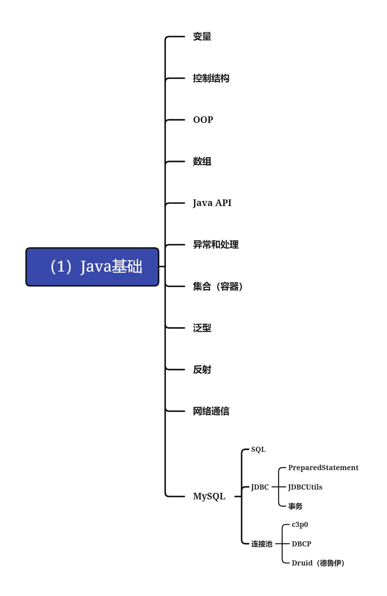
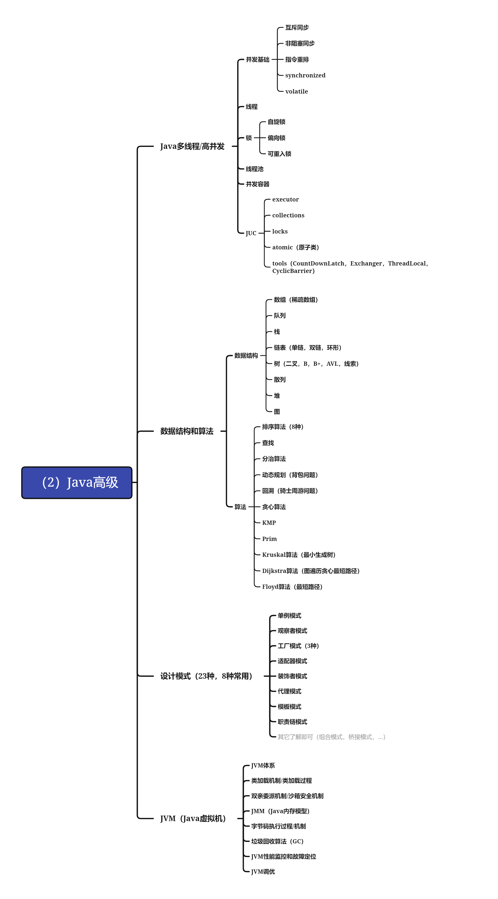
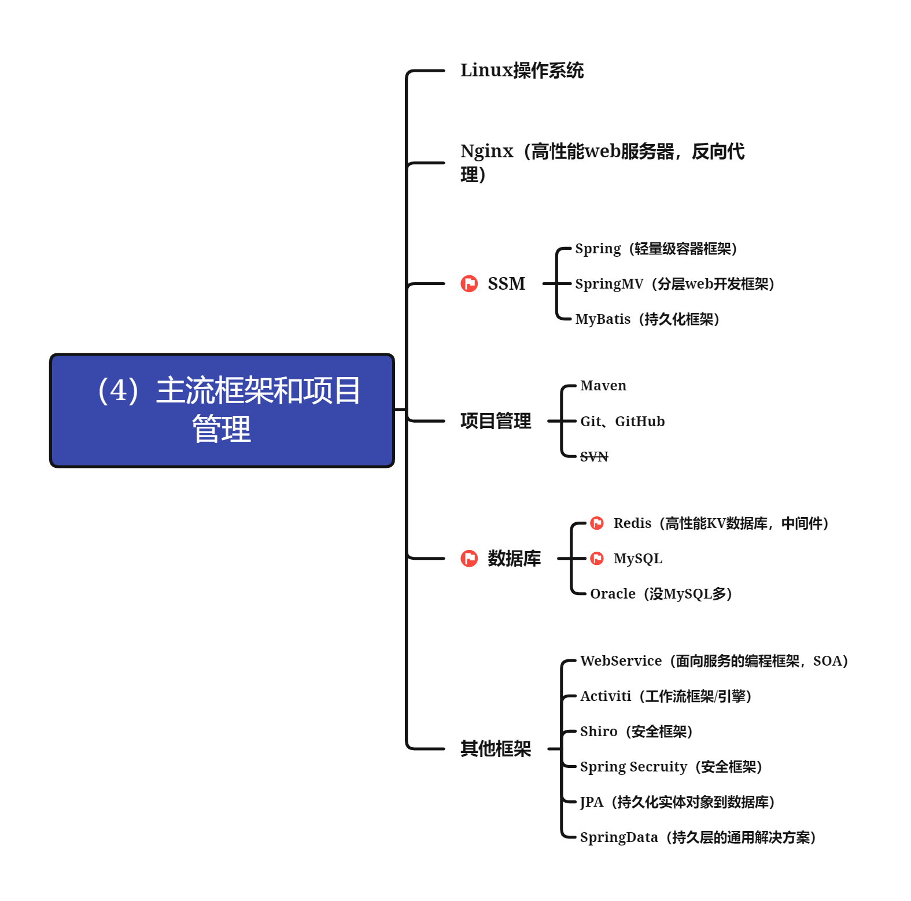
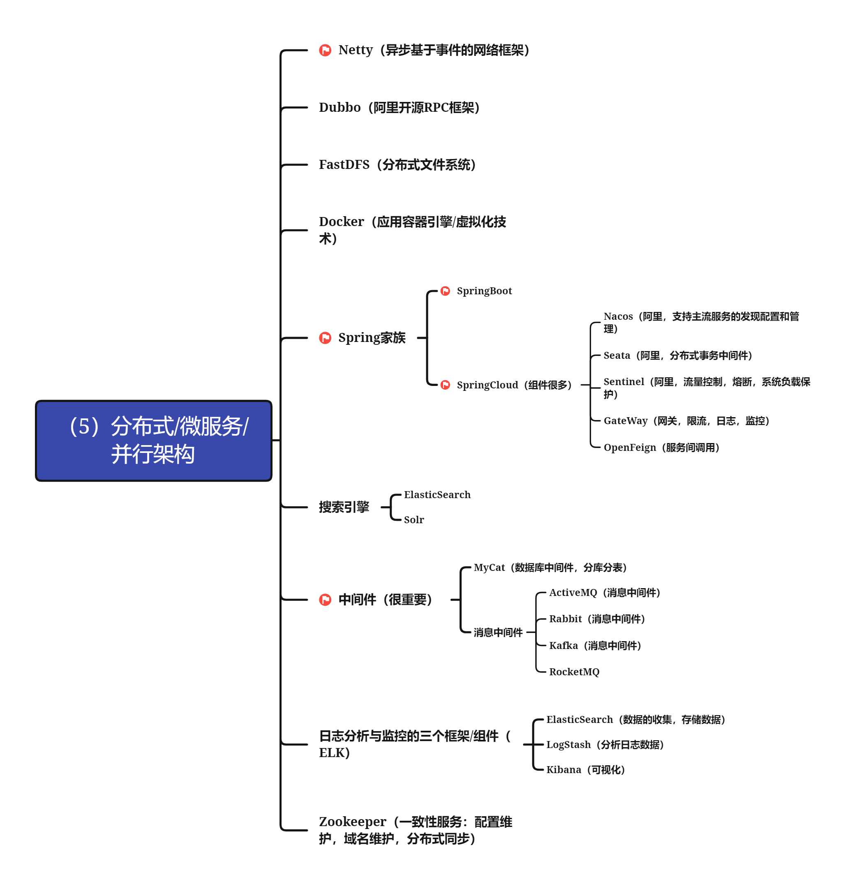
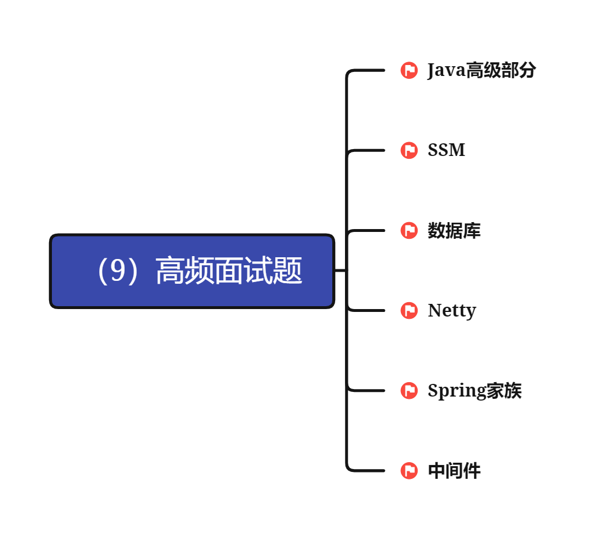

# Java体系

## **（1）Java基础**

### **变量**

### **控制结构**

### **OOP**

### **数组**

### **Java API**

### **异常和处理**

### **集合（容器）**

### **泛型**

### **反射**

### **网络通信**

### **MySQL**

- **SQL**
- **JDBC**

	- **PreparedStatement**
	- **JDBCUtils**
	- **事务**

- **连接池**

	- **c3p0**
	- **DBCP**
	- **Druid（德鲁伊）**

### 思维导图示意

## **（2）Java高级**

### **Java多线程/高并发**

- **并发基础**

	- **互斥同步**
	- **非阻塞同步**
	- **指令重排**
	- **synchronized**
	- **volatile**

- **线程**
- **锁**

	- **自旋锁**
	- **偏向锁**
	- **可重入锁**

- **线程池**
- **并发容器**
- **JUC**

	- **executor**
	- **collections**
	- **locks**
	- **atomic（原子类）**
	- **tools（CountDownLatch，Exchanger，ThreadLocal，CyclicBarrier）**

### **数据结构和算法**

- **数据结构**

	- **数组（稀疏数组）**
	- **队列**
	- **栈**
	- **链表（单链，双链，环形）**
	- **树（二叉，B，B+，AVL，线索）**
	- **散列**
	- **堆**
	- **图**

- **算法**

	- **排序算法（8种）**
	- **查找**
	- **分治算法**
	- **动态规划（背包问题）**
	- **回溯（骑士周游问题）**
	- **贪心算法**
	- **KMP**
	- **Prim**
	- **Kruskal算法（最小生成树）**
	- **Dijkstra算法（图遍历贪心最短路径）**
	- **Floyd算法（最短路径）**

### **设计模式（23种，8种常用）**

- **单例模式**
- **观察者模式**
- **工厂模式（3种）**
- **适配器模式**
- **装饰者模式**
- **代理模式**
- **模板模式**
- **职责链模式**
- 其它了解即可（组合模式，桥接模式，...）

### **JVM（Java虚拟机）**

- **JVM体系**
- **类加载机制/类加载过程**
- **双亲委派机制/沙箱安全机制**
- **JMM（Java内存模型）**
- **字节码执行过程/机制**
- **垃圾回收算法（GC）**
- **JVM性能监控和故障定位**
- **JVM调优**

### 思维示意图

## **（3）Java Web**

### 前端基础

- html
- CSS
- JavaScript
- Ajax
- jQuery

### 前端框架（了解即可，弱化）

- VUE
- React
- Angular
- bootstrap
- Node.js

### Java web后端

- Tomcat
- Servlet
- JSP

## **（4）主流框架和项目管理**

### **Linux操作系统**

### **Nginx（高性能web服务器，反向代理）**

### **SSM**

- **Spring（轻量级容器框架）**
- **SpringMV（分层web开发框架）**
- **MyBatis（持久化框架）**

### **项目管理**

- **Maven**
- **Git、GitHub**
- **SVN**

### **数据库**

- **Redis（高性能KV数据库，中间件）**
- **MySQL**
- **Oracle（没MySQL多）**

### **其他框架**

- **WebService（面向服务的编程框架，SOA）**
- **Activiti（工作流框架/引擎）**
- **Shiro（安全框架）**
- **Spring Secruity（安全框架）**
- **JPA（持久化实体对象到数据库）**
- **SpringData（持久层的通用解决方案）**

### 思维示意图

## **（5）分布式/微服务/并行架构**

### **Netty（异步基于事件的网络框架）**

### **Dubbo（阿里开源RPC框架）**

### **FastDFS（分布式文件系统）**

### **Docker（应用容器引擎/虚拟化技术）**

### **Spring家族**

- **SpringBoot**
- **SpringCloud（组件很多）**

	- **Nacos（阿里，支持主流服务的发现配置和管理）**
	- **Seata（阿里，分布式事务中间件）**
	- **Sentinel（阿里，流量控制，熔断，系统负载保护）**
	- **GateWay（网关，限流，日志，监控）**
	- **OpenFeign（服务间调用）**

### **搜索引擎**

- **ElasticSearch**
- **Solr**

### **中间件（很重要）**

- **MyCat（数据库中间件，分库分表）**
- **消息中间件**

	- **ActiveMQ（消息中间件）**
	- **Rabbit（消息中间件）**
	- **Kafka（消息中间件）**
	- **RocketMQ**

### **日志分析与监控的三个框架/组件（ELK）**

- **ElasticSearch（数据的收集，存储数据）**
- **LogStash（分析日志数据）**
- **Kibana（可视化）**

### **Zookeeper（一致性服务：配置维护，域名维护，分布式同步）**

### 思维示意图

## **（6）DevOps（开发运维一体化），自动化部分管理项目，解决CI/CD（持续集成持续部署），主要是运维的工作**

### **k8s（让部署容器化的应用简单并高效，轻松部署项目）**

### **普罗米修斯（prometheus，开源的，系统监控和报警工具）**

### **Jenkins（监控持续的工作，CI/CD，比如部署，集成，交付）**

### **Harbor（容器的镜像仓库）**

### **GitLab**

### **项目工程代码质量检测（SonarQube）**

## **（7）大数据**

### Hadoop

### Hive

### Implas

### Spark

### Flink

## **（8）项目**

### 电商

### 金融

### 教育

### 直播

### CRM/CRP

## **（9）高频面试题**

### **Java高级部分**

### **SSM**

### **数据库**

### **Netty**

### **Spring家族**

### **中间件**

### 思维示意图

## **（10）底层源码、内核研究**

## **（11）编程基础扩展（基本功力）**

### **计算机网络**

### **操作系统**

### **编译原理**

### **离散数学**

### **数值分析**

### **计算机组成原理**

### **汇编语言**

