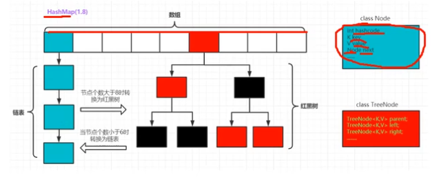

# Heading 0

## Heading 1

### Heading 2

#### Heading 3


# Font


**This is bold font**

*This is Italic font*

***This is bold & Italic font***

~~This is slash font~~


# Image


# Hyperlink


[My Link](www.google.com)


# List


### Unordered List

- row a
- row b
- row c

### Ordered List

1. row a 
2. row b
3. row c


# Table


| name  | sex  | age  |
| ----- | ---- | ---- |
| Pyrad | Male | 18   |


# Java内存


1. 线程内存区域
   1. 程序计数器
   2. Java虚拟机栈
   3. 本地方法栈
2. 堆
3. 方法区
4. 运行时常量池
5. 直接内存

- Java VM启动时会开启Garbage Collection的线程
  - **引用计数法**
  - **引用可达法（根搜索算法）**
  
- **三种GC**
  
  - Minor GC：清理年轻代，Eden区满了就出发一次Minor GC，清理无用对象，将有用的对象复制到Survivor1和Survivor2中
  - Major GC：清理年老代
  - Full GC：可以清理年轻代、年老代，有性能影响。
  
- **年轻代**
  
  - Eden区：（1个）尽可能收集生命周期短的对象（新生成的对象首先放这里），对应**Minor GC**，复制算法效率高，但浪费内存空间。
  - survivor区：（2个，分别是from和to）
  
- **年老代**
  
  - Eden区经过N（一般是15）次GC之后仍然存活的，被放到这里。
  - 有一个tenured区
  - 当年老代越来越多的时候，启动**Major GC**和**Full GC**全面清理年轻代和年老代区
  
- **永久代**
  
  - 用于存放静态文件，如Java类，方法等。持久代对GC没有显著的影响
  - JDK7以前是**方法区**的一种实现
  - JDK8之后使用元数据和metaspace
  
- 在一个java class类的构造器（constructor）里可以调用重载的其他的构造器，但必须是位于函数体的第一句，且使用this

  ```java
  public class User {
      int id;
      String name;
      String pwd;
      
      public User(int id, String name) {
          this.id = id;
          this.name = name;
      }
      
      public User(int id, String name, String pwd) {
          this(id, name); // <- overloaded constructor
          this.pwd = pwd;
      }
  }
  ```

  

# 面向对象三大特征

- 继承
  - Java中类只有单继承，没有C++中的类多继承
  - 但是Java中有接口的多继承
- 封装
- 多态
- Java中使用extends来实现继承

# 运算符 instanceof 

instanceof是二元运算符

```java
System.out.println(s instanceof Person);
System.out.println(s instanceof Student);
```


# 类中方法的重写

Java中重写函数的返回值，可以是本类的object，也可以是直接父类的object，但不可以是间接父类的object（爷爷辈的class）


# 关键字final

- 修饰变量：一旦被赋值，不能再改变
- 修饰方法：方法不可被重写，但可以被重载
- 修饰类：修饰的类不能被继承


# equals和==

- ==

  就是比较两个object的地址是否相同

- equals

  Object类里面的method，默认就是比较两个object的地址，但是可以被重载，用来比较两个object的内容是否相同（或者其他用途）

# super

可以看做是子类对父类对象的引用，可以通过super来引用父类的方法和熟悉（成员）

一个类中，构造方法的第一行没有显示调用super(...)或this(...)，Java编译器会自动默认调用super()，即调用父类的无参数构造函数。


# 封装

|  修饰符   | 同一个类 | 同一个包中 | 子类 | 所有类 |
| :-------: | :------: | :--------: | :--: | :----: |
|  private  |    *     |            |      |        |
|  default  |    *     |     *      |      |        |
| protected |    *     |     *      |  *   |        |
|  public   |    *     |     *      |  *   |   *    |


父类和子类在同一个包中，子类***可以***访问父类的protected成员，也***可以***访问父类对象的protected成员

父类和子类不在同一个包中，子类***可以***访问父类的protected成员，但***不可以***访问父类对象的protected成员


# 多态

同一个方法调用，由于对象的不同可能有不同的行为。


# 向下类型转换

类似于C++中的强制类型转换

```java
class Animal {
    public static void main() {
        System.out.println("Animal");
    }
    public void shout() {
        System.out.println("shout!");
    }
}

class Dog extends Animal {
    public static void main(String [] args) {
        Animal a = new Dog();
        Dog d = (Dog)a;  //<-- casting
        d.shout();
    }
    public void shout() {
        System.out.println("Wang!");
    }   
}
```


# 抽象类和抽象方法

```java
abstract class Animal { // <-- 抽象类只能被继承，不能实例化
    abstract public void shout(); //<-- 抽象方法在父类中可以不实现
}

class Dog extends Animal {
    public void shout() { // <-- 抽象方法必须在子类中实现
        System.out.println("Shout!");
    }
}
```

- 有抽象方法的类只能是抽象类
- 抽象类不能实例化
- 抽象类只能被继承
- 抽象类的方法必须被子类实现


# 接口

- 规范和实现彻底分离，即接口里面只有规范。

- 可以这样讲，接口是类的图纸，类是对象的模板。

- 接口中的常量总是public static final（可以省略）

- 接口中的方法总是public abstract（可以省略）

- 接口可以继承别的接口

- 接口可以多继承

- JDK8以后接口里面可以加入普通的静态方法和默认方法

- 接口里面的static method和它的继承里面的static method（哪怕函数名一样），是不同的两个函数（在方法区里面是不同的内存区域）

  ```java
  interface A {
      default void moren() {
          System.out.println("go");
      }
      
      public static void testStaticMethod() {
           System.out.println("testStaticMethod A");
      }
  }
  
  class TestA implements A {
      public static void testStaticMethod() {
           System.out.println("testStaticMethod TestA");
      }
      public static void main(String[] args) {
          System.out.println("InterfaceTester");
          TestA a = new TestA();
          a.testStaticMethod(); // <- testStaticMethod A
          A.testStaticMethod(); // <- testStaticMethod TestA
      }
  }
  ```

  

# String类

- 不可变字符序列
- 在java.lang中
- Java字符串就是Unicode字符序列
- Java没有内置字符串类型
- 需要掌握的常用方法：
  - char charAt(int index)
  - boolean equals(String other)
  - boolean equalsIgnoreCase(String other)
  - int indexOf(String str)
  - lastIndexOf()
  - int length()
  - String replace(char oldChar, char newChar)
  - boolean startsWith(String prefix)
  - boolean endsWith(String prefix)
  - String substring(int beginIndex)
  - String substring(int beginIndex, int endIndex)
  - String toLowerCase()
  - String toUpperCase()
  - String trim()
- 

# 常量池

1. 全局字符常量池

   每个VM中只有一份，放字符串常量池的引用（堆中生成字符串对象实例）

2. class文件常量池

   编译时每个class都有，在编译阶段，存放的是常量（文本字符串，final常量）和符号引用

3. 运行时常量池


# 内部类

定义在一个类的内部，分为

1. 成员内部类（非静态内部类和静态内部类）

2. 匿名内部类

3. 局部内部类

## 非静态内部类

非静态内部类主意事项：

- 内部类可以直接访问外部类的private成员
- 非静态内部类必须依存于一个外部类对象
- 非静态内部类不能有静态方法、静态属性和静态初始化块

## 静态内部类

- 可以看做是外部类的一个静态成员
- 可以访问外部类的静态成员，不能访问外部类的普通成员

## 匿名内部类

适合只使用一次的类

## 局部内部类

在方法中定义的类，作用域在于该方法内部（类似C++和Python中的lambda）

```java
package com.pyrad.testInnerClass;

public class testInnerClass {

    private int id = 0;
    static private int cnt = 0;

    public static void main(String[] args) {
        testInnerClass.Inner inn0 = new testInnerClass().new Inner();
        inn0.showInner();

        testInnerClass out0 = new testInnerClass();
        testInnerClass.Inner inn1 = out0.new Inner();
        inn1.showInner();

        testInnerClass.InnerStatic inn2 = new testInnerClass.InnerStatic();
        inn2.show();

        // Anonymous inner class usage
        testInnerClass out1 = new testInnerClass();
        out1.test(new A() {
                      @Override
                      public void run() {
                          System.out.println("run");
                      }
                  }
                );

    }

    public void show() {
        System.out.println("testInnerClass");
    }

    /**
     * 非静态内部类
     */
    public class Inner {
        private String m_name = "Tom";
        private int id = 0;
        public void showInner() {
            System.out.println("My name is " + m_name);
            System.out.println(id);
            System.out.println(testInnerClass.this.id);
        }
    }

    /**
     * 静态内部类
     */
    static class InnerStatic {
        private String m_name = "Java";
        public void show() {
            System.out.println(testInnerClass.cnt);
        }
    }

    public void test(A a) {
        a.run();
    }
}


interface A {
    void run();
}
```

# 创建对象的步骤

1. 分配对象空间，对象成员变量初始化为0或空
2. 执行属性值的显示初始化
3. 执行构造方法
4. 返回对象地址

# Java虚拟机内存模型

## 栈

- 描述方法执行的模型，每个方法调用时会创建一个栈帧（存储局部变量、操作数、方法出口等）
- JVM给每个线程创建一个栈，用来存放改线程执行的信息（实际参数、局部变量等）
- 栈是线程私有，不能线程间共享
- 栈是”先进后出，后进先出“
- 栈由系统自动分配，速度快，是连续的内存空间

## 堆

- 用于存储创建的对象和数组
- JVM只有一个堆，被所有线程共享
- 堆是一个不连续的内存空间，分配灵活但速度慢

## 方法区

- 方法区是Java虚拟机的规范可以有不同的实现
  - JDK7以前是**永久代**
  - JDK7部分去除**永久代**，静态变量、字符串常量池都挪到了堆内存中
  - JDK8是元数据空间和堆结合起来
- JVM只有一个方法区，被所有线程共享
- 实际上也是堆，只是用于存储类、常量相关的信息
- 用来存储程序中永远不变或唯一的内容

## 垃圾回收机制

- 针对***堆***中的对象


# 数组

- 定义

  - 数组变量属于引用类型，数组也是对象
  - 数组存元素的类型可以是任何类型
  - 数组是对象，数组中的元素是对象的属性
    - 初始化有默认初始化，动态初始化，以及静态初始化
  - 代码示例

  ```java
  package com.pyrad.testArray;
  
  public class testArray {
      public static void main(String[] args) {
          System.out.println("Array testing");
          testArray t = new testArray();
          t.test();
      }
  
      public void test() {
  
          int[] arr = new int[10]; // 默认初始化：0
          boolean[] barr = new boolean[10]; // 默认初始化：false
          String[] sarr = new String[10]; // 默认初始化：null
  
          // 静态初始化
          int[] arr1 = {0, 1, 2, 3};
          boolean[] barr1 = {false, true, false};
          String[] sarr1 = {"good", "bad"};
          Man[] marr = {new Man(0, "Jim"), new Man(1,"Tom"), new Man(2, "Kate")};
  
          // 动态初始化
          int[] s = null;
          s = new int[10];
          for (int i = 0; i < 10; i++) {
              s[i] = 2 * i + 1;
              System.out.println(s[i]);
          }
          for (int i = 0; i < s.length; i++) {
              System.out.println(s[i]);
          }
  		// for-each loop：只能读取，不能修改元素的值
          for (int k : s) {
              System.out.println(k);
          }
          
          // Copy (deep copy)
          String[] src = {"Jim", "Tom", "Kate"};
          String[] dest = new String[src.length];
          System.arraycopy(src, 0, dest, 0, src.length);
          for (String cstr : dest) {
              System.out.println(cstr);
          }
          
          // Arrays class test
          int[] iarr = {4, 3, 5, 1, 2, 0};
          System.out.println(Arrays.toString(iarr));
          Arrays.sort(iarr);
          System.out.println(Arrays.toString(iarr));
          System.out.println(Arrays.binarySearch(iarr, 3));
      }
  }
  
  class Man {
      private int m_id;
      private String m_name;
      Man(int id, String name) {
          this.m_id = id;
          this.m_name = name;
      }
      public void show() {
          System.out.printf("Name: %s, ID: %d\n", m_id, m_name);
      }
  }
  ```

  

- 四个特点

- 常见操作

  - 普通遍历
  - for-each
    - 增强型的for循环只能读取，不能修改元素的值
  - 数组拷贝
    - System.arraycopy
  - java.util.Array类
    - 提供排序、查找、填充、打印等相关方法

- 多维数组

  - 内存结构

    ```java
    package com.pyrad.testArrayMultiple;
    
    import java.lang.reflect.Array;
    import java.util.Arrays;
    
    /**
     * 多维数组
     */
    public class testArrayMultiple {
        public static void main(String[] args) {
            defaultInit();
            staticInit();
            dynInit();
        }
    
        // 默认初始化
        public static void defaultInit() {
            int[][] a = new int[3][];
            a[0] = new int[2];
            a[1] = new int[4];
            a[2] = new int[3];
    
            for (int[] ca : a) {
                System.out.println(Arrays.toString(ca));
            }
        }
    
        // 静态初始化
        public static void staticInit() {
            int[][] a = {{1, 3}, {1, 3, 7, 8}, {2, 0, 1}};
            a[0] = new int[2];
            a[1] = new int[4];
            a[2] = new int[3];
    
            for (int[] ca : a) {
                System.out.println(Arrays.toString(ca));
            }
        }
    
        // 动态初始化
        public static void dynInit() {
            int[][] a = new int[3][];
            a[0] = new int[]{1, 3};
            a[1] = new int[]{1, 3, 7, 8};
            a[2] = new int[]{2, 0, 1};
    
            for (int[] ca : a) {
                System.out.println(Arrays.toString(ca));
            }
        }
    }
    
    ```

    

  - 存储表格

  - Javabean和数组存储表格

- 常见算法

- comparable接口

  - 重写类中的compareTo接口即可
    - 大于规则：返回1
    - 等于规则：返回0
    - 小于规则：返回-1

# 常用的类

1. 基本数据类型的包装类(Wrapper class)

   - | 基本数据类型 |   包装类    |
     | :----------: | :---------: |
     |     byte     |    Byte     |
     |   boolean    |   Boolean   |
     |    short     |    Short    |
     |     char     |  Character  |
     |     int      | **Integer** |
     |     long     |    Long     |
     |    float     |    Float    |
     |    double    |   double    |

   - Number类是抽象类，它提供了一些抽象方法：intValue(), doubleValue(), floatValue(), doubleValue()等。

   - 自动装箱和拆箱(JDK 1.5之后)

     ```java
     // autoboxing & unboxing
     Integer i7 = 3; // > JDK 1.5, autoboxing
     int i8 = i7; // > JDK 1.5, unboxing
     ```

     

   - **包装类的缓存**

     如果第二次或以上使用同一个**[-128, 127]**之间的数字，返回缓存数组中的某个元素

     ```java
     Integer i9 = 4000;
     Integer i10 = 4000;
     Integer i11 = 123;
     Integer i12 = 123;
     System.out.println(i9 == i10);  // false
     System.out.println(i11 == i12); // true, wrapper class cache, implemented in Integer.valueOf()
     System.out.println(i9.equals(i10)); // true
     ```

     

2. 字符串相关（String）

   - **String**：不可变字符序列
   - **StringBuilder**：可变字符序列（效率高，线程不安全）
   - **StringBuffer**：可变字符序列（效率低，线程安全）

3. 时间处理
   时间在java里也是一个long类型的数组，以1970.1.1 00:00:00为时间原点
   **Date**类提供时间的基本操作
   **Calendar**类是一个抽象类，提供关于日期计算的功能，其一个具体子类是**GregorianCalendar**。

   ```java
   import java.text.ParseException;
   import java.text.SimpleDateFormat;
   import java.util.Date;
   import java.util.Calendar;
   import java.util.GregorianCalendar;
   
   
   public static void test() {
           SimpleDateFormat df = new SimpleDateFormat("yyyy-MM-dd hh:mm:ss");
           try {
               Date d1 = df.parse("1998-10-21 23:12:29");
               System.out.println(d1);
   
               Date d2 = new Date(1000L * 3600 * 23);
               String str = df.format(d2);
               System.out.println(str);
           } catch (ParseException e) {
               e.printStackTrace();
           }
   }
   
   public static void test2() {
           GregorianCalendar c = new GregorianCalendar(2021, 7, 19, 21, 2, 23);
           int cur_y = c.get(Calendar.YEAR);
           int cur_m = c.get(Calendar.MONTH);
   
           c.set(Calendar.DATE, 3);
   
           c.add(Calendar.MONTH, +3);
   
           GregorianCalendar c0 = new GregorianCalendar();
           c0.setTime(new Date());
   
           System.out.println(c);
           System.out.println(c0);
   
   }
   ```

   

4. 其他
   **Math**类：abs，acos，asin，sin，cos，sqrt，pow，max，min，ceil，floor，random（[0,1)之间的随机数），round，toDegrees，toRadians
   **Random**类

   ```java
       public static void test() {
           Random r = new Random();
           r.nextDouble();
           r.nextInt();
           r.nextFloat();
           r.nextBoolean();
           r.nextInt(10);
       }
   ```

   **File**类
   在java.io.File中，默认创建文件在系统定义的***user.dir***中

   ```java
   package com.pyrad.testFile;
   
   import java.io.File;
   import java.io.IOException;
   import java.util.Date;
   
   public class testFile {
       public static void main(String[] args) throws IOException {
           test();
       }
   
       public static void test() throws IOException {
           // Get current project's path
           System.out.println("Current project path is:");
           System.out.println(System.getProperty("user.dir"));
   
           // default path is: user.dir
           File f = new File("first.java.txt");
           if (f.exists()) {
               System.out.printf("File %s already exists\n", f.getName());
               System.out.println("File is directory:" + f.isDirectory());
               System.out.println("File is file:" + f.isFile());
               System.out.println("File size:" + f.length());
               System.out.println("File last modified:" + new Date(f.lastModified()));
               // Other operations:
               // boolean suc = f.mkdir()
               // f.mkdirs()
               // f.delete()
           } else {
               f.createNewFile();
               System.out.printf("Create file %s\n", f.getName());
           }
   
           File f2 = new File("C:\\Users\\Pyrad\\IdeaProjects\\JavaLearn\\src\\com\\pyrad\\testFile\\java.2nd.txt");
           f2.createNewFile();
       }
   }
   ```

   枚举

   枚举类隐式地继承了**java.lang.Enum**

   ```java
   public class testEnum {
       public static void main(String[] args) {
           test();
       }
   
       public static void test() {
           System.out.println(Season.SPRING);
           System.out.println(Season.valueOf(Season.AUTUMN.name()));
           System.out.println(Season.valueOf(Season.AUTUMN.name()));
   
           for (Week k : Week.values()) {
               System.out.println(k);
           }
   
           int a = new Random().nextInt(4);
           Season[] ss = Season.values();
           switch (ss[a]) {
               case SPRING:
                   System.out.println("Spring");
                   break;
               case SUMMER:
                   System.out.println("Summer");
                   break;
               case AUTUMN:
                   System.out.println("Autum");
                   break;
               case WINTER:
                   System.out.println("Winter");
                   break;
               default:
                   System.out.println("Not known");
                   break;
           }
       }
   }
   
   enum Season {
       SPRING, SUMMER, AUTUMN, WINTER
   }
   
   enum Week {
       MON, TUE, WED, THU, FRI, SAT, SUN
   }
   ```


# 异常

第一步：抛出异常对象

第二步：捕获异常对象

异常对象都是继承于**java.lang.Throwable**类，**Throwable**有两个子类**Error**和**Exception**。

Error类不用处理也处理不了，但Exception可以处理。

Exception类分为两种：**CheckedException**和（**RuntimeException**）**UncheckedException**。

不管有无异常，**finally**都会执行，通常用来释放前面申请的资源

处理方式：

（1）捕获异常

（2）声明异常

（3）try-with-resource（新，JDK7，它可以自动关闭实现了**AutoClosable**接口的类）

```java
// （1）捕获并处理异常
try {
    // whatever
} catch (Exception e1) {
    e1.printStackTrace();
} catch (Exception e2) {
    e2.printStackTrace();
} finally {
    // always execute here, no matter there's exception or not
}

// （2）声明异常：谁调用谁处理
static public void test() throws Exception {
     System.out.println("Might exception");
}


    static public void test3() {
        try (FileReader reader = new FileReader("d:/a.txt");){
            char c = (char) reader.read();
            System.out.println(c);
        } catch (Exception e) {
            e.printStackTrace();
        }
    }
```

自定义异常

一般定义两个构造器：default constructor和带有信息的constructor

```java
class IllegalAgeException extends Exception {
    // default constructor
    public IllegalAgeException() {}
    // constructor with message
    public IllegalAgeException(String msg) {
        super(msg);
    }
}
```


# 泛型

## 简单总结

主要解决编译期间的安全问题

简单示例

```java
public class testGeneric {
    public static void main(String[] args) {
        MyGeneric<String> ms = new MyGeneric<>();
        ms.show();
        ms.print("kkkk");

        MyGeneric<String> ms0 = new MyGeneric<>("ttt");
        ms.show();
        ms.print("ssss");
    }
}

// 如果要加上public访问修饰符，那么当前的.java文件名称必须是MyGeneric.java
class MyGeneric <T> {
    private T m_key;
    MyGeneric() { m_key = null; }
    MyGeneric(T k) { m_key = k; }
    public void show() { System.out.println(m_key); }
    public void print(T k) { System.out.println(k); }
}
```


经过编译之后，JVM都会把泛型替换成Object。

- 基本类型不能用于泛型：```Test<int> t;```这样的写法是错误的。
- 不能通过类型参数创建对象```T elem = new T();```这样的写法是错误的。

### 通配符？

- 上限限定：可以是泛型方法，也可适用泛型类。```<? extends Father>```
- 下限限定：只能用于泛型方法，不能用于泛型类。```<? super Child>```

### 泛型可变长参数

```java
public <T> Generic(T...arg) {
}
```


# Java容器

## 单例集合

祖先接口是Collection，有两个子接口List（有序可重复）、Set（无序无重复）

List有三个子类：ArrayList, LinkedList, Vector

Set有个子类：HashSet

## 双例集合

双例集合：key-value对，父接口是Map

有几个子类：HashTable，HashMap，TreeMap，LinkedHashMap，Property

## Collection的抽象方法

add

remove

contains

size

isEmpty

clear

iterator

containsAll

addAll（并集）

removeAll（差集）

retainAll（交集）

 toArray


## List接口的其他方法

add(int, Object)

set(int, Object)

get(int)

remove(int)
indexOf(Object)

lastIndexOf(Object)


## ArrayList类

- 本质是动态数组，底层用数组实现（底层以**1.5**倍上次数组大小的方式扩容）

- 线程不安全；多线程中可以用Vector或CopyOnWriteArrayList

- ArrayList底层用数组实现的。特点：查询效率高，增删效率低，线程不安全。

- 有几个两个重要对象

  - **elementData**：是一个Object[]，即object的数组
  - **size**：动态数组的实际大小
  - **DEFAULTCAPACITY_EMPTY_ELEMENTDATA**（一个final的空数组，默认构造时会赋值给elementData，JDK1.8之后的特点，**延迟加载**）

- 继承自AbstractList，并实现了以下几个接口

  - List：提供基本的增删改和遍历
  - RandomAccess：支持随机访问
  - Cloneable：可被克隆
  - java.io.Serializable：即可以支持序列化

  ```java
  public class ArrayList<E> extends AbstractList<E>
          implements List<E>, RandomAccess, Cloneable, java.io.Serializable {}
  ```

- 包含的方法

  ```java
  // Collection中定义的API
  boolean             add(E object)
  boolean             addAll(Collection<? extends E> collection)
  void                clear()
  boolean             contains(Object object)
  boolean             containsAll(Collection<?> collection)
  boolean             equals(Object object)
  int                 hashCode()
  boolean             isEmpty()
  Iterator<E>         iterator()
  boolean             remove(Object object)
  boolean             removeAll(Collection<?> collection)
  boolean             retainAll(Collection<?> collection)
  int                 size()
  <T> T[]             toArray(T[] array)
  Object[]            toArray()
  // AbstractCollection中定义的API
  void                add(int location, E object)
  boolean             addAll(int location, Collection<? extends E> collection)
  E                   get(int location)
  int                 indexOf(Object object)
  int                 lastIndexOf(Object object)
  ListIterator<E>     listIterator(int location)
  ListIterator<E>     listIterator()
  E                   remove(int location)
  E                   set(int location, E object)
  List<E>             subList(int start, int end)
  // ArrayList新增的API
  Object              clone()
  void                ensureCapacity(int minimumCapacity)
  void                trimToSize()
  void                removeRange(int fromIndex, int toIndex)
  ```

- 三种遍历方式

  ```java
  List<String> a = new ArrayList<>(20); //可以用父类的引用（指针）
  a.add("good"); a.add("day"); a.add("today");
  
  // 迭代器遍历
  Iterator itr = b.iterator(); // itr开始没有指向任何值
  while (itr.hasNext()) {
      String cur = (String) itr.next();
      System.out.println(cur);
  }
  System.out.println("----");
  
  // 索引遍历（随机访问）
  for (int i = 0; i < b.size(); i++) {
      System.out.println(b.get(i));
  }
  System.out.println("----");
  
  // 增强for循环遍历
  b.remove(b.iterator().next());
  for (String s : b) {
      System.out.println(s);
  }
  ```


## Vector类

Vector实现了List的接口，底层也是用数组实现的，相关的方法都有**同步检查**，所以是线程安全的。

Vector和ArrayList的使用基本上是一样的（方法基本都相同）

Vector扩容的倍数是以原先容量的**2倍扩容**

Vector采用的**默认初始化方式**是**立即初始化**，即最开始给elementData数组初始化为capacity是10（即容量为10）的数组。


## Stack类

Stack是**Vector**类的一个**子类**，即继承于Vector，特点是LIFO（Last In First Out）

扩展了Vector的5个方法

```java
boolean empty() // 查看栈是否空
E       peak() // 查看栈顶
E       pop() // 出栈
E       push(E item) // 入栈
int     search(Object o) // 返回元素在栈中的位置
```


```java
// 一个stack检查括号匹配的小程序
public static boolean symmetry() {
    String symbol = "...{..[..(...).....]..}...";
    Stack<String> stk = new Stack<>();
    for (int i = 0; i < symbol.length(); i++) {
        char c = symbol.charAt(i);
        if (c == '{') { stk.push("}"); }
        if (c == '[') { stk.push("]"); }
        if (c == '(') { stk.push(")"); }
        if (c == '}' || c == ']' || c == ')') {
            if (stk.empty()) {
                return false;
            }
            if (stk.peek().charAt(0) != c) {
                return false;
            }
            stk.pop();
        }
    }

    return stk.empty();
}
```


## LinkedList

- 也是实现了**List**的接口

- 底层用**双向链表**实现存储，查询效率低，增删效率高，线程不安全

- 继承（实现）关系

  ```java
  public class LinkedList<E>
      extends AbstractSequentialList<E>
      implements List<E>, Deque<E>, Cloneable, java.io.Serializable {}
  ```

  

- 重要的成员变量

  ```java
  transient int size;
  transient Node<E> first; // 指向链表的第一个元素
  transient Node<E> last; // 指向链表的最后一个元素
  ```

  

- 节点表示，是**LinkedList**的一个内部类

  ```java
  class Node<E> {
      E item;
      Node<E> next;
      Node<E> prev;
  }
  ```

- LinkedList除了Collection中的方法，还有自己的如下方法

  ```java
  void addFirst(E e); //元素添加到链表开头
  void addLast(E e); // 元素添加到链表尾
  getFirst(); // 返回链表第一个元素
  getLast(); // 返回链表最后一个元素
  removeFirst(); // 移除第一个元素，并返回该元素
  removeLast(); // 移除最后一个元素，并返回该元素
  E pop(); // 等效于removeFirst，移除头部元素（第一个）
  void push(E e); //等效于addFirst，在头部添加元素（第一个）
  boolean isEmpty();
  ```

  

## Set接口

- Set在是个**接口**，继承自Collection接口，但其方法和Collection的完全一致，并没有新增方法。
- 无序，不可重复，类似于C++中的std::set、std::unordered_set
- 常见的Set
  - HashSet
  - TreeSet


## HashSet

- 就是一个没有重复元素的集合

- 底层是**HashMap**实现的（简化版的HashMap）

- **HashMap**底层是用<font color='red'>**数组**</font>（默认初始长度16）和<font color='red'>**链表**</font>实现的，对元素的哈希值（**```hashCode```**方法）进行运算，然后决定元素在数组中的位置，同时也会通过元素的**```equals()```**方法来判断两个元素是否相同，如果相同则不会添加重复的元素（<font color='red'>**注意**</font>：是在元素的哈希值运算之后的值相同的时候，才会调用**```equals()```**方法，否则不会调用**```equals()```**方法）

- 如果经过对元素的hash值进行计算得到值相同，并且调用**```equals()```**方法也返回true，那么就会在该元素的位置（实际上是一个链表的节点）上生成一个链表（单向链表）把元素放到链表的下一个位置上，这就是前面提到的“底层是用<font color='red'>**数组**</font>（默认初始长度16）和<font color='red'>**链表**</font>实现的”

- 成员变量

  ```java
  private transient HashMap<E, Object> map;
  // Dummy value to associate with an Object in the backing Map
  // 即把key-value对里面的value固定给一个无意义的值，那么map就变成了set
  private static final Object PRESETN = new Object();
  ```

  

- HashSet中允许有null元素

- 利用Hash算法（散列算法）

- 因为是无序的，所以不能通过index索引来访问（其实和C++中的一模一样）

- 常见操作

  ```java
  public static void test() {    
      Set<String> sset = new HashSet<>();    
      sset.add("k"); sset.add("o"); sset.add("m"); sset.add("z");    
      for (String s : sset) {        
          System.out.println(s);    
      }    
      System.out.println(sset.contains("o") ? "Value exist" : "Value not found");    
      System.out.println(sset.remove("z"));    
      System.out.println(sset.remove("p"));        
      Set<Users> uset = new HashSet<>();	
      Users u = new Users("Pyrad", 18);	
      Users v = new Users("Pyrad", 18);	
      // 只有一个元素在uset中，因为Users类里面重写了hashCode和equals方法    
      for (Users cu : uset) {         
          System.out.println(cu);    
      }
  }
  // 可以通过重写自定义类的hashCode和equals方法来使用Set，以便达到想要的效果
  class Users {    
      private String username;    
      private int userage;    
      public Users(String username, int userage) { this.username = username; this.userage = userage;}    
      public Users() {}    
      public String getUsername() { return username;}    
      public void setUsername(String username) { this.username = username; }    
      public int getUserage() { return userage; }    
      public void setUserage(int userage) { this.userage = userage; }    
      @Override    
      public String toString() {        
          return "Users{" +                
              "username='" + username + '\'' +                
              ", userage=" + userage +                
              '}';    
      }    
      @Override    
      public boolean equals(Object o) {        
          if (this == o) return true;        
          if (o == null || getClass() != o.getClass()) 
              return false;        
          Users users = (Users) o;        
          return userage == users.userage && Objects.equals(username, users.username);    
      }    
      @Override    
      public int hashCode() {        
          return Objects.hash(username, userage);    
      }        
      // 如果要用于TreeMap或TreeSet    
      // (1) 就要在元素对应的类中实现接口Comparable<E>，并且重写compareTo    
      // (2) 或者在外部使用比较器    
      @Override    
      public int compareTo(Users o) {        
          if (this.getUsername().compareTo(o.getUsername()) == 0) {            
              return 1;        
          }       
          if (this.getUserage() > o.getUserage()) {          
              return 1;       
          }        
          return -1;    
      }
  }
  ```

## TreeSet容器

- 可以对元素进行排序

- 底层是TreeMap实现的，通过key来存储元素（TreeSet里面显然只使用到了key）

- TreeMap是用红黑树实现的

- 继承关系

  ```java
  public class TreeSet<E> extends AbstractSet<E>    
      implements NavigableSet<E>, Cloneable, java.io.Serializable// NavigableSet -> NvaigableMap -> SortedMap
  ```

- 成员变量

  ```java
  private transient NavigableMap<E, Object> m;
  private static final Object PRESENT = new Object();
  ```

- 需要给的排序规则

  - 通过元素自身实现比较规则（需要实现元素（就是类自己）Comparable接口中的compareTo方法）```Users```中的compareTo方法见如上

  - 通过比较器定义比较规则

    ```java
    import java.util.Comparator;
    // 如果Users类中没有compareTo方法，可以通过定义一个比较器类，传入其构造函数来实现
    public class UserComparator implements Comparator<Users> {   
        @Override   
        public int compare(Users o1, Users o2) {  
            return o1.compareTo(o2); 
        }
    }
    public static void test() {    
        Set<Users> uset2 = new TreeSet<>(new UserComparator());    
        uset2.add(u1); uset2.add(u2);
        for (Users s : uset2) {         
            System.out.println(s);      
        } 
    }
    ```

- 常用方法

  ```java
  public static void test() {   
      Set<String> tset = new TreeSet<>();  
      tset.add("d"); tset.add("c"); tset.add("a"); tset.add("c"); tset.add("b");  
      // 因为内部是红黑树，对加入的元素会排序，所以输出a,b,c和d   
      for (String s : tset) {        
          System.out.println(s); 
      }
  }
  ```

  

## Map接口

- Map是一个接口

- Map接口定义双例集合，它**不是**Collection的子接口

- 和C++中的std::map, std::unordered_map非常相似，比较理解即可

- 常用

  - **TreeMap**
  - **HashMap**

- Map接口中的常用方法

  ```java
  V put(K key, V value);               // 添加键值对，如果key已存在，会覆盖原有的key-value对，然后返回value；如果可以不存在，就返回null
  void putAll(Map m);                  // 复制另一个Map到此Map（并运算），如有key相同，会把对应的值覆盖
  V remove(Object key);                // 删除key对应的key-value对
  V get(Object key);                   // 得到key对应的value
  boolean containsKey(Object key);     // 是否有key
  boolean containsValue(Object value); // 是否有value
  Set keySet();                        // 取得所有key，并存储到Set中
  Set<Map.Entry<K,V>> entrySet();      // 返回一个Set，其Set的key是k-v对，在Map中以Map的内部类表示：Map.Entry<K,V>
  void clear();                        // 清空
  ```

## HashMap

- 是Map接口的实现类

- 底层采样**<font color='red'>哈希表</font>**存储数据，key重复的话，后面添加的会覆盖之前已经存在的key-value对

- HashMap中的成员变量

  ```java
  //数组初始长度，必须是2的次方
  static final int DEFAULT_INITIAL_CAPACITY = 1 << 4;
  
  // 数组最大长度
  static final int MAXIMUM_CAPACITY = 1 << 30;
  
  // 负载因子，数组扩容时的使用（即数组使用到75%时即扩容）
  static final float DEFAULT_LOAD_FACTOR = 0.75f;
  /**
   * 链表节点数超过多少时转换成红黑树（默认8），但不是马上转，还要看MIN_TREEIFY_CAPACITY值（即
   * 数组table长度超过64的时候才转成红黑树），如果链表节点数超过8单数组长度还没有超过64，
   * 那么值扩容，不转换成红黑树
   */
  static final int TREEIFY_THRESHOLD = 8;
  // 红黑树节点数少于多少时转换成链表（默认6）
  static final int UNTREEIFY_THRESHOLD = 6;
  // 并不是一个链表超过8个节点时马上转换成红黑树，而是在数组长度超过64的时候，才把那些超过8个节点的链表转换成红黑树
  static final int MIN_TREEIFY_CAPACITY = 64;
  // 当前HashMap中键值对的个数
  transient int size;
  // 就是HashMap中的数组（每个节点可能是单独的一个节点，或者一个链表，或者一个红黑树）
  transient Node<K,V>[] table;
  ```

- HashMap中存储元素的节点类型：两种，分别是**Node<K, V>**和**TreeNode<K, V>**

  **Node<K, V>**，是HashMap的内部类，用来表示**链表节点**

  ```java
  static class Node<K,V> implements Map.Entry<K,V> {
      final int hash;
      final K key; //注意，和C++中一样，key不能变，如果要变，只能删除再添加一个键值对
      V value; //value可以修改
      Node<K,V> next;
      Node(int hash, K key, V value, Node<K,V> next) {
          this.hash = hash;
          this.key = key;
          this.value = value;
          this.next = next;
      }
      public final getKey() {return key;}
      public final getValue
  }
  ```

  **TreeNode<K, V>**，是HashMap的内部类，用来表示**红黑树的节点**

  ```java
  /** 
   * 注意：LinkedHashMap.Entry<K,V>是LinkedHashMap的一个内部类（名字叫Entry<K,V>），
   * 它又继承了前面提到的HashMap的Node<K,V>这个内部类
   */
  static final class TreeNode<K,V> extends LinkedHashMap.Entry<K,V> {
  	// 当前节点的父节点
      TreeNode<K,V> parent;  // red-black tree links
      TreeNode<K,V> left;
      TreeNode<K,V> right;
      // 当前节点的前一个节点
      TreeNode<K,V> prev;    // needed to unlink next upon deletion
      boolean red; // 红树或黑树
      TreeNode(int hash, K key, V val, Node<K,V> next) {
          super(hash, key, val, next);
      }
  }
  ```

  

- 哈希表的本质就是：**数组**+**链表**

- JDK1.8里面哈希表采用的是：数组+链表/红黑树

  - 当数组中节点数大于8的时候，就把链表转换成红黑树
  - 当数组中节点数小于6的时候，就把红黑树转换成链表

  

- 数组初始化

  - JDK1.8中HashMap采用延迟初始化的方式
  - 通过**<font color='red'>resize</font>**方法（返回Node<K,V>[]，即Node数组）初始化，同时也实现的扩容。扩容的方式是通过**<font color='red'>2倍</font>**的方式增加的
  
- 计算Hash值的方法（步骤）

  1. 计算key对象的**hash code**（调用key对象的hashcode()方法）

  2. 根据**hashcode**计算出**hash值**（要求在**[0, 数组长度-1]**这个闭区间内）
     hashcode是一个整数，要求转换后的hash值尽量均匀分布在**[0, 数组长度-1]**这个闭区间内，以便减少”hash冲突“

     - 极端简单的办法：hash值=hashcode/hashcode，此时hash值总是1，那么键值对都会存到数组索引的第一个位置，这样HashMap就退化为一个“链表”了

     - 相除取余法：hash值 = hashcode % 数组长度。
       这种办法可以使hash值均匀地分布到**[0, 数组长度-1]**这个闭区间内，但用除法了，所以效率低。JDK后来改进为：**<font color='red'>hash值 = hashcode & （数组长度 - 1）</font>**，这里的前提是数组长度**必须是2的整数次幂**。
       根据下面的分析，简单总结为
       **<font color='red'>先把key的hashcode的高16位和低16位做异或，得到的值再和数组长度-1做与得到的值，就是最后的hash值</font>**

       ```java
       // HashMap中put的方法如下
       // 它首先会把key用下面的hash方法做一次运算，但这里hash(key)得到的值还不是最终的hash值，
       // 它的目的是是的最后算出来的hash值更散更均匀
       // 真正算hash值的地方在putVal里面，如下面第二个函数所示
       public V put(K key, V value) {
           return putVal(hash(key), key, value, false, true);
       }
       
       static final int hash(Object key) {
           int h;
           /// 这里'>>>'表示无符号的向右位移，h >>> 16即表示取h的前面的高16位
           /// 所以(h = key.hashCode()) ^ (h >>> 16)即表示h的高16位和低16位做异或运算
           return (key == null) ? 0 : (h = key.hashCode()) ^ (h >>> 16);
       }
       
       // 计算hash值的地方：tab[i = (n - 1) & hash]
       // 也就是说，通过(n - 1) & hash计算出来的hash值，就是想要放置节点在数组中的索引
       final V putVal(int hash, K key, V value, boolean onlyIfAbsent,
                          boolean evict) {
           Node<K,V>[] tab; Node<K,V> p; int n, i;
           if ((tab = table) == null || (n = tab.length) == 0)
               n = (tab = resize()).length;
           // 计算最终hash值的地方
           if ((p = tab[i = (n - 1) & hash]) == null)
               tab[i] = newNode(hash, key, value, null);
           else {
           }
           ...
       }
       ```

- 遍历等常用方法

  ```java
  Map<String, String> m = new HashMap<>();
  String v = m.put("a", "A"); v = m.put("b", "BBS"); v = m.put("c", "CCS");v = m.put("d", "DDS");
  Set<String> allkeys = m.keySet();
  for (String s : allkeys) {  
      String cv = m.get(s);  
      System.out.println(cv);
  }
  
  // Map.Entry<K,V>相当于C++中的std::pair
  Set<Map.Entry<String, String>> kvs = m.entrySet();
  for (Map.Entry<String, String> kv : kvs) { 
      System.out.println(kv.getKey() + ": " + kv.getValue());
  }
  
  map0.putAll(map1); //如有key相同，会把key对应的值覆盖成新的
  String removed = map0.remove("c");
  System.out.println("Removed: " + removed); // Removed: C
  
  String removed = map0.remove("k");
  System.out.println("Removed: " + removed); // Removed: null
  
  boolean has = map0.containsKey("b");
  has = map0.containsValue("B");
  ```

## TreeMap

- 和HashMap一样实现了Map接口，所以API基本相同

- TreeMap的底层实现是**红黑树**

- TreeMap是对键进行了排序的，所以要给定排序规则

  - 元素自己的比较规则

  - 给定比较器

    ```java
    package com.pyrad.testContainer;
    
    public class Student implements Comparable<Student> {
        private String name;
        private int age;
    
        public Student(String name, int age) { this.name = name; this.age = age; }
        public Student() {}
    
        public String getName() { return name; }
        public void setName(String name) { this.name = name; }
        public int getAge() { return age; }
        public void setAge(int age) { this.age = age; }
    
        // 定义元素自己的比较规则（实现Comparable<T>接口）
        @Override
        public int compareTo(Student o) {
            if (getName() == o.getName()) {
                if ( getAge() < o.getAge() ) {
                    return 1;
                } else if (getAge() > o.getAge()){
                    return -1;
                } else {
                    return 0;
                }
            }
            return getName().compareTo(o.getName());
        }
    }
    
    // 定义比较器
    public class StudentComparator implements Comparator<Student> {
        @Override
        public int compare(Student o1, Student o2) {
            if (o1.getAge() == o2.getAge()) {
                return o1.compareTo(o2);
            }
    
            return o1.getName().compareTo(o2.getName());
        }
    }
    
    
    public class testTreeMap {
        public static void main(String[] args) {
            test();
        }
    
        public static void test() {
            Map<Student, String> tmap = new TreeMap<>();
            Student s0 = new Student("pyard", 18);
            Student s1 = new Student("admin", 20);
            tmap.put(s0, "KKK");
            tmap.put(s1, "DDD");
            for (Map.Entry<Student, String> entry : tmap.entrySet()) {
                System.out.println(entry.getKey() + ": " + entry.getValue());
            }
        }
    }
    ```

## Iterator迭代器

- Collection接口继承了**Iterable接口**（注意是extends，不是implements，因为Collection也是一个接口），该接口中有一个名字是**iterator**的抽象方法，所以实现了Collection接口的容器类都有具体实现

- **iterator**方法会返回一个**Iterator类型**的迭代器对象

- **Iterator**也是一个接口，定义有三个方法

  ```java
  // 判断游标**当前**（注意是当前）是否有元素，如有返回true，否则返回false
  boolean hasNext();
  
  // 取代游标当前的元素，并将游标移动到下一个位置
  Obejct next();
  
  // 删除游标当前位置的元素，在执行完next之后只能执行一次
  void remove();
  ```

- 通过迭代器变量可以使用while或for循环

  ```java
  public static void test() {
      // 也可以用HashSet等容器，但Map类型（HashMap，TreeMap）不能直接用迭代器
      // 而且要用其keySet()或entrySet()得到的Set结构，再结合迭代器来遍历
      List<String> slist = new ArrayList<>();
  
      slist.add("a"); slist.add("b"); slist.add("c");
      Iterator<String> itr = slist.iterator();
      
      // 使用while + 迭代器
      while (itr.hasNext()) {
          String curval = itr.next();
          System.out.println(curval);
      }
  
      // 使用for + 迭代器
      for (Iterator<String> it = slist.iterator(); it.hasNext();) {
          String val = it.next();
          System.out.println(val);
      }
  
      // 遍历删除
      itr = slist.iterator();
      while (itr.hasNext()) {
          String curval = itr.next();
          itr.remove();
      }
  	
  	System.out.println(slist.isEmpty()); // 返回true
  }
  ```

- 可以在增强for循环中删除元素，但是不能添加元素；用迭代器遍历时，也可以删除元素，但是也一样不能添加元素。

  ```java
  for (String str : slist) {
      if (str == "c") {
          slist.remove(str);
      }
  }
  ```

## Collections工具类

- 提供的方法都是静态方法。常用方法如下

  ```java
  // 按升序排序
  void sort(List);
  
  // 随机排序
  void shuffle(List);
  
  // 逆序
  void reverse(List);
  
  // 用一个特定对象重新整个List容器
  void fill(List, Object);
  
  // 对于已排序的List容器，采用二分查找法查找元素，并返回索引
  int binarySearch(List, Object);
  ```

  

- 

# IO 流

## IO简介

- 和外部数据系统进行通信（外部系统可能是文件、数据库、其他程序、网络、IO设备等）

- java.io包提供了相关的API

- Java中的**四大IO抽象类**（分为**字节流**和**字符流**）

  - **InputStream**

    **字节**输入流的所有类的父类，是一个抽象类，数据单位是字节（1Byte/8bits）

    ```java
    // 常用方法
    
    // 读取一个字节，并以int返回（值为0-255之间）；未读出则返回-1（表示结束）
    int read();
    
    // 关闭输入流对象
    void close();

  - **OutputStream**

    **字节**输出流的所有类的父类，是一个抽象类，数据单位是字节（1Byte/8bits）

    ```java
    // 常用方法
    
    // 向目的地中写入一个字节
    int write(int n);
    
    // 关闭输出流对象
    void close();
    ```

  - **Reader**

    读取**字符**流的抽象类，数据单位为字符

    ```java
    // 常用方法
    // 读取一个字符的数据，以int返回（0-65535之间的值），即Unicode的值；
    // 未读出则返回-1（表示结束）
    int read();
    
    // 关闭流对象
    void close();
    ```

  - **Writer**

    输出**字符**流的抽象类，数据单位为字符

    ```java
    // 写出一个字符
    void write(int n);
    // 关闭
    void close();
    ```

- Java中流的概念细分

  - 按**流的方向**
    - **输入流**
    - **输出流**
  - 按处理**数据的单元**
    - **字节流**：一般以stream结尾（一般读二进制文件）
    - **字符流**：一般以Reader/Writer结尾（一般读取文本类文件）
  - 按**处理对象**分类
    - **节点流**：可以直接从数据源或目的地读写数据（FileInputSteam，FileReader，DataInputStream）
    - **处理流**：不直接连接到数据源或目的地读写数据，是“处理流的流”。通过处理其他流来提高程序的性能（BufferedInputStream，BufferedReader），也叫**包装流**。

- Java IO流体系

  

  - 注意File、RandomAccessFile类不是java.io里的

  - 简单总结各种流

    - **<font color='red'>InputStream/OutputStream</font>**
      **字节流**的**<font color='red'>抽象类</font>**
    - **<font color='red'>Reader/Writer</font>**
      **字符流**的**<font color='red'>抽象类</font>**
    - **FileInputStream/FileOutputStream**
      节点流，以**字节**为单位直接操作文件
    - **ByteArrayInputStream/ByteArrayOutputStream**
      节点流，以**字节**为单位直接操作“字节数组对象”
    - **ObjectInputStream/ObjectOutputStream**
      处理流：以**字节**为单位直接操作“对象”
    - **DataInputStream/DataOutputStream**
      处理流：以**字节**为单位直接操作“基本数据类型与字符串类型”
    - **FileReader/FileWriter**
      节点流：以**字符**为单位直接操作“文本文件”（注意：只能读写文本文件）
    - **BufferedReader/BufferedWriter**
      处理流：将Reader/Writer对象进行包装，增加缓存功能，提高读写效率
    - **BufferedInputStream/BufferedOutputStream**
      处理流：将InputStream/OutputStream对象进行包装，增加缓存功能，提高读写效率
    - **InputStreamReader/OutputStreamWriter**
      处理流：将字节流对象转化成字符流对象
    - **PrintStream**
      处理流：将OutputStream包装，方便输出字符，更灵活

  - 一个简单例子

    ```java
    public static void testAll() {
        FileInputStream fis = null;
        try {
            String fname = new String("D:\\someTestWords.txt");
            fis = new FileInputStream(fname);
            // int s1 = fis.read(); // read only 1 character
            int s = -1;
            int cnt = 0;
            StringBuilder sb = new StringBuilder();
            while ((s = fis.read()) > 0) {
                cnt += 1;
                System.out.println(s);
                sb.append((char) s);
            }
            System.out.println("Read chars: " + cnt);
            System.out.println(sb.toString());
            // System.out.println(s1);
        } catch (Exception e) {
            e.printStackTrace();
        } finally {
            if (fis != null) {
                try {
                    fis.close();
                } catch (IOException e) {
                    e.printStackTrace();
                }
            }
        }
    }
    ```

    


## File类的使用

- 针对磁盘中的文件或目录转换对象的包装类

- 可以是文件或目录

  针对**文件**的操作方法

  ```java
  // 创建新文件
  createNewFile();
  // 从磁盘中删除（文件或目录）
  delete();
  // 查询是否存在
  exists();
  // 获取绝对路径
  getAbsolutePath();
  // 获取相对路径
  getPath();
  // 文件名，相当于调用了一个toString()方法
  getName();
  // 判断是否为文件
  isFile();
  // 文件的字节数
  length();
  // 是否为隐藏文件
  isHidden();
  ```

  针对**目录**的操作方法

  ```java
  exists(); // 目录是否存在
  isDirectory(); // 是否为目录
  mkdir(); // 创建目录
  getParentFile(); // 父级目录
  list(); // 返回字符串数组，包含目录中的文件和目录
  listFiles(); // 返回File数组，表示目录路径中的文件
  ```

- File类的基本使用

  ```java
  // 文件
  File f2 = new File("C:/aa.txt");
  boolean created = f2.createNewFile();
  System.out.println(created);
  
  System.out.println(f2.getName());
  System.out.println(f2.length());
  System.out.println(f2.isFile());
  System.out.println(f2.isDirectory());
  System.out.println(f2.isHidden());
  
  boolean deleted = f2.delete();
  System.out.println(deleted);
  
  // 目录
  public static void testDir() throws IOException {
  	File f = new File("C:\\dirDemo");
      if (!f.exists()) {
          if (!f.mkdir()) {
              return;
          }
      }
      System.out.println(f.isDirectory());
      System.out.println(f.getParent());
      System.out.println(f.listFiles());
      for (File cf : f.listFiles()) {
          System.out.println(cf.getName());
      }
      System.out.println(f.list());
      for (String s : f.list()) {
          System.out.println(s);
      }
      File pf = f.getParentFile();
      String pfn = f.getParent();
  }
  ```

  

## 常用流对象

### 文件字节流

#### FileInputStream/FileOutputStream

**FileInputStream**：可以读所有类型文件，通过字节方式读取（FileReader专门读文本文件）

**FileOutputStream**：可以写所有类型文件，通过字节方式写入文件（FileWriter专门写文本文件）

```java
// 没有缓冲区（buffer数组）的读写法
File curDir = new File(".");
String curDirName = curDir.getCanonicalPath();
FileInputStream fis = null ;

// 文件输入流：读文件
fis = new FileInputStream(curDirName + "/riho.jpg");
int temp = 0;
int cnt = 0;
List<Integer> outdata = new ArrayList<Integer>();
while ((temp = fis.read()) != -1) { // 字节流每个读取的值不超过255(temp <= 255)
    cnt++;
    outdata.add(temp);
}
System.out.println("cnt = " + cnt);

// 文件输出流：写出到文件
fos = new FileOutputStream(curDirName + "/rhio_copy.jpg");
for (int idata : outdata) {
	fos.write(idata);
}
fos.flush();
fos.close();
```

#### **通过缓冲区提高读写效率**

**方式一**：创建指定长度的字节数组作为缓冲区，缓冲区长度为固定长度

```java
File curDir = new File(".");
String curDirName = curDir.getCanonicalPath();
FileInputStream fis = null ;

// 
fis = new FileInputStream(curDirName + "/riho.jpg");
fos = new FileOutputStream(curDirName + "/rhio_copy.jpg");
int temp = 0;
int cnt = 0;
byte [] buff = new byte[1024];
while ((temp = fis.read(buff)) != -1) { // 每次读入到buff中temp个字节
    cnt++;
    fos.write(buff, 0, temp);// 每次从buff的0位置开始写，写到总共读入的字节个数
}
System.out.println("cnt = " + cnt);

fos.flush();
fos.close();
```

方式二：创建指定长度的字节数组作为缓冲区，数组长度通过输入流对象的available()返回当前文件的预估长度来定义。在读写文件时一次完成读和写，但这种方式比较占内存。

```java
File curDir = new File(".");
String curDirName = curDir.getCanonicalPath();
FileInputStream fis = null ;

fis = new FileInputStream(curDirName + "/riho.jpg");
fos = new FileOutputStream(curDirName + "/rhio_copy.jpg");

byte [] buff = new byte[fis.available()];
fis.read(buff);
fos.write(buff);

fos.flush();
fos.close();
```

#### **通过字节缓冲流提高读写效率**

字节缓冲流有两个：**BufferedInputStream/BufferedOutputStream**

缓冲流把别的流包装起来，先将数据缓存起来，当缓存区满后或者手动刷新时在一次性写入程序或文件

有多个流时，关闭的顺序依据：后开的先关闭

**BufferedInputStream/BufferedOutputStream**的内部缓冲区的大小（byte数组的长度）默认是8192（2^13）

```java
fis = new FileInputStream(curDirName + "/riho.jpg");
bis = new BufferedInputStream(fis);

fos = new FileOutputStream(curDirName + "/riho.copy.3.jpg");
bos = new BufferedOutputStream(fos);
int temp = 0;
while ((temp = bis.read()) != -1) {
    bos.write(temp);
}
bos.flush();
```

#### 定义文件拷贝工具类

【因故缺失】

### 文件字符流

#### 文件字符输入流 FileReader

以字符（**Unicode字符**）的方式读入文件里面的内容，每次读入一个字符值（Unicode）

```java
File curDir = new File(".");
String curDirName = curDir.getCanonicalPath();
FileReader freader = null;
freader = new FileReader(curpath + "/staticStuffs/testwords.txt");
int temp = 0;
while ((temp = freader.read()) != -1) {    
    System.out.println(temp); // unicode value in int type
    System.out.println((char) temp); // unicode value
}
freader.close();
/** 
 * 假如文件内容为"Good day today 你好！"，则输出如下： 
 * 71: G 
 * 111: o 
 * 111: o 
 * 100: d 
 * 32:   
 * 100: d 
 * 97: a 
 * 121: y 
 * 32:   
 * 116: t 
 * 111: o 
 * 100: d 
 * 97: a 
 * 121: y 
 * 32:   
 * 20320: 你 
 * 22909: 好 
 * 33: ! 
 */
```

#### 文件字符输出流 FileWriter

注意：windows里面的回车/换行是***```\r\n```***。

注意：如果用FileWriter初始化一个已经存在的文件，那么再写数据到该文件里面的时候，会把文件之前的内容覆盖。

```java
String curpath = getCurrentDirPath();
System.out.println(curpath);
FileWriter fwriter = null;
fwriter = new FileWriter(curpath + "/staticStuffs/testwords.copy.txt");
fwriter.write("Good day today 你好!\r\n");
fwriter.write("Good day today 你好！");
// 追加文件内容，在构造FileWriter的时候给定第二个参数
fwriter2 = new FileWriter(curpath + "/staticStuffs/testwords.copy.txt", true);
fwriter2.write("Not anymore");
fwriter.close();
fwriter2.close();
```


#### 使用字符流实现文本文件的拷贝处理

```java
FileReader fr = new FileReader(cpath + "/staticStuffs/test.words.txt");
FileWriter fw = new FileWriter(cpath + "/staticStuffs/test.words.copy2.txt");
char[] buff = new char[1024];
int temp = 0;
while ((temp = fr.read(buff)) != -1) {    
    fw.write(buff, 0, temp);
}
fw.flush();
```


#### 字符缓冲输入流 BufferedReader

可以**按行为单位**进行读取文件

```java
FileReader fr = new FileReader(cpath + "/staticStuffs/testwords.txt");
BufferedReader bfr = new BufferedReader(fr);
String temp = "";
while ((temp = bfr.readLine()) != null) {    
    System.out.println(temp);
}
```


#### 字符缓冲输出流 BufferedWriter

BufferedWriter有个newLine()的方法，可以代替之前使用```\r\n```来添加一个换行符

```java
FileWriter fw = new FileWriter("mytest.txt");
BufferedWriter bfw = new BufferedWriter(fw);
bfw.write("Good day today!");
bfw.newLine(); // 添加一个换行符
bfw.write("To be or not to be");
bfw.newLine(); // 添加一个换行符
bfw.flush();
bfw.close();
fw.close();
```


#### 使用字符缓冲流实现文本文件的拷贝处理

```java
String cpath = testUtils.getCurrentDirPath();
String fname = cpath + "/staticStuffs/testwords.txt";
String fout = cpath + "/staticStuffs/testwords.txt.copy";
BufferedReader br = new BufferedReader(new FileReader(fname));
BufferedWriter bw = new BufferedWriter(new FileWriter(fout));
String strtmp = "";
while ((strtmp = br.readLine()) != null) {    
    bw.write(strtmp);    
    bw.newLine();
}
bw.flush();
bw.close();
br.close();
```


### 转换流

**InputStreamReader/OutputStreamWriter**来实现把**字节流**转换为**字符流**

场景：比如System.in是System下面的一个static 变量in，类型是InputStream，而键盘输入就是InputStream，所以如果要把键盘输入的字节转换成（一行）字符，就要用到转换流InputStremReader。同时System.out是System下面的一个static 变量out，类型是OutputStream，如果要把一行字符显示到控制台，就要用到字符流的write(String str)方法，OutputStreamWriter。

```java
// System.in is type 'InputStream'
// but BufferedRead accepts the char stream
// So use InputStreamRead
/* BufferedReader接收的是字符输入流，但System.in是InputStream类型，即字节输入流，所以需要 
 * InputStreamReader这个转换流。 
 * BufferedWriter接收的是字符输出流，但System.out是OutputStream类型，即字节输出流，所以需要 
 * OutputStreamWriter这个转换流。
 */
BufferedReader br = new BufferedReader(new InputStreamReader(System.in));
String input = br.readLine();
BufferedWriter bw = new BufferedWriter(new OutputStreamWriter(System.out));
bw.write(input);
bw.flush();
bw.close();
br.close();
```

### 字符输出流

java.io中提供的字符输出流对象**```PrintWriter```**，可自动换行、刷新缓冲字符输出流。

特点是可以按行写出字符串，通过**println()**方法实现自动换行。

```java
String cpath = testUtils.getCurrentDirPath();
String fn = cpath + "/staticStuffs/testwords.txt";
String fn1 = cpath + "/staticStuffs/testwords2.txt";
BufferedReader br = new BufferedReader(new InputStreamReader(new FileInputStream(fn)));
PrintWriter pw = new PrintWriter(fn1);
String temp = "";
while ((temp = br.readLine()) != null) {    
    pw.println(temp);
}
br.close();
pw.close();
```


### 字节数组流

经常用于流和数组需要转换的情况下

- **ByteArrayInputStream**
- **ByteArrayOutputStream**


#### 字节数组输入流

**ByteArrayInputStream**把**内存中的字节数组**对象当做数据源（相比较，FileInputStream把文件当做数据源）

它的构造函数里面需要一个**字节数组**参数，这个字节数组就是数据源

```java
byte [] arr = "abcdefg".getBytes();
StringBuffer sb = new StringBuffer();
ByteArrayInputStream bis = new ByteArrayInputStream(arr);
int temp = 0;
while ((temp = bis.read()) != -1) {    
    sb.append((char) temp);
}
System.out.println(sb.toString());
bis.close();
```


#### 字节数组输出流

**ByteArrayOutputStream**把**流中的数据**写入到**字节数组**中，这个字节数组是**ByteArrayOutputStream**的对象的内部的变量（字节数组），可以通过ByteArrayOutputStream.**toByteArray()**这个方法来获取

```java
ByteArrayOutputStream bos = new ByteArrayOutputStream();
bos.write('g');
bos.write('o');
bos.write('o');
bos.write('d');
byte [] arr = bos.toByteArray();
for (byte c : arr) {    
    System.out.println((char) c);
}
```


### 数据流

#### 数据流的作用

- 以“基本数据类型和字符串类型”作为数据源，允许程序以与机器无关的方式从底层输入输出流中操作Java基本数据类型和字符串类型

- **DataInputStream**和**DataOutputStream**提供了存取与机器无关的所有Java基本数据类型

- 理解

  前面提到的字节输入输出流和字符输入输出流，要么以字节的方式读写，要么以字符的方式读写，但是如果想以其他类型的数据读写该怎么办？

  比如，读写一个都是double类型的文件，就要求以double的方式读写，这时候就要用到这里提到的**数据流**（**DataInputStream**和**DataOutputStream**）。

  简单来说，就是帮助我们节省了转换成相应数据类型的工作

  

#### 数据输出流

**DataOutputStream**下面有一些写出为各种类型的方法


#### 数据输入流

**DataInputStream**下面有一些以按各种类型读入的方法

下面这个例子同时示意了如何使用**数据输出流**和**数据输入流**

```java
String cpath = testUtils.getCurrentDirPath();
String fn = cpath + "/staticStuffs/dataIoStreamTest.txt";
DataOutputStream dos = new DataOutputStream(new BufferedOutputStream(new FileOutputStream(fn)));
dos.writeDouble(3.1415926);
dos.writeUTF("Pyrad"); // 写字符串
dos.writeChar('x');
dos.writeInt(1024);
dos.writeBoolean(false);

dos.flush();
dos.close();

// 之前是按照什么顺序写出的，就要按照相应的顺序读入
DataInputStream dis = new DataInputStream(new BufferedInputStream(new FileInputStream(fn)));
double v0 = dis.readDouble();
String v1 = dis.readUTF();
char v2 = dis.readChar();
int v3 = dis.readInt();
boolean v4 = dis.readBoolean();

dis.close();
```


### 对象流

把对象存储到磁盘或通过网络传输


#### Java对象的序列化和反序列化

**序列化**：把Java对象转换成字节序列

**反序列化**：把字节序列恢复为Java对象

对象序列化的用途：**持久化**（保存到磁盘上等）和**网络通信**（网络传输对象的字节序列）


#### 序列化的类和接口

**ObjectOutputStream**代表对象输出流，它的writeObject(Object obj)把对象obj进行序列化，把得到的字节序列写到一个目标输出流中

**ObjectInputStream**代表对象输入流，它的readObject()方法从一个源输入流中读入字节序列，再反序列化称为一个对象，并把它返回。

只有实现了**Serializable接口**的类的对象才能序列化，**Serializable接口**是一个空接口（可以叫**标识接口**），只是起到了标记的作用。


#### 写出和读入基本数据类型的数据

通过**ObjectOutputStream**写，通过**ObjectInputStream**写（见下面的程序片段）

```java
String cpath = testUtils.getCurrentDirPath();
String fn = cpath + "/staticStuffs/oos.dat";

ObjectOutputStream oos = new ObjectOutputStream(new BufferedOutputStream(new FileOutputStream(fn)));
oos.writeInt(10);
oos.writeDouble(1.34);
oos.writeChar('a');
oos.writeBoolean(false);
oos.writeUTF("Testcase");

oos.close();


ObjectInputStream ois = new ObjectInputStream(new BufferedInputStream(new FileInputStream(fn)));
int v0 = ois.readInt();
double v1 = ois.readDouble();
char v2 = ois.readChar();
boolean v3 = ois.readBoolean();
String v4 = ois.readUTF();

ois.close();
```


#### 操作对象（序列化/反序列化）

Java可以把任何类都序列化，只要它实现了**Serializable**序列化接口

- 把对象序列化到文件

  - **ObjectOutputStream**把内存中的Java对象通过序列化的方式写入磁盘文件
  - 被序列化的文件必须实现**Serializable**序列化接口
  - 通过**ObjectOutputStream.writeObject()**把对象写入文件，这个文件必须通过**字节输出流**（FileOutputStream/BufferedOutputStream）打开

- 把对象从文件中反序列化到内存中

  - **ObjectInputStream**把磁盘文件中的Java对象通过反序列化的方式读入内存
  - 通过**ObjectInputStream.readObject()**把对象读入内存，这个文件必须通过**字节输入流**（FileInputStream/BufferedInputStream）打开
  - 读入之后，要把读入的对象进行强制类型转换

  

  ```java
  class Users implements Serializable {
      private int m_id;
      private String m_name;
      private int m_age;
  
      public Users(int m_id, String m_name, int m_age) {
          this.m_id = m_id;
          this.m_name = m_name;
          this.m_age = m_age;
      }
      public Users() {    }
  
      public int getM_id() { return m_id; }
      public void setM_id(int m_id) { this.m_id = m_id; }
      public String getM_name() { return m_name; }
      public void setM_name(String m_name) { this.m_name = m_name;  }
      public int getM_age() { return m_age; }
      public void setM_age(int m_age) {  this.m_age = m_age;  }
  }
  
  
  Users u = new Users(1, "pyrad", 18);
  
  // 对象序列化，写入到文件中
  String cp = testUtils.getCurrentDirPath();
  String fn = cp + "/staticStuffs/obj_out.dat";
  ObjectOutputStream oos = new ObjectOutputStream(new BufferedOutputStream(new FileOutputStream(fn)));
  oos.writeObject(u);
  oos.flush();
  oos.close();
  
  // 对象反序列化，从文件读入到内存中
  ObjectInputStream ois = new ObjectInputStream(new BufferedInputStream(new FileInputStream(fn)));
  Users ru = (Users) ois.readObject();
  System.out.println(ru.getM_age());
  System.out.println(ru.getM_id());
  System.out.println(ru.getM_name());
  
  ois.close();
  ```


### 随机访问流

RandomAccessFile

- 实现对一个文件的读写操作
- 可以访问文件的任意位置（其他流只能按照先后顺序读取）

主要掌握3个方法

1. RandomAccessFile(String name, String mode)

   name表示访问的文件，mode取r（读）或rw（读写）；mode确定流对文件的访问权限

2. seek(long a)

   定位流对象读写文件的位置，a表示读写位置距离文件开头的字节个数

3. getFilePointer()

   获得流的当前读写位置

```java
String cp = testUtils.getCurrentDirPath();
String fn = cp + "/staticStuffs/testwords.txt";
RandomAccessFile raf = new RandomAccessFile(fn, "rw");

int[] arr = new int[]{0, 1, 2, 3, 4, 5, 6, 7, 8, 9};
for (int i : arr) {
    raf.writeInt(arr[i]);
}

raf.seek(4); // move the file pointer to 4 bytes away from the file beginning

int temp = raf.readInt();
System.out.println(temp); // output 1, because each integer occupies 4 bytes

raf.close();
```


### File类

之前利用IO流对文件读写的时候，是用String字符串来指定的；如果以文件作为数据源或目标，也可以使用File类的对象来指定

```java
public class testFileIn {
    public static void main(String[] args) throws IOException {
        String cp = testUtils.getCurrentDirPath();
        String fn = cp + "/staticStuffs/testwords.txt";
        File fi = new File(fn);
        // 使用File类的对象指定要读写的文件
        BufferedReader br = new BufferedReader(new FileReader(fi));
        String line = "";
        while ((line = br.readLine()) != null) {
            System.out.println(line);
        }
        br.close();
    }
}
```


## Apache IO包

JDK提供的文件操作比较基础，需要第三方的包来补充

**Apache-commons**工具包提供了**IOUtils/FileUtils**，可以方便地对文件和目录进行操作

**Apache Software Foundation (ASF)**

来自ASF的开源Java项目：commons，kafka，Lucene，maven，shiro，structs，以及大数据技术的：hadoop，hbase，spark，strom，mahout

### FileUtils

常用方法

```java
// 清空目录（里面的文件），但不删除目录
cleanDirectory();
// 比较两个文件内容是否相同
contentEquals();
// 拷贝一个目录的内容到另一个目录。可以通过FileFilter过滤要拷贝的文件
copyDirectory();
// 把一个文件拷贝到一个新的地址
copyFile();
// 把一个文件拷贝到某个目录下
copyFileToDirectory();
// 拷贝输入流的内容到文件
copyInputStreamToFile();
// 删除目录
deleteDirectory();
// 删除文件
deleteQuietly();
// 列出目录下文件
listFiles();
// 打卡指定文件的输入流
openInputStream();
// 把文件的内容作为字符串返回
readFileToString();
// 文件内容按行返回到一个字符串数组中
readLines();
// 返回文件或目录的大小
size();
// 把字符串内容直接写到文件中
write();
// 把字节数组内容写到文件中
writeByteArrayToFile();
// 把容器里元素的toString()方法返回的内容依次写入文件
writeLines();
// 把字符串内容写入文件
writeStringToFile();
```

举例

```java
public class testFileUtils {
    public static void main(String[] args) throws IOException {
        File curDir = new File(".");
        String curDirName = curDir.getCanonicalPath();
        String fn = curDirName + "/first.java.txt";
        
        // 注意：接受的参数是File类
        String content = FileUtils.readFileToString(new File(fn), "utf-8");
        System.out.println(content);

        // Copy a directory to a new directory
        String dir_src = curDirName + "/mytestdir";
        String dir_dest = curDirName + "/mytestdirNew";
        
        // 注意：可以使用原地实现的方式实现一个接口，只要实现其中的方法即可（这里的FileFilter）
        FileUtils.copyDirectory(new File(dir_src), new File(dir_dest), new FileFilter() {
            @Override
            public boolean accept(File pathname) {
                if (pathname.isDirectory() ||
                    pathname.getName().endsWith("jpg") ||
                    pathname.getName().endsWith("html")) 
                {
                    return true;
                }
                return false;
            }
        });
    }
}
```

### IOUtils

常用方法

```java
// 把传入的流包装成缓冲流，可以通过参数指定缓冲大小
buffer();
// 关闭流
close();
// 比较两个流中的内容是否一致
contentEquals();
// 把输入流内容拷贝到输出流中，可指定字符编码
copy();
// 把输入流内容拷贝到输出流中，适合大于2G内容的拷贝
copyLarge();
// 返回可以迭代每一行内容的迭代器
lineIterator();
// 把输入流中的部分内容读入到字节数组中
read();
// 把输入流中的所有内容读入到字节数组中
readFully();
// 读入输入流中的一行
readLine();
// 把输入转换成带缓冲的输入流
toBufferedInputStream();
toBufferedReader();
// 把输入流内容转为字节数组、字符数组
toByteArray();
toCharArray();
// 把输入流或数组中的内容转换为字符串
toString();
// 向流里写入内容
write();
// 向流里写入一行内容
writeLine();
```

举例

```java
public class testIOUtils {
    public static void main(String[] args) throws IOException {
        File curDir = new File(".");
        String curDirName = curDir.getCanonicalPath();
        String fn = curDirName + "/first.java.txt";
        
        // 实现了以字节流的方式读入文件，并以字符的方式打印出来
        String cont = IOUtils.toString(new FileInputStream(fn), "utf-8");
        System.out.println(cont);
    }
}
```


## 总结

- 四大基本IO抽象类
- 分类
  - 按流的方向
  - 按流处理的数据单元
  - 按处理的对象
- 四个基本IO抽象类的实现类
  - InputStream
    - FileInputStream
    - ByteArrayInputStream
    - BufferedInputStream
    - DataInputStream
    - ObjectInputStream
  - OutputStream
    - FileOutputStream
    - ByteArrayOutputStream
    - BufferedOutputStream
    - DataOutputStream
    - ObjectOutputStream
  - Reader
    - FileReader
    - BufferedReader
    - InputStreamReader
  - Writer
    - FileWriter
    - BufferedWriter
    - OutputStreamWriter


# Java重要知识点

- 注解
- 反射
- 动态代理
- 泛型
- Servlet
- Filter
- Listener
- JDBC
- 常用设计模式
- 
