# The Code Interview Guide


# 第一章 栈和队列

本章总共11题


## 1.1  设计一个有getMin功能的栈

【题目】实现一个特殊的栈，在实现栈的基本功能的基础上，再实现返回栈中最小元素的操作。

【要求】

【1】  `pop`，`push`，`getMin`操作的时间复杂度O(1)

【2】  设计的栈类型可以使用现成的栈结构


## 1.2  由两个栈组成的队列

【题目】编写一个类，用两个栈实现队列，支持队列的基本操作（`push`，`pop`，`front`，`back`）


## 1.3  如何仅用递归函数和栈操作逆序一个栈

一个栈依次压入1,2,3,4,5，那么从栈顶到栈底就依次为5,4,3,2,1。将这个站逆转后，从栈顶到栈底依次是1,2,3,4,5，即实现栈中元素的逆序，但是仅能用递归函数来实现，不能使用其他数据结构。


## 1.4  猫狗队列

宠物，狗和猫的类如下：

```cpp
class Pet {
public:
   Pet(std::string type) {
       this->type = type;
   }
   std::string getPetType() {
        return this->type;
   }

private:
   std::string type;
};


class Dog : public class Pet {
public:
	Dog() : Pet("dog") {}
};

class Cat : public class Pet {
public:
   Cat() : Pet("cat") {}
};
```


实现一种狗猫队列，要求如下：

（1）  用户可以调用`add`方法将cat类或dog类的实例放入队列中

（2）  用户可以调用`pollAll`方法，将队列中的所有实例按照进队列的先后顺序依次弹出

（3）  用户可以调用`pollDog`方法，将队列中Dog类的所有实例按照进队列的先后顺序依次弹出

（4）  用户可以调用`pollCat`方法，将队列中Cat类的所有实例按照进队列的先后顺序依次弹出

（5）  用户可以调用`isEmpty`方法，检查队列中是否还有Dog类或者Cat类的实例

（6）  用户可以调用`isDogEmpty`方法，检查队列中是否还有Dog类的实例

（7）  用户可以调用`isCatEmpty`方法，检查队列中是否还有Cat类的实例


## 1.5  用一个栈实现另一个站的排序

【题目】一个栈中的元素为整型，现在想将该栈从顶到底按照从大到小的顺序排序，只允许申请一个栈。除此之外，可以申请新的变量，但不能申请额外的数据结构。然后完成排序？


## 1.6  用栈求解汉诺塔问题

【题目】汉诺塔问题比较经典，这里修改一下游戏规则：现在限制不能直接从最左侧的塔移动到最右侧，也不能直接从最右侧移动到最左侧，而是必须经过中间的塔。求当有N层塔时，打印最优移动过程和最优移动步数。

例如，当塔为两层时，最上层的塔记为1，最下层的塔记为2，则打印：

```bash
Move 1 from left to mid
Move 1 from mid to right
Move 2 from left to mid

Move 1 from right to mid
Move 1 from mid to left
Move 2 from mid to right
Move 1 from left to mid
Move 1 from mid to right

It will move 8 steps
```


【要求】方法一：使用递归的方法；方法二：使用非递归的方法，用栈来模拟汉诺塔的三个塔。


## 1.7  生成窗口最大值数组

【题目】有一个整型数组arr和一个大小为w的窗口从数组的最左边滑动到最右边，窗口每次向右滑动一个位置。

例如：数组为[4,3,5,4,3,3,6,7]，窗口大小为3时：

[4 3 5] 4 3 3 6 7 窗口中最大值为5

4 [3 5 4] 3 3 6 7 窗口中最大值为5

4 3 [5 4 3] 3 6 7 窗口中最大值为5

4 3 5 [4 3 3] 6 7 窗口中最大值为4

4 3 5 4 [3 3 6] 7 窗口中最大值为6

4 3 5 4 3 [3 6 7] 窗口中最大值为7

如果数组长度为n，窗口大小为w，则总共产生n-w+1个窗口的最大值。

请实现一个函数：

输入：整型数组arr，窗口大小为w。

输出：一个长度为n-w+1的数组res，res[i]表示每一种窗口状态下的最大值。

以本题为例，结果应该返回数组[5,5,5,4,6,7]


## 1.8  单调栈结构

【题目】给定一个不含有重复值的数组arr，找到每一个位置i左边和右边距离i位置最近且值比arr[i]小的位置。返回所有位置相应的信息。

【举例】arr = {3,4,1,5,6,2,7}，返回如下二维数组作为结果：

```bash
{
	{-1,2}，
	{0,2}，
	{-1,-1},
	{2,5},
	{3,5},
	{2,-1},
	{5,-1},
}
```

-1表示不存在。所以上面的结果表在arr中，0位置左边和右边距离0位置最近而且值比arr[0]小的位置是-1和2；1位置左边和右边距离1位置最近而且值比arr[1]小的位置是0和2；2位置左边和右边距离2位置最近而且值比arr[2]小的位置是-1和-1；……

【进阶问题】给定一个可能含有重复值的数组arr，找到每一个位置i左边和右边距离i位置最近且值比arr[i]小的位置。返回所有位置相应的信息。

【要求】如果arr长度为N，实现原问题和进阶问题的解法，时间复杂度都达到O(N)。


## 1.9  求最大子矩阵的大小

【题目】给定一个整型矩阵map，其中的值只有0和1两种，求其中全是1的所有矩形区域中，最大的矩形区域为1的数量。

例如：

1 1 1 0

其中，最大的矩形区域有3个，所有返回3。

再比如：

1 0 1 1

1 1 1 1

1 1 1 0

其中，最大的矩形区域有6个，所有返回6。


## 1.10 最大值减去最小值小于或等于num的子数组数量

给定数组arr和整数num，返回共有多少个子数组满足如下情况：

max{arr[i..j]} – min{arr[i..j]} <= num

max{arr[i..j]}是子数组arr[i..j]中的最大值，min{arr[i..j]}是子数组arr[i..j]中的最小值


## 1.11 可见的山峰对数量

一个不含有负数的数组可以代表一圈环形山，每个位置的值代表山的高度。比如{3,1,2,4,5}, {4,5,3,1,2}, {1,2,4,5,4}都代表同样的环形山。3->1->2->4->5->3方向是next方向（顺时针），3->5->4->2->1->3方向是last方向（逆时针）。

山峰A和山峰B能够相互看见的条件为：

\1.   如果A和B是同一座山，认为不能互相看见。

\2.   如果A和B是不同的山，并且在环中相邻，认为可以互相看见。

\3.   如果A和B是不同的山，并且在环中不相邻，假设两座山高度最小值为min。如果A通过next方向到B的途中没有高度比min大的山峰，或者A通过last方向到B的途中没有高度比min大的山峰，认为A和B可以互相看见。

给定一个不含有负数且没有重复值的数组，返回共有多少对山峰能够相互看见？

【进阶问题】给定一个不含有负数但可能有重复值的数组，返回共有多少对山峰能够相互看见？


# 第二章   链表问题

本章共20题


## 2.1  打印两个有序链表的公共部分

【题目】给定两个有序链表的头指针head1和head2，打印两个链表的公共部分


## 2.2  在单链表和双链表中删除倒数第K个节点

【题目】分布实现两个函数，一个可以删除单链表中倒数第K个节点，另一个可以删除双链表中倒数第K个节点。

【要求】如果链表长度为N，时间复杂度达到O(N)，额外空间复杂度达到O(1)。


## 2.3  删除链表的中间节点和a/b处的节点

【题目】给定链表的头节点head，实现删除链表的中间节点的函数。

例如：

（链表空）不删除任何节点；

1->2，删除节点1；

1->2->3，删除节点2；

1->2->3->4，删除节点2；

1->2->3->4->5，删除节点3；

【进阶】给定链表的头节点head、整数a和b，实现删除位于a/b处节点的函数。

例如：链表1->2->3->4->5，假设a/b的值为r。

如果r等于0，不删除任何节点；

如果r在区间(0, 1/5)上，删除节点1；

如果r在区间(1/5, 2/5]上，删除节点2；

如果r在区间(2/5, 3/5]上，删除节点3；

如果r在区间(3/5, 4/5]上，删除节点4；

如果r在区间(4/5, 1]上，删除节点5；

如果r大于1，不删除任何节点。


## 2.4  反转单向和双向链表

【题目】分别实现反转单向链表和反转双向链表的函数。

【要求】如果链表长度为N，时间复杂度要求为O(N)，额外空间复杂度要求为O(1)。


## 2.5  反转部分单向链表

【题目】给定一个单向链表的头节点head，以及两个整数from和to，在单向链表上把第from个节点到第to个节点这一部分进行反转。

例如

1->2->3->4->5->null，from=2， to=4

调整结果为：1->4->3->2->5->null

再如：

1->2->3->null，from=1， to=3

调整结果为：3->2->1->null


## 2.6  环形链表的约瑟夫问题

【题目】据说著名犹太历史学家Josephus有过一下故事：在罗马人占领乔塔帕特后，39个犹太人与Josephus以及他的朋友躲到一个洞中，39个犹太人决定宁愿死也不要被敌人抓到，于是决定了一种自杀方式，41个人排成一个圆圈，由第一个人开始报数，报数到3的人就自杀，然后再由下一个人重新报1，报数到3的人再自杀，这样依次下去，直到剩下最后一个人时，那个人可以自由选择自己的命运。这就是著名的约瑟夫问题。现在请用单向环形链表描述该结构并呈现整个自杀过程。

输入：一个环形单向链表的头节点head和报数的值m

返回：最后生存下来的节点，且这个节点自己最初环形单向链表，其他节点都删除掉。

【进阶】如果链表节点数为N，想在时间复杂度为O(N)时完成原问题的要求，该怎么实现？


## 2.7  判断一个链表是否为回文结构

【题目】给定一个链表的头节点head，请判断该链表是否为回文结构。

例如：

1->2->1，返回true。

1->2->2->1，返回true。

15->6->15，返回true。

1->2->3，返回false。

【进阶】如果链表长度为N，时间复杂度达到O(N)，额外空间复杂度达到O(1)。


## 2.8 将单向链表按照某值划分成左边小、中间相等、右边大的形式

【题目】给定一个单向链表的头节点head，节点的值类型是整型，在给定一个整数pivot。实现一个调整链表的函数，将链表调整为左部分都是值小于pivot的节点，中间部分都是值等于pivot的节点，右部分都是值大于pivot的节点。除这个要求外，对调整后的节点顺序没有更多的要求。

例如：链表9->0->4->5->1，pivot=3.

调整后链表可以是1->0->4->9->5，也可以是0->1->9->5->4。总之，满足左部分都是小于3的节点，中间部分都是等于3的节点（本例中这个部分为空），右部分都是大于3的节点即可，对某部分内部的节点顺序不做要求。

【进阶】在原问题的要求之上再增加如下两个要求

（1）    在左、中、右三个部分的内部也作顺序要求，要求每部分里的节点从左到右的顺序与原链表中节点的先后次序一致。

例如：链表9->0->4->5->1，pivot=3。调整后的链表是0->1->9->4->5。在满足原问题要求的同时，左部分节点从左到右为0、1。在原链表中也是先出现0后出现1；中间部分在本例中为空，不做讨论；右部分节点从左到右为9、4、5。在原链表中也是先出现9，然后出现4，最后出现5。

（2）    如果链表长度为N，时间复杂度请达到O(N)，额外空间复杂度请达到O(1)。


## 2.9 复制含有随机指针节点的链表

【题目】一种特殊的链表节点类描述如下：

```cpp
class Node {
public:
   Node(int data) {
       this->value = data;
   }

private:
   int value;
   Node *next;
   Node *rand;
};
```

Node类中的value是节点的值，next指针和正常单链表中next指针的意义一样，都指向下一个节点，rand指针是Node类中新增的指针，这个指针可能指向链表中的任意一个节点，也可能指向null。

给定一个由Node节点类型组成的无环单链表的头节点head，请实现一个函数完成这个链表中所有结构的复制，并返回复制的新链表的头节点。例如：链表1->2->3->null，假设1的rand指针指向3，2的rand指针指向null，3的rand指针指向1。复制后的链表应该也是这种结构，比如1’->2’->3’->null，1’的rand指针指向3’，2’的rand指针指向null，3’的rand指针指向1’，最后返回1’。

【进阶】不使用额外的数据结构，只用有限几个变量，且在时间复杂度为O(N)内完成原问题要实现的函数。


## 2.10   两个单链表生成相加链表

【题目】假设链表中每一个阶段的值都在0~9之间，你们链表整体就可以代表一个整数。例如：9->3->7，可以代表937。给定两个这种链表的头节点head1和head2，请生成代表两个整数相加值的结果链表。例如：链表1为9->3->7，链表2为6->3，最后生成新的结果链表为1->0->0->0。


## 2.11   两个单链表相交的一系列问题

【题目】在本题中，单链表可能有环，也可能无环。给定两个单链表的头节点head1和head2，这两个链表可能相交，也可能不相交。请实现一个函数，如果两个链表相交，请返回相交的第一个节点；如果不相交，返回null即可。

【要求】如果链表1的长度为N，链表2的长度为M，时间复杂度请达到O(N+M)，额外的空间复杂度请达到O(1)。


## 2.12   将单链表的每K个节点之间逆序

【题目】给定一个单链表的头节点head，实现一个调整单链表的函数，使得每K个节点之间逆序。如果最后不够K个节点一组，则不调整最后几个节点。

例如：链表1->2->3->4->5->6->7->8->null，K=3。

调整后为：3->2->1->6->5->4->7->8->null。其中7、8不调整，因为不够一组。


## 2.13   删除无序单链表中重复出现的节点

【题目】给定一个无序单链表的头节点head，删除其中值重复出现的节点。

例如：1->2->3->4->4->2->1->1->null，删除值重复的节点之后为1->2->3->4->null。

请按以下要求实现两种方法。

方法1：如果链表长度为N，时间复杂度达到O(N)。

方法2：额外空间复杂度为O(1)。


## 2.14   在单链表中删除指定值的节点

【题目】给定一个链表的头节点head和一个整数num，请实现函数将值为num的节点全部删除。

例如，链表为1->2->3->4->null，num=3，链表调整后为：1->2->4->null。


## 2.15   将搜索二叉树转换成双向链表

【题目】对二叉树的节点来说，有本身的值域，有指向左孩子节点和右孩子节点的两个指针；对双向链表的节点来说，有本身的值域，有指向上一个节点和下一个节点的指针。在结构上，两种结构有相似性，现在有一棵搜索二叉树，请将其转换成一个有序的双向链表。

例如：节点定义为：

```cpp
class Node {
public:
   Node(int data) {
       this->value = data;
   }

private:
   int value;
   Node *left;
   Node *right;
};
```

一棵搜索二叉树如图所示。

这棵搜索二叉树转换后的双向链表从头到尾依次是1~9。对每一个节点来说，原来的right指针等价于转换后的next指针，原来的left指针的等价于转换后的last指针，最后返回转换后的双向链表的头节点。


## 2.16   单链表的选择排序

【题目】给定一个无序单链表的头节点head，实现单链表的选择排序。

【要求】额外的空间复杂度为O(1)


## 2.17   一种怪异的节点删除方式

【题目】链表节点值为int型，给定一个链表中的节点node，但不给定整个链表的头节点。如何在链表中删除node？请实现这个函数，并分析这样做会出现哪些问题？

【要求】时间复杂度为O(1)


## 2.18   向有序的环形单链表中插入新节点

【题目】一个环形单链表从头节点head开始不降序，同时由最后的节点指回头节点。给定这样一个环形单链表的头节点head和一个整数num，请生产节点值为num的新节点，并插入到这个环形链表中，保证调整后的链表依然有序。


## 2.19   合并两个有序的单链表

【题目】给定两个有序单链表的头节点head1和head2，请合并两个有序链表，合并后的链表依然有序，并返回合并后的链表头节点。

例如：

0->2->3->7->null

1->3->5->7->9->null

合并后的链表为：

0->1->2->3->3->5->7->7->9->null


## 2.20   按照左右半区的方式重新组合单链表

【题目】给定一个单链表的头节点head，链表长度为N，如果N为偶数，那么前N/2个节点算作左半区，后N/2个节点算作右半区；如果N为奇数，那么前N/2个节点算作左半区，后N/2+1个节点算作右半区。左半区从左到右依次记作L1->L2->… …，右半区从左到右依次记作R1->R2->… …，请将链表调整成L1->R1->L2->R2->… …的形式。

例如：

1->null，调整为1->null

1->2->null，调整为1->2->null

1->2->3->null，调整为1->2->3->null

1->2->3->4->null，调整为1->3->2->4->null

1->2->3->4->5->null，调整为1->3->2->4->5->null

1->2->3->4->5->6->null，调整为1->4->2->5->3->6->null


# 第三章 二叉树问题

本章共23题


## 3.1.    分别用递归和非递归的方式实现二叉树先序、中序和后序遍历

【题目】用递归和非递归的方式，分布实现二叉树先序、中序和后序打印所有的节点。我们约定：先序遍历顺序为根、左、右；中序遍历顺序为左、根、右；后序遍历顺序为：左、右、根。


## 3.2.    二叉树的最小深度

【题目】给定一个二叉树的头节点head，求这颗二叉树的最小深度。例如下图所示的二叉树，答案为4.

【进阶】请将解法时间复杂度优化到O(N)，额外空间复杂度O(1)。

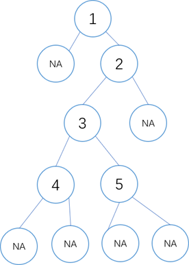


## 3.3.    如何较为直观地打印二叉树

【题目】二叉树可以用三种常用的遍历结果来描述其结构，但是不够直观，尤其是二叉树中有重复值的时候，仅通过三种遍历的结果来构造二叉树的真实结构更是难上加难，有时则根本不可能。给定一棵二叉树的头节点head，已知二叉树节点值的类型为32为整型，请实现一个打印二叉树结构的函数，可以直观地展示树的结构，也便于画出真实的结构。


## 3.4.    二叉树的序列化和反序列化

【题目】二叉树被记录成文件的过程叫做二叉树的序列化，通过文件内容来重建原来二叉树的过程叫做二叉树的反序列化。给定一棵二叉树的头节点head，已知二叉树节点值的类型为32为整型。请设计一种二叉树的序列化和反序列化的方案，并用代码实现。


## 3.5.    遍历二叉树的神级方法

【题目】给定一棵二叉树的头节点head，完成二叉树的先序、中序和后序遍历。如果二叉树的节点数为N，则要求时间复杂度为O(N)，额外的空间复杂度为O(1)。【2020.5.25日之前看到本题】


## 3.6.    在二叉树中找到累加值为指定值的最长路径长度

【题目】给定一棵二叉树的头节点和一个32位整数sum，二叉树节点值类型为整型，求累加和为sum的最长路径长度。路径是指从某个节点往下，每次最多选择一个孩子节点或者不选所形成的节点链。

例如,二叉树如图所示。

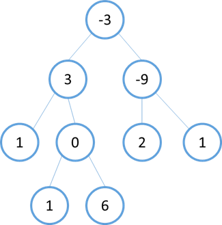

如果sum=6，那么累加和为6的最长路径为：-3,3,0,6，所以返回4.

如果sum=-9，那么累加和为-9的最长路径为：-9，所以返回1.

注：本题不用考虑节点值相加可能溢出的情况。


## 3.7.    找到二叉树中最大搜索二叉子树

【题目】给定一棵二叉树的头节点head，已知其中所有节点的值都不一样，找到含有节点最多的搜索二叉子树，并返回这棵树的头节点。

例如，二叉树如下图左所示，那么这棵树中的最大搜索二叉子树如下图右所示。

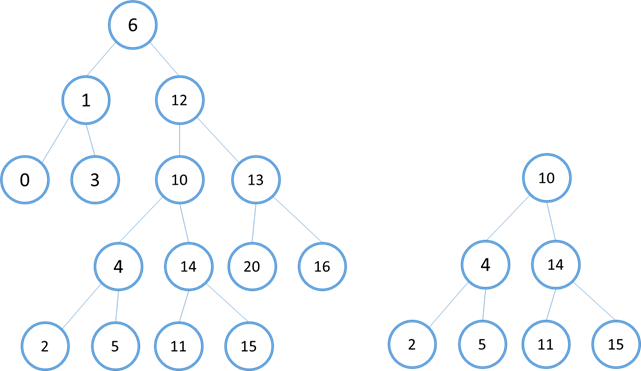

【要求】如果节点数为N，则要求时间复杂度为O(N)，额外空间复杂度为O(h)，h为二叉树的高度。


## 3.8.    找到二叉树中符合搜索二叉树条件的最大拓扑结构

【题目】给定一棵二叉树的头节点head，已知所有节点的值都不一样，返回其中最大的且符合搜索二叉树条件的最大拓扑结构的大小。

例如，二叉树如下图左所示，其中最大的且符合搜索二叉树条件的最大拓扑结构如下图右所示，这个拓扑结构的节点数为8，所以返回8.

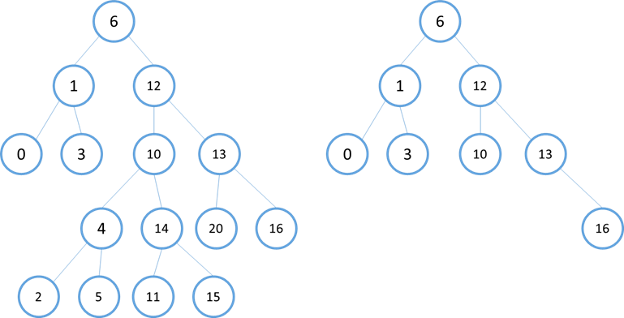

二叉树的按层打印与ZigZag打印

【题目】给定一棵二叉树的头节点head，分别实现按层和ZigZag打印二叉树的函数。例如二叉树如图所示。

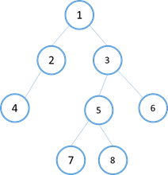

那么按层打印时，输出格式必须如下：

```bash
Level 1: 1

Level 2: 2 3

Level 3: 4 5 6

Level 4: 7 8
```

ZigZag打印时，输出格式必须如下：

```cpp
Level 1 from left to right: 1

Level 2 from right to left: 3 2

Level 3 from left to right: 4 5 6

Level 4 from right to left: 8 7
```


## 3.9.    调整搜索二叉树中两个错误的节点

【题目】一棵二叉树原本是搜索二叉树，但是其中的两个节点调换了位置，使得这棵二叉树不再是搜索二叉树，请找到这两个节点并返回。已知二叉树中所有节点的值都不一样，给定二叉树的头节点head，返回一个长度为2的二叉树节点类型数组errs，errs[0]表示一个错误节点，errs[1]表示另一个错误节点。

【进阶】如果在原问题中得到了这两个错误节点，我们当然可以通过交换两个节点的节点值的方式让整棵二叉树重新成为搜索二叉树。但现在要求你不能这么做，而是在结构上完全交换两个节点的位置，请实现调整函数。


## 3.10.   判断t1树是否包含t2树全部的拓扑结构

【题目】给定彼此独立的两棵树头节点，分别为t1和t2，判断t1树是否包含t2树全部的拓扑结构。例如下图左的t1树包含图右t2树全部的拓扑结构，所以返回true。

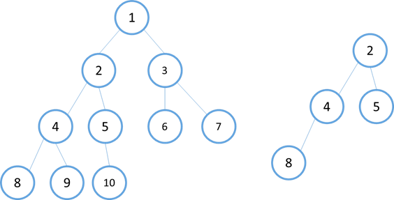


## 3.11.   判断t1树中是否有与t2树拓扑结构完全相同的子树

【题目】给定彼此独立的两棵树头节点，分别为t1和t2，判断t1树中是否有与t2树拓扑结构完全相同的子树。

例如，下图左的t1树有与图右t2树拓扑结构完全相同的子树，所以返回true。

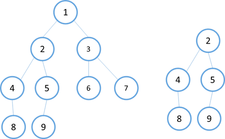

再比如，下图左的t1树没有与图右t2树拓扑结构完全相同的子树，所以返回true。

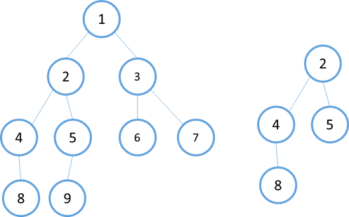


## 3.12.   判断二叉树是否为平衡二叉树

【题目】平衡二叉树的性质为：要么是一棵空树，要么任何一个节点的左右子树高度差的绝对值不超过1。给定一棵二叉树的头节点head，判断这棵二叉树是否为平衡二叉树。

【要求】如果二叉树的节点数为N，要求时间复杂度为O(N)。


## 3.13.   根据后序数组重建搜索二叉树

【题目】给定一个整型数组arr，已知其中没有重复值，判断arr是否可能是节点值类型为整型的搜索二叉树后序遍历的结果。

【进阶】如果整型数组arr中没有重复值，且已知是一棵搜索二叉树后序遍历的结果，通过数组arr重构二叉树。


## 3.14.   判断一棵二叉树是否为搜索二叉树和完全二叉树

【题目】给定二叉树的一个头节点head，已知其中没有重复值的节点，实现两个函数分别判断这棵二叉树是否为搜索二叉树和完全二叉树。


## 3.15.   通过有序数组生成平衡搜索二叉树

【题目】给定一个有序数组sortArr，已知其中没有重复值，用这个有序数组生成一个平衡搜索二叉树，并且该搜索二叉树中序遍历的结果与sortArr一致。


## 3.16.   在二叉树中找到一个节点的后继节点

现在有一种新型的二叉树节点类型如下：

```cpp
class Node {
public:
	Node(int data) {
		this->value = data;
	}

private:
	int value;
	Node *left;
	Node *right;
	Node *parent;
};
```


该结构比普通二叉树结构多了一个指向父节点的指针parent。假设有一颗Node类型的节点组成的二叉树，树中每个节点的parent指针都正确地指向自己的父节点，头节点的parent指向null。只给出一个在二叉树中的某个节点node，请实现返回node的后继节点的函数。在二叉树的中序遍历的结果中，node的下一个节点叫做node的后继节点。

如图所示的二叉树

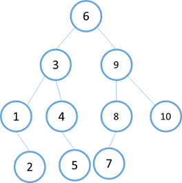

中序遍历结果为：1,2,3,4,5,6,7,8,9,10

所以节点1的后继节点为2，节点2的后继节点为3… … ，节点10的后继节点为null。


## 3.17.   在二叉树中找到两个节点的最近公共祖先

【题目】给定一棵二叉树的头节点head，以及这棵树中的两个节点o1和o2，请返回o1和o2的最近公共祖先节点。例如如下图的二叉树，

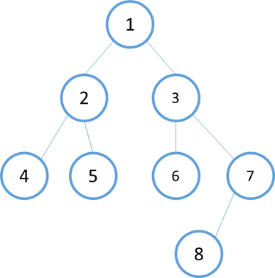

节点4和节点5的最近公共祖先为节点2，节点5和节点2的最近公共祖先节点为节点2，节点6和节点8的最近公共祖先节点为节点3，节点5和节点8的最近公共祖先节点为节点1。

【进阶】如果查询两个节点最近公共祖先的操作十分频繁，想让单次查询的查询时间减少。

【再进阶】给定二叉树的头节点head，同时给定所有想要进行的查询。二叉树的节点数量为N，查询条数为M，请在时间复杂度为O(N+M)内返回所有查询的结果。


## 3.18.   Tarjan算法与并查集进阶二叉树节点间最近公共祖先的批量查询问题

【题目】如下的Node类是标准的二叉树节点结构：

```cpp
class Node {
public:
	Node(int data) {
		this->value = data;
    }

private:
	int value;
	Node *left;
	Node *right;
};
```

再定义Query类如下：

```cpp
class Query {
public:
    Node(Node *o1, Node *o2) {
		this->o1 = o1;
        this->o2 = o2;
	}
    
private:
	Node *o1;
	Node *o2;
};
```

一个Query类的实例表示一条查询语句，表示想要查询o1节点和o2节点的最近公共祖先节点。

给定一棵二叉树的头节点head，并给定所有的查询语句，即一个Query类型的数组Query ques[]，请返回Node类型的数组Node[] ans，ans[i]代表ques[i]这条查询语句的答案，即ques[i].o1和ques[i].o2的最近公共祖先。

【要求】如果二叉树的节点数为N，查询语句的条数为M，整个处理过程的时间复杂度要求达到O(N+M)


## 3.19.   二叉树节点间的最大距离问题

【题目】从二叉树的节点A出发，可以向上走或向下走，但沿途的节点只能经过一次，当到达节点B时，路径上的节点数叫做A到B的距离。

比如图示的二叉树，节点4和节点2的距离为2，节点5和节点6的距离为5.给定一棵二叉树的头节点head，求整棵树上节点间的最大距离。

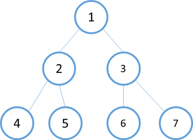

【要求】如果二叉树的节点数为N，时间复杂度要求为O(N)。


## 3.20.   派对的最大快乐

【题目】员工的消息如下：

```cpp
class Employee {
public:
	Node(int data) {
		this->value = data;
	}

private:
	int happy;
	std::list<Employee> subordinates;
};
```


公司的每个员工都符合Employee类的描述。整个公司的人员结构可以看做是一棵标准的、没有环的多叉树。树的头节点是公司的唯一老板，除老板外，每个员工都有唯一的上级。叶节点是没有任何下属的基层员工(subordinates为空)，除了基层员工外，每个员工都有一个或多个直接下级。

这个公司现在要举办派对，你可以决定哪些员工来，哪些员工不来。但是要遵循如下规则：

（1）  如果某个员工来了，那么这个员工的所有直接下级都不能来

（2）  派对的整体快乐值是所有到场的员工快乐值的累加和

（3）  你的目标是让派对的整体快乐值尽量大

给定一个头节点boss，请返回派对的最大快乐值

【要求】如果以boss为头节点的整棵树有N个节点，请做到时间复杂度为O(N)。


## 3.21.   请通过先序和中序数组生成后序数组

【题目】已知一棵二叉树的所有节点值都不同，给定这棵树正确的先序和中序数组，不要重建整棵树，而是通过这两个数组直接生成正确的后序数组。


## 3.22.   统计和生成所有不同的二叉树

【题目】给定一个整数N，如果N<1，代表空树结构，否则代表中序遍历数组的结果为{1,2,3,…,N}。请返回可能的二叉树结构有多少种？

例如，N=-1时，代表空树结构，返回1；N=2时，满足中序遍历为{1,2}的二叉树结构只有图示两种结构，所以返回结果为2.

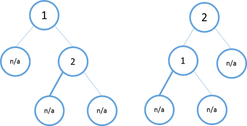

【进阶】N的含义不变，假设可能的二叉树结构有M种，请返回M个二叉树的头节点，每一棵二叉树代表一种可能的结构。


## 3.23.   统计完全二叉树的节点数

【题目】给定一棵完全二叉树的头节点head，请返回这棵树的节点个数。

【要求】如果完全二叉树的节点数为N，请实现时间复杂度低于O(N)的解法。


# 第四章 递归和动态规划

本章共21题


## 4.1.    斐波那契数列问题的递归和动态规划

【题目】给定整数N，返回斐波那契数列的第N项。

【补充问题1】给定整数N，代表台阶数，一次可以跨越2个或1个台阶，返回有多少种走法。

【举例】N=3，可以三次都跨1个台阶；也可以先跨2个台阶，再跨1个台阶；还可以先跨1个台阶，再跨两个台阶。所以有三种走法，返回3。

【补充问题2】假设农场中一头成熟的母牛每年只会生一头小母牛，并且永远不会死。第一年农场只有1头母牛，从第二年开始，母牛开始生小母牛。每头小母牛3年之后成熟又可以生小母牛。给定整数N，求N年后母牛的数量。

【举例】N=6，第1年1头成熟母牛记为a；第2年a母牛生了新的小母牛，记为b，牛的总数为2；第3年a母牛生了新的小母牛，记为c，牛的总数为3；第4年a母牛生了新的小母牛，记为d，牛的总数为4；第5年b成熟了，a和b母牛分别生了新的小母牛，牛的总数为6；第6年c也成熟了，a、b和c分别生了新的小母牛，总牛数为9，返回9。

【要求】对于以上所有问题，请实现时间复杂度为O(logN)的解法。


## 4.2.    矩阵的最小路径和

【题目】给定一个矩阵m，从左上角开始每次只能向右或向下走，最后到达右下角的位置，路径上所有数字累加起来就是路径和，返回所有路径中最小的路径和。

【举例】如果给定的m如下：

1 3 5 9

8 1 3 4

5 0 6 1

8 8 4 0

路径1，3，1，0，6，1，0是所有路径中路径和最小的，所有返回12。


## 4.3.    换钱的最少货币

【题目】给定数组arr，arr中所有的值都为正数且不重复。每个值代表一种面值的货币，每种面值的货币可以使用任意张，再给定一个整数aim，代表要找的钱数，求组成aim的最少货币数。

【举例】

arr=[5,2,3]，aim=20。

4张5元可以组成20元，其他的找钱方案要使用更多张的货币，所所以返回4。

arr=[5,2,3]，aim=0。

不用任何货币就能组成0元，所以返回0。

arr=[3, 3]，aim=2。

根本无法组成2元，钱不能找开的情况下默认返回-1。


## 4.4.    机器人到达指定位置的方法数

【题目】假设有排成一行的N个位置，记为1~N，N一定大于等于2。开始的时候机器人在其中的位置M上（M是1~N中的一个），机器人可以往左走或往右走，如果机器人来到1位置，那么下一步只能来往右走来到2位置；如果机器人来到N位置，那么下一步只能来往左走来到N-1位置。规定机器人必须走K步，最终来的P位置（P也是1~N中的一个）的方法有多少种。给定4个参数N，M，K和P，返回方法数。

【举例】N=5，M=2，K=3，P=3

上面的参数代表所有的位置为1 2 3 4 5.机器人最开始在2位置上，必须经过3步，最后到达3位置。走的方法只有如下3种：

（1）  从2到1，从1到2，从2到3

（2）  从2到3，从3到2，从2到3

（3）  从2到3，从3到4，从4到3

所以返回方法数3.

再比如，N=3，M=1，K=3，P=3

上面的参数代表所有的位置为1 2 机器人最开始在1位置上，必须经过3步，最后到达3位置。因为怎么走都不可能，所以返回方法数0。

【要求】时间复杂度为O(N*K)。


## 4.5.    换钱的方法数

【题目】给定数组arr，arr中所有的值都为正数且不重复。每个值代表一种面值的货币，每种面值的货币可以使用任意张，再给定一个整数aim，代表要找的钱数，求换钱有多少种方法。

【举例】

arr=[5,10,25,1]，aim=0。

组成0元的方法有1种，就是所有面值的货币都不用，所以返回1。

arr=[5,10,25,1]，aim=15。

组成15元的方法有6种，分别为：

（1）    3张5元

（2）    1张10元+1张5元

（3）    1张10元+5张1元

（4）    10张1元+1张5元

（5）    2张5元+5张1元

（6）    15张1元

arr=[3,5]，aim=2。

任何方法都无法组成2元，所以返回0。


## 4.6.    打气球的最大分数

【题目】给定一个数组arr，代表一排有分数的气球。每打爆一个气球就能获得分数，假设打爆气球的分数为X，获得分数的规则如下：

（1）  如果被打爆的气球左边有没被打爆的气球，找到离被打爆气球最近的气球，假设分数为L；如果被打爆的气球右边有没被打爆的气球，找到离被打爆气球最近的气球，假设分数为R。获得分数为L*X*R。

（2）  如果被打爆的气球左边有没被打爆的气球，找到离被打爆气球最近的气球，假设分数为L；如果被打爆气球的右边所有气球都已经被打爆。获得分数为L*X。

（3）  如果被打爆气球的左边所有气球都已经被打爆；如果被打爆的气球右边有没被打爆的气球，找到离被打爆气球最近的气球，假设分数为R；如果被打爆气球的右边所有气球都已经被打爆。获得分数为L*R。

（4）  如果被打爆气球的左边和右边所有气球都已经被打爆。获得分数为X。

目标是打爆所有气球，获得每次打爆的分数。通过选择打爆气球的顺序，可以得到不同的总分数，请返回能得到的最大的分数。

【举例】

arr=[3,2,5]

如果先打爆3，获得3x2；再打爆2，获得2x5；最后打爆5，获得5。最后总分21。

如果先打爆3，获得3x2；再打爆5，获得2x5；最后打爆2，获得2。最后总分18。

如果先打爆2，获得3x2x5；再打爆3，获得3x5；最后打爆5，获得5。最后总分50。

如果先打爆2，获得3x2x5；再打爆5，获得3x5；最后打爆3，获得3。最后总分48。

如果先打爆5，获得2x5；再打爆3，获得3x2；最后打爆2，获得2。最后总分18。

如果先打爆5，获得2x5；再打爆2，获得3x2；最后打爆3，获得3。最后总分19。

能获得的最大分数为50。

【要求】如果arr长度为N，时间复杂度O(N^3)


## 4.7.    最长递增子序列

【题目】给定数组arr，返回arr的最长递增子序列。

【举例】arr=[2,1,5,3,6,4,8,9,7]，返回最长的递增子序列[1,3,4,8,9]。

【要求】如果arr长递为N，请实现时间复杂度为O(NlogN)的方法。


## 4.8.    信封嵌套问题

【题目】给定一个N行2列的二维数组，每一个小数组中的两个值分别代表一个信封的长和宽。如果信封A的长和宽都小于信封B，那么信封A可以放在信封B里面，请返回信封最多嵌套多少层。

【举例】

Matrix = {

{3, 4},

{2, 3},

{4, 5},

{1, 3},

{2, 2},

{3, 6},

{1, 2},

{3, 2},

{2, 4}

}

信封最多可以嵌套4层，从里到外分别是{1,2},{2,3},{3,4},{4,5}，所以返回4。

【要求】时间复杂度为O(NlogN)


## 4.9.    汉诺塔问题

【题目】给定一个整数n，代表汉诺塔中从小到大放置的n个圆盘，假设开始时所有的圆盘都放在左边的柱子上，想按照汉诺塔游戏的要求把所有的圆盘移到右边的柱子上。实现函数打印最优轨迹。

【举例】

n=1时，打印：

move from left to right

n=2时，打印：

move from left to mid

move from left to right

move from mid to right

【进阶问题】给定一个整形数组arr，其中只含有1、2和3，代表所有圆盘目前的状态，1代表左柱，2代表中柱，3代表右柱，arr[i]的值代表第i+1个圆盘的位置。比如，arr=[3,3,2,1]，代表第一个圆盘在右柱上，第二个圆盘在右柱上，第三个圆盘在中柱上，第四个圆盘在左柱上。如果arr代表的状态是最优移动轨迹过程中出现的状态，返回arr这种状态是最优移动轨迹中的第几个状态。如果arr代表的状态不是最优移动轨迹过程中出现的状态，则返回-1。

【举例】

arr=[1,1]。两个圆盘目前都在左柱上，也就是初始状态，所以返回0。

arr=[2,1]。第一个圆盘在中柱上、第二个圆盘在左柱上，这个状态是2个圆盘的汉诺塔游戏中最优移动轨迹的第1步，所以返回1。

arr=[3,3]。第一个圆盘在中柱上、第二个圆盘在右柱上，这个状态是2个圆盘的汉诺塔游戏中最优移动轨迹的第3步，所以返回3。

arr=[2,2]。第一个圆盘在中柱上、第二个圆盘在中柱上，这个状态是2个圆盘的汉诺塔游戏中最优移动轨迹从来不会出现的状态，所以返回-1。

【进阶】如果arr长度为N，请实现时间复杂度为O(N)、额外空间复杂度为O(1)的方法。


## 4.10.   最长公共子序列问题

【题目】给定两个字符串str1和str2，返回两个字符串的最长公共子序列。

【举例】

Str1=”1A2C3D4B56”，str2=”B1D23CA45B6A”。

“123456”或者”12C4B6”都是最长公共子序列，返回哪一个都行。


## 4.11.   最长公共子串问题

【题目】给定两个字符串str1和str2，返回两个字符串的最长公共子串。

【举例】

Str1=”1AB2345CD”，str2=”12345EF”，返回”2345”

【要求】如果str1长度为M，str2长度为N，实现时间复杂度为O(M*N)，额外空间复杂度为O(1)的方法。


## 4.12.   子数组异或和为0的最多划分

【题目】数组异或和的定义：把数组中所有的数异或起来得到的值。

给定一个整形数组arr，其中可能有正、有负、有零。你可以随意把整个数组切成若干个不相容的子数组，求异或和为0的子数组最多有多少个？

【举例】

arr=[3,2,1,9,0,7,0,2,1,3]

把数组分割成{3,2,1}、{9}、{0}、{7}、{0}、{2,1,3}是最优分割，因为其中{3,2,1}、{0}、{0}、{2,1,3}这四个子数组的异或和为0，并且是所有分割方案中，能切出最多异或和为0的子数组的方案，返回4。

【要求】如果arr长度为N，时间复杂度为O(N)。


## 4.13.   最小编辑代价

【题目】给定两个字符串str1和str2，再给定三个整数ic、dc和rc，分别代表插入、删除和替换一个字符的代价，返回将str1编辑成str2的最小代价。

【举例】

str1=”abc”，str2=”adc”，ic=5，dc=3，rc=2。

从”abc”编辑成”adc”，把’b’替换成’d’是代价最小的，所以返回2。

str1=”abc”，str2=”adc”，ic=5，dc=3，rc=100。

从”abc”编辑成”adc”，先删除’b’，然后插入’d’是代价最小的，所以返回8。

str1=”abc”，str2=”abc”，ic=5，dc=3，rc=2。

不用编辑了，本来就是一样的字符串，所以返回0。


## 4.14.   字符串的交错组成

【题目】给定三个字符串str1、str2和aim，如果aim包含且仅包含来自str1和str2的所有字符串，而且在aim中属于str1的字符之间保持原来在str1中的顺序，属于str2的字符之间保持原来在str2中的顺序，那么称aim是str1和str2的交错组成。实现一个函数，判断aim是否是str1和str2交错组成。

【举例】str1=”AB”，str2=”12”。那么”AB12”、”A1B2”、”A12B”、”1A2B”和”1AB2”等都是str1和str2的交错组成。


## 4.15.   龙与地下城游戏问题

【题目】给定一个二维数组map，含义是一张地图，例如，如下矩阵：

-2 -3 3

-5 -10 1

0 30 -5

游戏的规则如下：

（1）  骑士从左上角出发，每次只能向右或向下走，最后到达右下角见到公主

（2）  地图中每个位置的值代表骑士要遭遇的事情。如果是负数，说明此处有怪兽，要让骑士损失血量。如果是非负数，代表此处有血瓶，能让骑士回血。

（3）  骑士从左上角到右下角的过程中，走到任何一个位置时，血量都不能少于1。

为了保证骑士能见到公主，初始血量至少是多少？根据map，返回初始血量。


## 4.16.   数字字符串转换为字母组合的种数

【题目】给定一个字符串str，str全部有数字字符组成。如果str中某一个或某相邻两个字符组成的子串值在1~26之间，则这个子串可以转换为一个字母。规定”1”转换为”A”，”2”转换为”B”，”3”转换为”C”，…，”26”转换为”Z”。写一个函数，求str有多少种不同的转换结果，并返回种数。

【举例】

str=”1111”。

能转换出的结果有”AAAA”、”LAA”、”ALA”、”AAL”和”LL”，返回5。

str=”01”。

“0”没有对应的字母，而”01”根据规定不可转换，返回0。

str=”10”。

能转换出的结果是”J”，返回1。


## 4.17.   表达式得到期望结果的组成种数

【题目】给定一个只由0（假）、1（真）、&（逻辑与）、|（逻辑或）和^（异或）五种字符组成的字符串express，再给定一个布尔值desired。返回express能有多少种组合方式，可以达到desired的结果。

【举例】

express=”1^0|0|1”，desired=false。

只有1^((0|0)|1)和1^(0|(0|1))的组合可以得到false，返回2.

express=”1”，desired=false

无组合可以得到false，返回0。


## 4.18.   排成一条线的纸牌博弈问题

【题目】给定一个整形数组arr，代表数值不同的纸牌排成一条先。玩家A和玩家B依次拿走每张纸牌，规定玩家A先拿，玩家B后拿，但是每个玩家每次只能拿走最左或最右的纸牌，玩家A和玩家B都聪明绝顶。请返回最后获胜者的分数。

【举例】

arr=[1,2,100,4]

开始时，玩家A只能拿走1或4。如果玩家拿走1，则排列变为[2,100,4]，接下来玩家B可以拿走2或4，然后继续轮到玩家A。如果开始时玩家A拿走4，则排列变为[1,2,100]，接下来玩家B可以拿走1或100，然后继续轮到玩家A。玩家A作为聪明绝顶的人不会先拿4，因为拿走4之后，玩家B会拿走100。所以玩家A会先拿走1，让排列变为[2,100,4]，接下来玩家B不管怎么选，100都会被玩家A拿走。玩家A会获胜，分数为101。。所以返回101。

arr=[1,100,2]

开始时，玩家A不管拿走1还是2，玩家B作为聪明绝顶的人，都会把100拿走。玩家B会获胜，分数为100。所以返回100。


## 4.19.   跳跃游戏

【题目】规定数组arr，arr[i]==k代表可以从位置i向右跳1~k个距离。比如，arr[2]==3，代表可以从位置2跳到位置3、位置4或者位置5。如果从位置0出发，返回最少跳几次能跳到arr最后的位置上。

【举例】

arr=[3,2,3,1,1,4]。

arr[0]==3，选择跳到位置2；arr[2]==3，可以跳到最后的位置。所以返回2。

【要求】如果arr长度为N，要求实现时间复杂度为O(N)、额外空间复杂度为O(1)的方法。


## 4.20.   数组种的最长连续序列

【题目】给定无序数组arr，返回其中最长的联系序列的长度

【举例】

Arr=[100,4,200,1,3,3]，最长的连续序列为[1,2,3,4]，所以返回4。


## 4.21.   N皇后问题

【题目】N皇后问题是指在NxN的棋盘上摆N个皇后，要求任何两个皇后不同行、不同列，也不在同一条斜线上。给定一个整数n，返回n皇后的摆法有多少种。

【举例】

N=1，返回1。

N=2或3，2皇后和3皇后问题无论怎么摆都不行，返回0。

N=8，返回92。


# 第五章 字符串问题

本章共25题


## 5.1.    判断两个字符串是否互为变形词

【题目】给定两个字符串str1和str2，如果str1和str2中出现的字符种类一样且每种字符出现的次数也一样，那么str1和str2互为变形词。请实现函数判断两个字符串是否互为变形词。

【举例】

str1=”123”，str2=”231”，返回true

str1=”123”，str2=”2331”，返回false


## 5.2.    判断两个字符串是否互为旋转词

【题目】如果一个字符串为str，把字符串str前面任意的部分挪到后面形成的字符串叫做str的旋转词。比如str=”12345”，str的旋转词有”12345”、 ”23451”、 ”34512”、 ”45123”和 ”51234”。给定两个字符串a和b，请判断a和b是否互为旋转词。

【举例】

a=”cdab”，b=”abcd”，返回true。

a=”1ab2”，b=”ab12”，返回false。

a=”2ab1”，b=”ab12”，返回true。

【要求】如果a和b的长度不一样，那么a和b必然不互为旋转词，可以直接返回false。当a和b长度一样，都为N时，要求解法的时间复杂度为O(N)。


## 5.3.    将整数字符串转成整数值

【题目】给定一个字符串str，如果str符合日常书写的整数形式，并且属于32位整数的范围，返回str所代表的整数值，否则返回0。

【举例】

str=”123”，返回123。

str=”023”，因为”023”不符合日常的书写习惯，所以返回0。

str=”A13”，返回0。

str=”0”，返回0。

str=”2147483647”，返回2147483647。

str=”2147483648”，因为溢出了，所以返回0。

str=”-123”，返回-123。


## 5.4.    字符串的统计字符串

【题目】给定一个字符串str，返回str的统计字符串。例如，”aaabbadddffc”的统计字符串为”a_3_b_2_a_1_d_3_f_2_c_1”。

【补充问题】给定一个字符串的统计字符串cstr，再给定一个整数index，返回cstr所代表的原始字符串上第index个字符。例如”a_1_b_100”所代表的原始字符串上第0个字符是’a’，第50个字符是’b’。


## 5.5.    判断字符数组中所有的字符是否都只出现过一次

【题目】给定一个字符类型数组chas[]，判断chas中所有的字符是否都只出现过一次，请根据以下两种要求实现两个函数。

【举例】

chas=[‘a’, ‘b’, ‘c’]，返回true

chas=[‘1’, ‘2’, ‘1’]，返回false

【要求】

（1）  实现时间复杂度为O(N)的方法。

（2）  在保证额外空间复杂度为O(1)的前提下，请实现时间复杂度尽量低的方法。


## 5.6.    在有序但含有空的数组中查找字符串

【题目】给定一个字符串数组strs[]，在strs中有些位置为null

，但在不为null的位置上，其字符串是安装字典顺序从小到大依次出现的。再给定一个字符串str，请返回str再strs中出现的最左的位置。

【举例】

strs=[null, “a”, null, “a”, null, “b”, null, “c”]，str=”a”，返回1。

strs=[null, “a”, null, “a”, null, “b”, null, “c”]，str=null，只要str为null，就返回-1。

strs=[null, “a”, null, “a”, null, “b”, null, “c”]，str=”d”，返回-1。


## 5.7.    字符串的调整与替换

【题目】给定一个字符类型的数组chas[]，chas右半区全是空字符，左半区不含空字符。现在想将左半区中所有的空格字符替换成”%20”，假设chas右半区足够大，可以满足替换所需要的空间，请完成替换函数。

【举例】如果把chas的左半区看作字符串，为”a b c”，假设chas的右半区足够大。替换后，chas的左半区为”a%20b%20%20c”。

【要求】替换函数的时间复杂度为O(N)，额外空间复杂度为O(1)。

【补充问题】给定一个字符类型的数组chas[]，其中只含有数字字符和”*”字符。现在想把所有的”*”挪到chas的左边，数字字符挪到chas

的右边。请完成调整函数。

【举例】如果把chas看作字符串，为”12**345”。调整后chas为”**12345”。

【要求】（1）调整函数的时间复杂度为O(N)，额外空间复杂度为O(1)（2）不得改变数字字符从左到右出现的顺序


## 5.8.    翻转字符串

【题目】给定一个字符类型的数组chas，请在单词间做逆序调整。只要做到单词顺序的逆序即可，对空格的位置没有特别要求。

【举例】

如果把chas看作字符串为”dog loves pigs”，调整成”pig loves dog”。

如果把chas看作字符串为”I’m a student.”，调整成”student. a I’m”。

【补充问题】给定一个字符类型的数组chas和一个整数size，请把大小为size的左半区整体移到右半区，把右半区移到左边。

【举例】

如果把chas看作字符串为”ABCDE”，size=3，调整成”DEABC”。

【要求】如果chas长度为N，两道题要求时间复杂度为O(N)，额外空间复杂度为O(1)。


## 5.9.    完美洗牌问题

【题目】给定一个长度为偶数的数组arr，长度记为2*N，前N个为左部分，后N个为右部分。arr就可以表示为{L1, L2, L3, …, LN, R1, R2, R3, …, RN}，请将数组调整成{R1, L1, R2, L2, R3, L3, …, RN, LN}的样子。

【举例】

arr={1,2,3,4,5,6}，调整之后为{4,1,5,2,6,3}。

【进阶】给定一个数组arr，请将数组调整为依次相邻的数字总是先<=，再>=的关系，并交替下去。比如数组中有五个数字，调整为{a,b,c,d,e}，使之满足a<=b>=c<=d>=3。

【要求】

原问题要求时间复杂度为O(N)，额外空间复杂度为O(1)。

进阶问题要求时间复杂度为O(NlogN)，额外空间复杂度为O(1)。


## 5.10.   删除多余字符得到字典序最小的字符串

【题目】给定一个全是小写字母的字符串str，删除多余字符，使得每种字符只保留一个，并让最终结果字符串的字典序最小。

【举例】

str=”acbc”，删掉一个’c’，得到”abc”，是所有结果字符串中字典序最小的。

str=”dbcacbca”，删掉第一个’b’、第一个’c’、 第二个’c’、 第二个’a’，得到”dabc”，是所有结果字符串中字典序最小的。


## 5.11.   数组中两个字符串的距离

【题目】给定一个字符串数组strs，再给定两个字符串str1和str2，返回在strs中str1和str2的最小距离，如果str1或str2为null，或不在strs中，返回-1.

【举例】

strs=[“1”, “3”, “3”, “3”, “2”, “3”, “1”]，str1=”1”，str2=”2”，返回2.

strs=[“CD”]，str1=”CD”，str2=”AB”，返回-1.

【进阶】如果查询发生的次数有很多，如何把每次查询的时间复杂度降为O(1)？


## 5.12.   字符串的转换路径问题

【题目】给定两个字符串，记为start和to，再给定一个字符串列表list，list中一定包含to，list中没有重复字符串。所有的字符串都是小写的。规定start每次只能改变一个字符，最终目标是彻底变成to，但是每次变成的新字符串必须在list中存在。请返回所有的变换路径中最短的变换路径。

【举例】

start=”abc”, end=”cab”, list={“cab”, “acc”, “cbc”, “ccc”, “cac”, “cbb”, “aab”, “abb”}

转换路径的方法有很多种，但所有最短的转换路径如下：

abc à abb à aab à cab

abc à abb à cbb à cab

abc à cbc à cac à cab

abc à cbc à cbb à cab


## 5.13.   添加最少字符使字符串整体都是回文字符串

【题目】给定一个字符串str，如果可以在str的任意位置添加字符，请返回在添加字符最少的情况下，让str整体都是回文字符串的一种结果。

【举例】

str=”ABA”。str本身就是回文串，不需要添加字符，所以返回”ABA”。

str=”AB”。可以在’A’之前添加’B’，使str整体都是回文字符串，故可以返回”BAB”。 也可以在’B’之前添加’A’，使str整体都是回文字符串，故也可以返回”ABA”。总之，只要添加的字符最少，返回其中的一种结果即可。

【进阶】给定一个字符串str，再给定str的最长回文子序列字符串strlps，请返回在添加最少字符的情况下，让str整体都是回文字符串的一种结果。进阶问题比原问题多了一个参数，请做到时间复杂度比原实现低。

【举例】

str=”A1B21C”，strlps=”121”，返回”AC1B2B1CA”或者”CA1B2B1AC”。 总之，只要添加的字符最少，返回其中的一种结果即可。


## 5.14.   括号字符串的有效性和最长有效长度

【题目】给定一个字符串str，判断是不是整体有效的括号字符串。

【举例】

str=”()”，返回true；str=”(()())”，返回true；str=”(())”，返回true。

str=”())”，返回false；str=”()(”，返回false；str=”()a()”，返回false。

【进阶】给定一个括号字符串str，返回最长的有效括号字符子串。

【举例】

str=”(()())”，返回6；str=” ())”，返回2；str=”()(()()(”，返回4。


## 5.15.   公式字符串求值

【题目】给定一个字符串str，str表示一个公式，公式里可能有整数、加减乘除符号和左右括号，返回公式的计算结果。

【举例】

str=”48*((70-65)-43)+8*1”，返回-1816。

str=”3+1*4”，返回7。

str=”3+(1*4)”，返回7。

【说明】

（1）    可以认为给定的字符串一定是正确有效的公式，即不需要对str做公式的有效性检查

（2）    如果是负数，就需要用括号括起来，比如”4*(-3)”。但如果负号作为公式的开头或括号部分的开头，则可以没有括号，比如”-3*4”和”(-3*4)”都是合法的。

（3）    不用考虑计算过程中可能发生的溢出情况。


## 5.16.   0左边必有1的二进制字符串数量

【题目】给定一个整数N，求”0”字符和”1”字符组成的长度为N的所有字符串中，满足”0”字符左边必有”1”字符的字符串数量。

【举例】

N=1，只由”0”字符和”1”字符组成，长度为1的所有字符串：”0”、”1”。只有字符串”1”满足要求，所以返回1。

N=2，只由”0”字符和”1”字符组成，长度为2的所有字符串：”00”、”01”、 ”10”、”11”。只有字符串”10”和”11”满足要求，所以返回2。

N=3，只由”0”字符和”1”字符组成，长度为3的所有字符串：”000”、”001”、 ”010”、”011”、 ”100”、”101”、 ”110”、”111”。字符串”101” 、 ”110”和”111”满足要求，所以返回3。


## 5.17.   拼接所有字符串产生字典序最小的大写字符串

【题目】给定一个字符串类型的数组strs，请找到一种拼接顺序，使得所有的字符串拼接起来组成的大写字符串是所有可能性中字典序最小的，并返回这个大写字符串。

【举例】

str=[“abc”, “de”]，可以拼接成“abcde”，也可以拼接成“deabc”，但是前者的字典序更小，所以返回“abcde”。

str=[“b”, “ba”]，可以拼接成“bba”，也可以拼接成“bab”，但是后者的字典序更小，所以返回“bab”。


## 5.18.   找到字符串的最长无重复字符子串

【题目】给定一个字符串str，返回str的最长无重复字符子串的长度

【举例】

str=”abcd”，返回4。

str=”aabcb”，最长无重复字符子串为”abc”，返回3。

【要求】如果str的长度为N，请实现时间复杂度为O(N)的方法。


## 5.19.   找到指定的新类型字符

【题目】新类型字符的定义如下：

（1）  新类型字符的长度是1或2的字符串。

（2）  表现形式可以仅是小写字母，例如，”e”；也可以是大写字母+小写字母，例如，”Ab”；还可以是大写字母+大写字母，例如，”DC”。

现在给定一个字符串str，str一定是若干新类型字符串正确组合的结果。比如”eaCCBi”，由新类型字符”e”， ”a”， ”CC”和”Bi”拼成。再给定一个整数k，代表str中的位置。请返回被k位置所指定的新类型字符。

【举例】

str=”aaABCDEcBCg”。

k=7，返回”Ec”。

k=4，返回”CD”。

k=10，返回”g”。


## 5.20.   旋变字符串问题

【题目】一个字符串可以分解成多种二叉树结构。如果str的长度为1，认为不可分解；如果str的长度为N（N>1），左部分长度可以为1~N-1，剩下的为右部分的长度。左部分和右部分都可以按照同样的逻辑，继续分解。形成的所有结构都是str的二叉树结构。比如，字符串”abcd”，可以分解成五种结构，分别如下图所示。

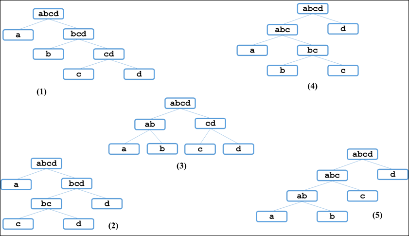

任何一个str的二叉树结构中，如果两个节点有共同的父节点，那么这两个节点就可以交换位置，这两个节点叫作一个交换组。一个结构会有很多交换组，每个交换组都可以选择交换或者不交换，最终形成一个新的结构，这个新结构所代表的字符串叫作str的旋变字符串。比如上面图**(5)**中的交换组有a和b，ab和c，abc和d，如果让a和b的组交换，让ab和c的组不交换，让abc和d组交换，形成的结构如下图

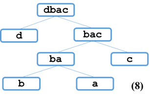

这个新结构所代表的字符串为”dbac”，叫作”abcd”的旋变字符串。也就是说，一个字符串的旋变字符串是非常多的，str可以形成很多种结构，每一种结构都有很多交换组，每一个交换组都可以选择交换或者不交换，形成的每一个新的字符串都叫作str的旋变字符串。

给定两个字符串str1和str2，判断str2是不是str1的旋变字符串。

【要求】str1和str2的长度为N，时间复杂度做到O(N^4)。


## 5.21.   最小包含子串的长度

【题目】给定字符串str1和str2，求str1所有子串中含有str2所有字符的最小子串长度。

【举例】

str1=”abcde”，str2=”ac”。因为”abc”包含str2所有的字符，并且在满足这一条件的str1 的所有子串中，”abc”是最短的，返回3。

str1=”12345”，str2=”344”。最小包含子串不存在，返回0。


## 5.22.   回文最小分割数

【题目】给定一个字符串str，返回把str全部切成回文子串的最小分割数。

【举例】

str=”ABA”。不需要切割，str本身就是回文串，所以返回0。

str=”ACDCDCDAD”。最少需要切2次变成3个回文串，比如”A”、”CDCDC”和”DAD”，所以返回2。


## 5.23.   字符串匹配问题

【题目】给定字符串str，其中绝对不含有字符”.”和”*”。再给定字符串exp，其中可以含有”.”或”*”，”*”字符不能是exp的首字符，并且任意两个”*”不相邻。exp中的”.”代表任意一种字符，exp中的”*”表示”*”的前一个字符可以有0个或者多个。请写一个函数，判断str是否能被exp匹配。

【举例】

str=”abc”，exp=”abc”，返回true。

str=”abc”，exp=”a.c”， exp中的”.”可以代表任意一种字符，所以返回true。

str=”abcd”，exp=”.*”， exp中的”*”前一个字符是”.”，所以可以表示任意数量的”.”字符，当exp是”….”时与”abcd”匹配，所以返回true。

str=””，exp=”..*”， exp中的”*”前一个字符是”.”，可表示任意数量的”.”字符，但是”.*”前还有一个”.”字符，该字符不受”*”影响，所以str起码有一个字符才能被exp匹配。所以返回false。


## 5.24.   字典树（前缀树）的实现

【题目】字典树又称为前缀树或Trie树，是处理字符串常见的数据结构。假设组成所有单词的字符仅是”a”~”z”，请实现字典树的结构，并包含以下四个主要功能：

（1）  void insert(std::string word)：添加word，可重复添加。

（2）  void delete(std::string word)：删除word，如果word添加过多次，仅删除一次。

（3）  bool search(std::string word)：查询word是否在字典树中。

（4）  int prefixNumber(std::string pre)：返回以字符串pre为前缀的单词数量。


## 5.25.   子数组的最大异或和

【题目】数组异或和的定义：把数组中所有的数异或起来得到的值。

给定一个整型数组arr，其中可能有正、有负、有零，求其中子数组的最大异或和。

【举例】

arr={3}，数组只有一个数，所以只有一个子数组，就是这个数组本身，最大异或和为3。

arr={3,-28,-29,2}，子数组有很多，但是{-28,-29}这个子数组的异或和为7，是所有子数组中最大的。

【要求】如果arr长度为N，时间复杂度O(N)。


# 第六章 大数据和空间限制

本章共六6题


## 6.1.    认识布隆过滤器

【题目】不安全网页的黑名单包含100亿个黑名单网页，每个网页的URL最多占用64B。现在想要实现一个网页过滤系统，利用该系统可以根据网页的URL判断该网页是否在黑名单上，请设计该系统。

【要求】

（1）  该系统允许有万分之一以下的判断失误率

（2）  使用的额外空间不要超过30GB


## 6.2.    只用2GB内存在20亿个整数中找到出现次数最多的数

【题目】有一个包含20亿个全是32位整数的大文件，在其中找到出现次数最多的数。

【要求】

内存限制为2GB


## 6.3.    40亿个非负整数中找到未出现的数

【题目】32位无符号整数的范围是0~4294967295，现在有一个正好包含40亿个无符号整数的文件，所以在整个范围中必然有未出现过的数。最多可以使用1GB内存，怎么找到所有未出现过的数？

【进阶】内存限制为10MB，但是只用找到一个未出现过的数即可。


## 6.4.    找到100亿个URL中重复的URL以及搜索词汇的Top K问题

【题目】有一个包含100亿个URL的大文件，假设每个URL占用64B，请找出其中所有重复的URL。

【补充问题】某搜索公司一天的搜索词汇是海量的（百亿数据量），请设计一种求出每天热门Top100词汇的可行办法。


## 6.5.    40亿个非负整数中找到出现两次的数和所有数的中位数

【题目】32位无符号整数的范围是0~4294967295，现在有40亿个无符号整数，最多可以使用1GB内存，找到所有出现了两次的数。

【补充问题】最多可以使用10MB内存，怎么找到这40亿个整数的中位数？


## 6.6.    一致性哈希算法的原理

【题目】工程师经常使用服务器集群来实现和设计数据缓存，以下是常见的策略：

（1）  无论是添加、查询还是删除数据，都先将数据的id通过哈希函数转换成一个哈希值，记为key。

（2）  如果目前机器有N台，则计算key%N的值，这个值就是该数据所属的机器编号，无论是添加、查询还是删除操作，都只在这台机器上进行。

请分析这种缓存方案可能带来的问题，并提出改进的方案。


## 6.7.    岛问题

【题目】给定一个二维数组matrix，其中只有0和1两种值，每个位置都与其上下左右相邻。如果一堆1可以连成一片，这片区域叫作一个岛。返回matrix中岛的数量。

【举例】

maxtrix =

1 0 1 1

1 0 1 1

0 0 0 0

1 0 1 0

返回4。

maxtrix =

1 1 1 0

1 1 0 1

返回2。最右下角1不与左上角的岛相邻，是单独的一个岛。

maxtrix =

1 1 1 1 1 1 1 1

1 0 0 0 0 0 0 1

1 0 1 1 1 1 1 1

1 0 1 0 0 0 0 0

1 0 1 1 1 1 1 1

1 0 0 0 0 0 0 1

1 1 1 1 1 1 1 1

返回1。

【进阶】一般来讲，代码面试题目默认的解法都是单线程的，或者使用串行函数的方式。那么如果原问题给定的matrix规模巨大，一般实现的方法会用一个CPU来计算出结果，时间就非常长。如果你哟多个CPU，或者多个计算单元，请设计一种并行算法来解决这个问题，当matrix规模巨大时，任务是可以并行执行的，时间不会太长。


# 第七章 位运算

本章共7题

## 7.1.    不用额外变量交换两个整数的值

【题目】如何不用任何额外变量交换两个整数的值？


## 7.2.    不用做任何比较判断找出两个数中较大的数

【题目】给定两个32位整数a和b，返回a和b中较大的。

【要求】不用做任何比较判断


## 7.3.    只用位运算不用算术运算实现整数的加减乘除运算

【题目】给定两个32位整数a和b，可正、可负、可零。不能使用算术运算符，分别实现a和b的加减乘除运算。

【要求】如果给定的a和b执行加减乘除的某些结果本来就会导致数据的溢出，那么你实现的函数不必对那些结果负责。


## 7.4.    整数的二进制数表达中有多少个1

【题目】给定一个32位整数n，可正、可负、可零。返回该整数二进制数表达中1的个数。


## 7.5.    在其他数都出现偶数次的数组中找到出现奇数次的数

【题目】给定一个整型数组arr，其中只有一个数出现了奇数次，其他的数都出现的了偶数次，打印这个数。

【进阶】有两个数出现了奇数次，其他的数都出现的了偶数次，打印这个数。

【要求】时间复杂度为O(N)，额外空间复杂度为O(1)。


## 7.6.    在其他数都出现k次的数组中找到只出现一次的数

【题目】给定一个整型数组arr和一个大于1的整数k。已知arr中只有一个数出现了1次，其他的数都出现了k次，返回只出现了一次的数。

【要求】时间复杂度为O(N)，额外空间复杂度为O(1)。


# 第八章 数组和矩阵问题

本章共31题


## 8.1.    转圈打印矩阵

【题目】给定一个整型矩阵matrix，请按照转圈的方式打印它。例如，

maxtrix =

1 2 3 4

5 6 7 8

9 10 11 12

13 14 15 16

打印结果为1,2,3,4,8,12,16,15,14,13,9,5,6,7,11,10

【要求】额外空间复杂度为O(1)。


## 8.2.    将正方形矩阵顺时针转动90°

【题目】给定一个NxN的矩阵matrix，把这个矩阵调整成顺时针转动90°之后的形式。例如

maxtrix =

1 2 3 4

5 6 7 8

9 10 11 12

13 14 15 16

顺时针转动90°之后为：

maxtrix =

13 9 5 1

14 10 6 2

15 11 7 3

16 12 8 4

【要求】额外空间复杂度为O(1)。


## 8.3.    “之”字形打印矩阵

【题目】给定一个矩阵，按照“之”字形的方式打印这个矩阵，例如：

maxtrix =

1 2 3 4

5 6 7 8

9 10 11 12

“之”字形打印的结果为：1,25,9,6,3,4,7,10,11,8,12。

【要求】额外空间复杂度为O(1)。


## 8.4.    找到无序数组中最小的k个数

【题目】给定一个无序的整型数组arr，找到其中最小的k个数。

【要求】如果数组arr的长度为N，排序之后自然可以得到最小的k个数，此时时间复杂度与排序的时间复杂度相同，均为O(NlogN)。本题要求实现时间复杂度分别为O(Nlogk)和O(N)的方法。


## 8.5.    需要排序的最短子数组长度

【题目】给定一个无序数组arr，求出需要排序的最短子数组长度。例如，arr=[1,5,3,4,2,6,7]，返回4，因为只有[5,3,4,2]需要排序。


## 8.6.    在数组中找到出现次数大于N/K的数

【题目】给定一个整型数组arr，打印其中出现次数大于一半的数，如果没有这样的数，打印提示信息。

【进阶问题】给定一个整型数组arr，再给定一个整数K，打印其中所有出现次数大于N/K的数，如果没有这样的数，打印提示信息。

【要求】原问题要求时间复杂度为O(N)，额外空间复杂度为O(1)。进阶问题要求时间复杂度为O(NxK)，额外空间复杂度为O(K)。


## 8.7.    在行列都排好序的矩阵中找指定的数

【题目】给定一个NxM的整型矩阵数组matrix和一个整数K，matrix的每一行和每一列都是排好序的。实现一个函数，判断K是否在matrix中。例如：

maxtrix =

0 1 2 5

2 3 4 7

4 4 4 8

5 7 7 9

如果K为7，返回true；如果K为6，返回false。

【要求】时间复杂度为O(N+M)，额外空间复杂度为O(1)。


## 8.8.    最长的可整合的子数组的长度

【题目】先给出可整合数组的定义：如果一个数组再排序之后，每相邻两个数差的绝对值都小于1，则该数组为可整合数组。例如，[5,3,4,6,2]排序之后为[2,3,4,5,6]，符合每相邻两个数差的绝对值都小于1，所以这个数组为可整合数组。

给定一个整型数组arr，请返回其中最大可整合子数组的长度。例如，[5,5,3,2,6,4,3]的最大可整合数组为[5,3,2,6,4]，所以返回5。


## 8.9.    不重复打印排序数组中相加和为给定值的所有二元组和三元组

【题目】给定排序数组arr和整数k，不重复打印arr中所有相加和为k的不降序二元组。例如，arr=[-8,-4,-3,0,1,2,4,5,8,9]，k=10，打印结果为：

1,9

2,8

【补充问题】给定排序数组arr和整数k，不重复打印arr中所有相加和为k的不降序三元组。例如，arr=[-8,-4,-3,0,1,2,4,5,8,9]，k=10，打印结果为：

-4,5,9

-3,4,9

-3,5,8

0,1,9

0,2,8

1,4,5


## 8.10.   未排序正数数组中累加和为给定值的最长子数组长度

【题目】给定一个数组arr，该数组无序，但每个值均为正数，再给定一个正数k。求arr的所有子数组中所有元素相加和为k的最长子数组长度。

例如，arr=[1,2,1,1,1]，k=3.

累加和为3的最长子数组为[1,1,1]，所以结果返回3。


## 8.11.   未排序数组中累加和为给定值的最长子数组系列问题

【题目】给定一个无序数组，其中元素可正、可负、可零。给定一个整数k，求arr所有子数组中累加和为k的最长子数组长度。

【补充问题1】给定一个无序数组，其中元素可正、可负、可零。给定一个整数k，求arr所有子数组中正数和负数个数相等的最长子数组长度。

【补充问题2】给定一个无序数组，其中元素只是1或0。求arr所有子数组中0和1个数相等的最长子数组长度。

【提示】

s[i]=∑arr[0…i], s[j]=∑arr[0…j], 所以s[i]-s[j]=∑arr[j+1…i]。

 

## 8.12.   未排序数组中累加和小于或等于给定值的最长子数组长度

【题目】给定一个无序数组，其中元素可正、可负、可零。给定一个整数k，求arr所有子数组中累加和小于或等于k的最长子数组长度。

例如，arr=[3,-2,-4,0,6]，k=-2，相加和小于等于-2的最长子数组为{3,-2,-4,0}，所以结果返回4。

【要求】实现出时间复杂度为O(N)的方法。


## 8.13.   计算数组的小和

【题目】数组小和的定义如下：

例如，数组s=[1,3,5,2,4,6]，在s[0]的左边小于或等于s[0]的数的和为0；在s[1]的左边小于或等于s[1]的数的和为1；在s[2]的左边小于或等于s[2]的数的和为1+3=4；在s[3]的左边小于或等于s[3]的数的和为1；在s[4]的左边小于或等于s[4]的数的和为1+3+2=6；在s[5]的左边小于或等于s[5]的数的和为1+3+5+2+4=15。所以s的小和为0+1+4+1+6+15=27。

给定一个数组s，实现函数返回s的小和。


## 8.14.   自然数数组的排序

【题目】给定一个长度为N的整型数组arr，其中有N个互不相等的自然数1~N。请实现arr的排序，但是不要把下标0~N-1位置上的数通过直接赋值的方式替换成1~N。

【要求】时间复杂度为O(N)，额外空间复杂度为O(1)。


## 8.15.   奇数下标都是奇数或者偶数下标都是偶数

【题目】给定一个长度不小于2的数组arr，实现一个函数调整arr，要么让所有的偶数下标都是偶数，要么让所有的奇数下标都是奇数。

【要求】如果arr的长度为N，函数要求时间复杂度为O(N)，额外空间复杂度为O(1)。


## 8.16.   子数组的最大累加和问题

【题目】给定一个数组arr，返回子数组的最大累加和。

例如，arr=[1,-2,3,5,-2,6,-1]，所有的子数组中，[3,5,-2,6]可以累加出最大的和12，所以返回12。

【要求】如果arr的长度为N，函数要求时间复杂度为O(N)，额外空间复杂度为O(1)。


## 8.17.   子矩阵的最大累加和问题

【题目】给定一个矩阵matrix，其中的值有正、有负、有零，返回子矩阵的最大累加和。

例如：矩阵matrix为：

-90 48 78

64 -40 64

-81 -7 66

其中，最大累加和的子矩阵为：

48 78

-40 64

-7 66

所以返回累加和209。

再比如：矩阵matrix为：

-1 -1 -1

-1 2 2

-1 -1 -1

其中，最大累加和的子矩阵为：

2 2 

所以返回累加和4。


## 8.18.   在数组中找到一个局部最小的位置

【题目】定义局部最小的概念。arr长度为1时，arr[0]是局部最小。arr的长度为N（N>1）时，如果arr[0]<arr[1]，那么arr[0]是局部最小；如果arr[N-1]<arr[N-2]，那么arr[N-1]是局部最小；如果0<i<N-1，既有arr[i]<arr[i-1]，又有arr[i]<arr[j+1]，那么arr[i]是局部最小。

给定无序数组arr，已知arr中任意两个相邻的数都不相等。写一个函数，只需返回arr中任意一个局部最小出现的位置即可。


## 8.19.   数组中子数组的最大累乘积

【题目】给定一个double类型的数组arr，其中的元素可正、可负、可零，返回子数组累乘的最大乘积。例如，arr=[-2.5,4,0,3,0.5,8,-1]，子数组[3,0.5,8]累乘可以获得最大的乘积12，所以返回12。


## 8.20.   打印N个数组整体最大的TopK

【题目】有N个长度不一的数组，所有的数组都是有序的，请从大到小打印这N个数组整体最大的前N个数。

例如，输入含有N行元素的二维数组可以代表N个一维数组。

219,405,538,845,971

148,558

52,99,348,691

再输入整数K=5，则打印：

Top5： 971,845,691,558,538

【要求】（1）如果所有数组的元素个数小于K，则从大到小打印所有的数（2）因为时间复杂度为O(KlogN)。


## 8.21.   边界都是1的最大正方形大小

【题目】给定一个NxN的矩阵matrix，在这个矩阵中，只有0和1两种值，返回边框全是1的最大正方形的边长长度。

例如

0 1 1 1 1

0 1 0 0 1

0 1 0 0 1

0 1 1 1 1

0 1 0 1 1

其中，边框全是1的最大正方形的大小为4x4，所以返回4。


## 8.22.   不包含本位置值的累乘数组

【题目】给定一个整型数组arr，返回不包含本位置值的累乘数组。

例如，arr=[2,3,1,4]，返回[12,8,24,6]，即除自己外，其他位置上的累乘。

【要求】（1）时间复杂度为O(N)（2）除需要返回的结果数组外，额外空间复杂度为O(1)。

【进阶问题】对时间和空间复杂度的要求不变，而且不可以所有除法。


## 8.23.   数组的partition调整

【题目】给定一个有序数组arr，调整arr使得这个数组的左半部分没有重复元素且升序，而不用保证右半部分是否有序。

例如，arr=[1,2,2,2,3,3,4,5,6,6,7,7,8,8,8,9]，调整之后arr=[1,2,3,4,5,6,7,8,9,…]。

【补充问题】给定一个数组arr，其中只可能含有0、1、2三种值，请实现arr的排序。

另一种问法为：有一个数组，其中只有红球、蓝球和黄球，请实现红球全放在数组的左边，蓝球放在中间，黄球放在右边。

另一种问法为：有一个数组，再给定一个值k，请实现比k小的数都放在数组左边，等于k的数都放在数组的中间，比k大的数都放在数组的右边。

【要求】（1）所有题目实现的时间复杂度为O(N)（2）所有题目实现的空间复杂度为O(1)。


## 8.24.   求最短通路值

【题目】用一个整型矩阵matrix表示一个网络，1代表有路，0代表无路，每一个位置只要不越界，都有上下左右4个方向，求从最左上角到最右下角的最短通路。

例如，matrix为：

1 0 1 1 1

1 0 1 0 1

1 1 1 0 1

0 0 0 0 1

通路只有一条，由12个1组成，所以返回12。


## 8.25.   数组中未出现的最小正整数

【题目】给定一个无序整型数组arr，找到数组中未出现的最小正整数。

【举例】

arr=[-1,2,3,4]。返回1。

arr=[1,2,3,4]。返回5。


## 8.26.   数组排序之后相邻数的最大差值

【题目】给定一个整型数组arr，返回数组排序之后相邻数的最大差值。

【举例】

arr=[9,3,1,10]。如果排序，结果为[1,3,9,10]，9和3的差为最大差值，故返回6。

arr=[5,5,5,5]。返回0。

【要求】如果arr的长度为N，请做到时间复杂度为O(N)。


## 8.27.   做项目的最大收益问题

【题目】给定两个整数W和K，W代表你拥有的初始资金，K代表你最多可以做K个项目。再给定两个长度为N的正数数组costs[]和profits[]，代表一共有N个项目，costs[i]和profits[i]分别表示第i号项目的启动资金与做完后的利润（注意是利润，如果一个项目启动资金为10，利润为4，代表该项目最终的收入为14）。你不能并行只能串行地做项目，并且手里拥有的资金大于或等于某个项目的启动资金时，你才能做这个项目。该如何选择做项目，能让你最终的收益最大？返回最后能获得的最大资金。

【举例】

W=3，K=2，cost={5,4,1,2}，profits={3,5,3,2}

初始资金为3，最多做两个项目，每个项目的启动资金和利润见costs和profits。最优选择为：先做2号项目，做完之后资金增长到6,。然后做1号项目，做完之后资金增长到11。其他的任何选择都不会比这种选择更好，所以返回11。

【要求】时间复杂度为O(KlogN)。


## 8.28.   分金条的最小花费

【题目】给定一个正数数组arr，arr的累加和代表金条的总长度，arr的每个数代表金条要分成的长度。规定长度为K的金条只需分成两块，费用为K个铜板。返回把金条分出arr中每个数字需要的最小代价。

【举例】

arr=[10,30,20]，金条总长度为60。

如果先分成40和20两块，将花费60个铜板，再把长度为40的金条分成10和30两块，将花费40个铜板，总花费为100个铜板；如果先分成10和50两块，将花费60个铜板，再把长度为50的金条分成20和30两块，将花费50个铜板，总花费为110个铜板；如果先分成30和30两块，将花费60个铜板，再把其中一根长度为30的金条分成10和20两块，将花费30个铜板，总花费为90个铜板。所以返回最低花费90。

【要求】如果arr长度为N，时间复杂度为O(NlogN)。


## 8.29.   大楼轮廓问题

【题目】给定一个Nx3的矩阵matrix，对于每一个长度为3的小数组arr，都表示一个大楼的三个数据。arr[0]表示大楼的左边界，arr[1]表示大楼的右边界，arr[2]表示大楼的高度（一定大于0）。每座大楼的地基都在X轴上，大楼之间可能会有重叠，请返回整体的轮廓线数组。

【举例】

matrix = {{2,5,6},{1,7,4},{4,6,7},{3,6,5},{10,13,2},{9,11,3},{12,14,4},{10,12,5}}

代表的图像如下图所示：

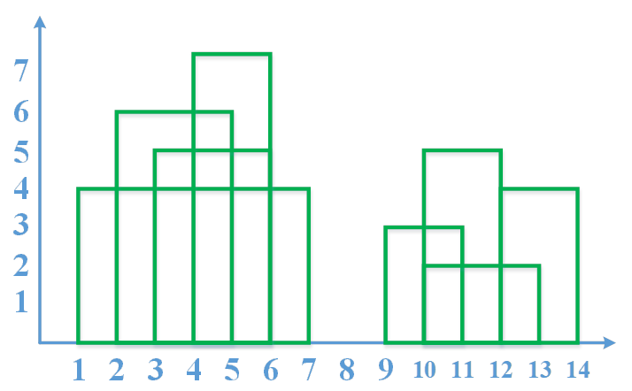

返回轮廓线数组如下：

{{1,2,4},{2,4,6},{4,6,7},{6,7,4},{9,10,3},{10,12,5},{12,14,4}}

【要求】时间复杂度为O(NlogN)。


## 8.30.   加油站良好出发点问题

【题目】N个加油站组成一个环形，给定两个长度都是N的非负数组oil和dis(N>1)，oil[i]代表第i个加油站存储的油可以跑多少千米，dis[i]代表第i个加油站到环中下一个加油站相隔多少千米。假设你有一辆油箱足够大的车，初始时车里没有油。如果车从第i个加油站出发，最终可以回到这个加油站，那么第i个加油站就算是良好出发点，否则就不算。请返回长度为N的boolean型数组res，res[i]代表第i个加油站是否为良好出发点。

【举例】

oil={4,2,0,4,5,2,3,6,2}

dis={6,1,3,1,6,4,1,1,6}

代表的环如下图所示

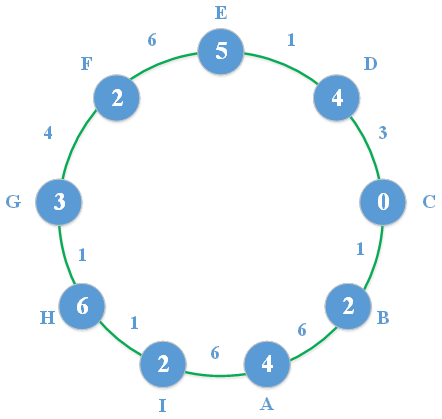

图中A点油量为oil[0]，A点到B点的距离为dis[0]；B点油量为oil[1]，B点到C点的距离为dis[1]；……I点油量为oil[8]，I点到A点的距离为dis[8]。如果从A点出发，车初始将获得4的油量，但是A到B的距离为6，车跑不到B就会停下，所以A不是良好出发点；如果从B点出发，车初始将获得2的油量，B到C的距离为1，车可以跑到C，并且还剩1的油量，C点油量为0，所以车仍然带着1的油量继续往下走，但是C到D的距离为3，车跑不到D就会停下，所以B也不是良好出发点；如果从C点出发……这个例子没有任何一个点是良好出发点，所以返回

{false, false, false, false, false, false, false, false, false }

再比如

oil={4,2,0,4,5,2,3,6,2}

dis={6,1,3,1,6,4,1,1,6}

代表的环如下图所示

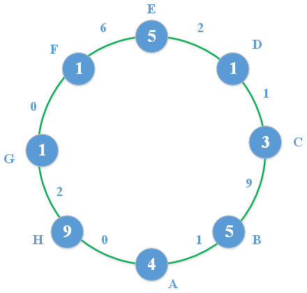

如果车从A点出发，到B点且加上B的油，还剩8的油量，发现到不了C；如果从B点出发，发现车到不了C；如果从C点出发，发现可以转一圈，所以C点是良好出发点……最终返回

{false, false, true, false, false, true, false, true}

【要求】如果oil和dis长度为N，时间复杂度达到O(N)，额外空间复杂度O(1)，返回的Boolean类型数组不算额外空间。

## 8.31.   容器盛水问题

【题目】给定一个数组arr，已知其中所有的值都是非负的，将这个数组看作一个容器，请返回容器能装多少水。

【举例】

arr={3,1,2,5,2,4}，代表的容器如下所示，该容器可以装下5格水，也就是图中画圈的部分，所以返回5。

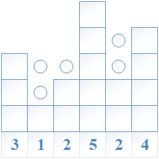

arr={4,5,1,3,2}，代表的容器如下所示，该容器可以装下2格水，也就是图中画圈的部分，所以返回2。

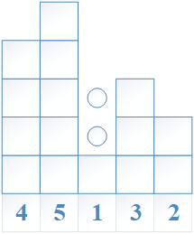

【要求】时间复杂度为O(N)，额外空间复杂度为O(1)。


# 第九章 其他题目

（本章共三十七题）

## 9.1.    从5随机到7随机以及其扩展

【题目】给定一个等概率随机产生1~5的随机函数rand1To5如下：

int rand1To5() {

   return (Math.random() * 5) + 1;

}

除此之外，不能使用任何额外的随机机制，请用rand1To5实现等概率随机产生1~7的随机函数rand1To7。

【补充问题】给定一个以p概率产生0，以1-p概率产生1的随机函数rand01p如下：

int rand01p() {

   double p = 0.83; // 可以随意改变p

   return Math.random() < p ? 0 ： 1;

}

除此之外，不能使用任何额外的随机机制，请用rand01p实现等概率随机产生1~6的随机函数rand1To6。

【进阶问题】给定一个等概率随机产生1~m的随机函数rand1ToM如下：

int rand1ToM(int m) {

   return (Math.random() * m) + 1;

}

除此之外，不能使用任何额外的随机机制。有两个输入参数，分别为m和n，请用rand1ToM(m)实现等概率随机产生1~n的随机函数rand1ToN。


## 9.2.    一行代码求两个数的最大公约数

【题目】给定两个不等于0的整数M和N，求M和N的最大公约数。


## 9.3.    有关阶乘的两个问题

【题目】给定一个非负整数N，返回N!结果的末尾为0的数量。

例如3!=6，结果末尾没有0，则返回0；5!=120，结果末尾有1个0，返回1；1000000000!，结果的末尾有249999998个0，返回249999998。

【进阶问题】给定一个非负整数N，如果用二进制数表达N!的结果，返回最低位的1在哪个位置上，认为最右的位置为位置0。

例如：1!=1，最低位的1在位置0上。2!=2，最低位的1在位置0上。1000000000! 最低位的1在位置999999987位置上。


## 9.4.    判断一个点是否在矩形内部

【题目】在二维坐标系中，所有值都是double类型，那么一个矩形可以由4个点来代表，(x1,y1)为最左的点、(x2,y2)为最上的点、(x3,y3)为最下的点、(x4,y4)为最右的点。给定4个点代表的矩形，再给定一个点(x,y)，判断(x,y)是否在矩形中。


## 9.5.    判断一个点是否在三角形内部

【题目】在二维坐标系中，所有值都是double类型，那么一个三角形可以由3个点来代表，给定3个点代表的三角形，再给定一个点(x,y)，判断(x,y)是否在三角形中。


## 9.6.    折纸问题

【题目】请把一张纸条竖着放在桌子上，然后从纸条的下边向上方对折1次，压出折痕后展开。此时折痕是凹下去的，即折痕突起的方向指向纸条的背面。如果从纸条的下边向上连续方对折2次，压出折痕后展开，此时有三条折痕，从上到下依次是下折痕、下折痕和上折痕。给定一个输入参数N，代表纸条都从下边向上连续方对折N次，请从上到下依次打印折痕的方向。

例如：

N=1时，打印：

down

N=2时，打印：

down

down

up


## 9.7.    能否完美地拼成矩形

【题目】每条边不是平行于X轴就是平行于Y轴的矩形，可以用左下角点和右上角点来表示。比如{1,2,3,4}，表示的图形如下所示。

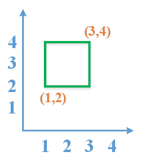

给定一个N行2列的二维数组matrix，表示N个每条边不是平行于X轴就是平行于Y轴的矩形。想知道所有的矩形能否组成一个大的完美矩形。完美矩形是指拼出的整体图案是矩形，既不缺任何块，也没有重合的部分。

【举例】

matrix = {

{1, 1, 3, 3},

{3, 1, 4, 2},

{1, 3, 2, 4},

{3, 2, 4, 4},

}

返回false。如果画出这四个矩形，会发现拼出的图案缺少{2,3,3,4}这一块。

matrix = {

{1, 1, 3, 3},

{3, 2, 4, 2},

{3, 2, 4, 4},

{2, 3, 3, 4},

}

返回false。拼出的图案缺少{3,1,4,2}，并且{3,2,4,3}是重合区域。

matrix = {

{1, 1, 3, 3},

{3, 1, 4, 2},

{3, 2, 4, 4},

{1, 3, 2, 4},

{2, 3, 3, 4},

}

返回false。拼出的图案是完整的一块矩形，既不缺任何块，也没有重合的部分。


## 9.8.    蓄水池算法

【题目】有一台机器按照自然数序列的方式吐出球（1号球，2号球，3号球……），你有一个袋子，袋子最多只能装下K个球，并且除袋子以外，你没有更多的空间。设计一种选择方式，使得当机器吐出第N号球的时候（N>K），袋子中的球数是K个，同时可以保证从1号球到N号球中的每一个被选进袋子的概率都是K/N。

【举例】举一个更具体的例子，有一只只能装下10个球的袋子，当吐出100个球时，袋子里有10个球，并且1~100号球中的每一个球被选中的概率都是10/100。然后继续吐球，当吐出1000个球时，袋子里有10个球，并且1~1000号球中的每一个球被选中的概率都是10/1000。继续吐球，当吐出i个球时，袋子里有10个球，并且1~i号球中的每一个球被选中的概率都是10/i，即吐球的同时，已经吐出的球被选中的概率也动态地变化。


## 9.9.    设计有setAll功能的哈希表

【题目】哈希表常见的三个操作是put、get和containsKey，而且这三个操作的时间复杂度为O(1)。现在想加一个setAll功能，就是把所有记录的value都设置成统一的值。请设计并实现这种有setAll功能的哈希表，并且put、get、containsKey和setAll四个操作的时间复杂度都为O(1)。


## 9.10.   最大的leftMax和rightMax之差的绝对值

【题目】给定一个长度为N（N>1）的整型数组arr，可以划分成左右两个部分，左部分为arr[0…K]，右部分为arr[K+1…N-1]，K可以取值的范围是[0,N-2]。求这么多划分方案中，左部分中的最大值减去右部分中的最大值的绝对值中，最大是多少？

例如：[2,7,3,1,1,]，当左部分为[2,7]，右部分为[3,1,1]时，左部分中的最大值减去右部分中的最大值的绝对值为4。当左部分为[2,7,3]，右部分为[1,1]时，左部分中的最大值减去右部分中的最大值的绝对值为6。还有很多划分方案，但最终返回6。


## 9.11.   设计LRU缓存结构

【题目】设计LRU缓存结构，该结构在构造时确定大小，假设大小为K，并有如下两个功能。

l set(key,value)：将记录(key,value)插入该结构。

l get(key)：返回key对应的value值

【要求】

（1）  set和get的时间复杂度为O(1)。

（2）  某个key的set或get操作一旦发生，认为这个key的记录成了最常用的。

（3）  当缓存的大小超过K时，移除最不经常使用的记录，即set或get最久远的。

【举例】假设缓存结构的实例是cache，大小为3，并依次发生以下行为：

（1）  cache.set(“A”, 1)。最常使用的记录为(“A”, 1)。

（2）  cache.set(“B”, 2)。最常使用的记录为(“B”, 2), (“A”, 1)变成最不常用的。

（3）  cache.set(“C”, 3)。最常使用的记录为(“C”, 3), (“A”, 1)还是最不常用的。

（4）  cache.get(“A”)。最常使用的记录为(“A”, 1), (“B”, 2)变成最不常用的。

（5）  cache.set(“D”, 4)。大小超过3了，所以移除此时最不常使用的记录(“B”, 2)，加入记录(“D”, 4)，并且为最常使用的记录，然后(“C”, 3)变为最不常用的记录。


## 9.12.   LFU缓存结构设计

【题目】一个缓存结构需要实现以下功能：

l void set(int key, int value)：加入或修改key对应的value。

l int get(int key)：查询key对应的value值。

但是缓存中最多存放K条记录，如果新的第K+1条记录要加入，就需要根据策略删除一条记录，然后才能把新记录加入。这个策略为：在缓存结构的K条记录中，哪一个key从进入缓存结构的时刻开始，被调用set或get的次数最少，就删掉这个key的记录；如果调用次数最少的key有多个，上次调用发生最早的key被删除。

这就是LFU缓存替换算法。实现这个结构，K作为参数给出。

【要求】set和get的时间复杂度为O(1)。


## 9.13.   设计RandomPool结构

【题目】设计一种结构，在该结构中有如下三个功能。

l insert(key)：将某个key加入到该结构中，做到不重复加入。

l delete(key)：将原本在结构中的某个key移除。

l getRandom()：等概率随机返回结构中的任何一个key。

【要求】insert、delete和getRandom方法的时间复杂度都是O(1)。


## 9.14.   并查集的实现

【题目】给定一个没有重复值的整型数组arr，初始时认为arr中每一个数各自都是一个单独的集合。请设计一种叫UnionFind的结构并提供以下两个操作。

（1）  bool isSameSet(int a, int b)：查询a和b这两个数是否属于同一个集合。

（2）  void union(int a, int b)：把a所在的集合和b所在的集合合并在一起，原本两个集合各自的元素以后都算作同一个集合的元素。

【要求】如果调用isSameSet和union的总次数逼近或超过O(N)，请做到单次调用isSameSet或union方法的平均时间复杂度为O(1)。


## 9.15.   调整[0,x)区间上数的出现的概率

【题目】假设函数Math.random()等概率随机返回一个在[0,1)范围上的数，那么我们知道，在[0,x)区间上的数的出现的概率为x（0<=x<=1）。给定一个大于0的整数k，并且可以使用Math.random()函数，请实现一个函数依然返回在[0,1)范围上的数，但是在[0,x)区间上的数的出现的概率为x^k（0<=x<=1）


## 9.16.   路径数字变为统计数组

【题目】给定一个路径数组paths，表示一张图。path[i]=j表示城市i连向城市，如果path[i]=i，表示城市i是首都，一张图里只会有一个首都且图中除了首都指向自己之外不会有环。例如，paths[]={9,1,4,9,0,4,8,9,0,1}，代表的图如下所示。

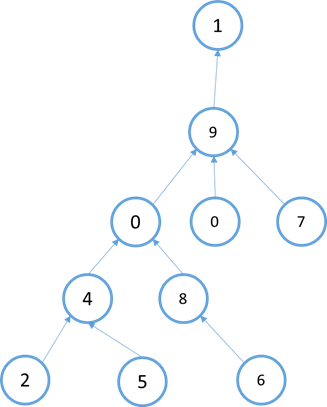

由数组表示的图可以知道，城市1是首都，所以距离为0，离首都距离为1的城市只有城市9，离首都距离为2的城市有城市0、3和7，离首都距离为3的城市有城市4和8，离首都距离为4的城市有城市2、5和6。所以距离为0的城市有1座，距离为1的城市有1座，距离为2的城市有3座，距离为3的城市有2座，距离为4的城市有3座。那么统计数组为nums={1,1,3,2,3,0,0,0,0,0}，nums[i]=j代表距离为i的城市有j座。要求实现一个void类型的函数，输入一个路径数组，直接在原数组上调整，使之变为nums数组，即paths[]={9,1,4,9,0,4,8,9,0,1}经过这个函数处理之后变成nums={1,1,3,2,3,0,0,0,0,0}。

【要求】如果paths长度为N，请达到时间复杂度为O(N)，额外空间复杂度为O(1)。


## 9.17.   正数数组的最小不可组成和

【题目】给定一个正数数组arr，其中所有的值都为整数，以下是最小不可组成和的概念：

（1）  把arr每个子集内的元素加起来会出现很多值，其中最小的记为min，最大的记为max

（2）  在[min, max]区间上，如果有数不可以被arr的某一个子集相加得到，那么其中最小的那个数是arr的最小不可组成和。

（3）  在[min, max]区间上，如果所有的数都可以被arr的某一个子集相加得到，那么其中max+1是arr的最小不可组成和。

【举例】

arr=[3,2,5]。子集{2}相加产生2为min，子集{3,2,5}相加产生10为max。在[2,10]上，4、6和9不能被任何子集相加得到，其中4是arr的最小不可组成和。

arr=[1,2,4]。子集{1}相加产生1为min，子集{1,2,4}相加产生7为max。在[1,7]上，任何数都可以被子集相加得到，所以8是arr的最小不可组成和。

【进阶问题】如果已知正数数组中肯定有1这个数，是否能更快地得到最小不可组成和？


## 9.18.   累加出整个范围所有的数最少还需要几个数

【题目】给定一个有序的正数数组arr和一个正数range，如果可以自由选择arr中的数字，想累加得到1~range上的所有数，返回arr最少还缺几个数。

【举例】

arr={1,2,3,7}, range=15。

想累加得到1~15上的所有数，arr还缺14这个数，所以返回1。

arr={1,5,7}, range=15。

想累加得到1~15上的所有数，arr还缺2和4，所以返回2。


## 9.19.   一种字符串和数字的对应关系

【题目】一个char类型的数组chs，其中所有的字符都不同。

例如，ch=[‘A’, ‘B’, ‘C’, …, ‘Z’]，则字符串与整数的对应关系如下：

A,B,…,Z,AA,AB,…,AZ,BA,BB,…,ZZ,AAA,…,ZZZ,AAAA…

1,2,…,26,27,28,…52,53,54,…,702,703,…,18278,18279,…

例如，ch=[‘A’, ‘B’, ‘C’]，则字符串与整数的对应关系如下：

A,B,C,AA,AB,…,CC,AAA,…,CCC,AAAA,…

1,2,3,4,5,…,12,13,…,39,40,…

给定一个数组chs，实现根据对应关系完成字符串与整数相互转换的两个函数。


## 9.20.   1到n中1出现的次数

【题目】给定一个整数n，返回从1到n的数组中1出现的个数。

例如：

n=5，1~n为1,2,3,4,5。那么1出现了1次，所以返回1。

n=11，1~n为1,2,3,4,5,6,7,8,9,10,11。那么1所在的数出现为1（出现1次），10（出现1次），11（有两个1所以出现2次），所以返回4。


## 9.21.   从N个数中等概率打印M个数

【题目】给定一个长度为N且没有重复元素的数组arr和一个整数n，实现函数等概率随机打印arr中的M个数。

【要求】

（1）  相同的数不要重复打印。

（2）  时间复杂度为O(N)，额外空间复杂度为O(1)。

（3）  可以改变arr数组。


## 9.22.   判断一个数是否是回文数

【题目】定义回文数的概念如下：

l 如果一个非负数左右完全对应，则该数是回文数，例如：121,22等。

l 如果一个负数的绝对值左右完全对应，则该数也是回文数，例如：-121,-22等。

给定一个32位整数num，判断num是否是回文数。


## 9.23.   在有序旋转数组中找到最小值

【题目】有序数组可能经过一次旋转处理，也可能没有，且arr中可能存在重复的数。例如，有序数组[1,2,3,4,5,6,7]，可以旋转处理成[4,5,6,7,1,2,3]等。给定一个可能经过旋转处理的有序数组arr，返回arr中的最小值。


## 9.24.   在有序旋转数组中找到一个数

【题目】有序数组可能经过一次旋转处理，也可能没有，且arr中可能存在重复的数。例如，有序数组[1,2,3,4,5,6,7]，可以旋转处理成[4,5,6,7,1,2,3]等。给定一个可能经过旋转处理的有序数组arr，再给定一个数num，返回arr中是否含有num。


## 9.25.   数字的英文表达和中文表达

【题目】给定一个32位整数num，写两个函数分别返回num的英文和中文表达字符串。

【举例】

num=319

英文表达字符串为：Three Hundred Nineteen

中文表达字符串为：三百一十九

num=1014

英文表达字符串为：One Thousand, Fourteen

中文表达字符串为：一千零四十

num=-2147483648

英文表达字符串为：Negative, Twoo Billion, One Hundred Forty Seven Million, Four Hundred Eighty Three Thousand, Six Hundred Forty Eight.

中文表达字符串为：负二十一亿四千七百四十八万三千六百四十八

num=0

英文表达字符串为：Zero

中文表达字符串为：零


## 9.26.   分糖果问题

【题目】一群孩子做游戏，现在请你根据游戏得分来分发糖果，要求如下：

（1）  每个孩子不管分得多少，起码分到一个糖果。

（2）  任意两个相邻的孩子之间，得分较多的孩子必须拿到多一些的糖果。

给定一个数组arr代表得分数组，请返回最少需要多少糖果。

例如：arr=[1,2,2]，糖果分配为[1,2,1]，即可满足要求且数量最少，所以返回4。

【进阶问题】原题目中的两个规则不变，再加一条规则：

（3）  任意两个相邻的孩子之间如果得分一样，分到的糖果数必须相同。

给定一个数组arr代表得分数组，请返回最少需要多少糖果。

例如：arr=[1,2,2]，糖果分配为[1,2,2]，即可满足要求且数量最少，所以返回5。

【要求】arr长度为N，原题目和进阶题目都要求时间复杂度为O(N)，额外空间复杂度为O(1)。


## 9.27.   一种消息接收并打印的结构设计

【题目】

消息流吐出2，这种结构接收而不打印，因为1还没有出现。

消息流吐出1，这种结构接收1，并且打印：1，2。

消息流吐出4，这种结构接收而不打印4，因为3还没有出现。

消息流吐出5，这种结构接收而不打印5，因为3还没有出现。

消息流吐出7，这种结构接收而不打印7，因为3还没有出现。

消息流吐出3，这种结构接收3，并且打印：3，4，5。

消息流吐出9，这种结构接收而不打印9，因为6还没有出现。

消息流吐出8，这种结构接收而不打印8，因为6还没有出现。

消息流吐出6，这种结构接收6，并且打印：6，7，8，9。

已知一个消息流会不断地吐出整数1~N，但不一定按照顺序吐出。如果上次打印的数为i，那么当i+1出现时，请打印i+1及其之后接收过的并且连续的所有数，直到1~N全部接收并打印完成，设计这种接收并打印的结构。

【要求】

消息流最终会吐出全部的1~N，当然最终也会打印完所有的1~N，要求接收和打印1~N的整个过程，时间复杂度为O(N)。


## 9.28.   随时找到数据流的中位数

【题目】有一个源源不断地吐出整数的数据流，假设你有足够的空间来保存吐出的所有数。请设计一个叫做MedianHolder的数据结构，MedianHolder结构可以随时取得之前吐出的所有数的中位数。

【要求】

（1）  如果MedianHolder结构已经保存了之前吐出的N个数，那么将一个新数加入到MedianHolder的过程，时间复杂度为O(logN)。

（2）  取得之前已经吐出的N个数整体的中位数的过程，时间复杂度为O(1)。


## 9.29.   在两个长度相等的排序数组中找到上中位数

【题目】给定两个有序数组arr1和arr2，已知两个数组的长度都为N，求两个数组中所有数的上中位数。

【举例】

arr1=[1,,2,3,4], arr2=[3,4,5,6]

总共有8个数，那么上中位数是第4小的数，所以返回3。

arr1=[0,1,2], arr2=[3,4,5]

总共有6个数，那么上中位数是第3小的数，所以返回2。

【要求】时间复杂度为O(logN)，额外空间复杂度为O(1)。


## 9.30.   在两个排序数组中找到第k小的数

【题目】给定两个有序数组arr1和arr2，再给定一个整数k，返回所有数种第K小的数。

【举例】

arr=[1,2,3,4,5], arr=[3,4,5],k=1

1是所有数中第1小的数，所以返回1。

arr=[1,2,3], arr=[3,4,5,6],k=4

3是所有数中第4小的数，所以返回3。

【要求】如果arr1的长度为N，arr2的长度为M，时间复杂度请到达O(log(min{M,N}))，额外空间复杂度为O(1)。


## 9.31.   两个有序数组间相加和的Top K问题

【题目】给定两个有序数组arr1和arr2，再给定一个整数k，返回来自arr1和arr2的两个数相加和最大的前k个，两个数必须分别来自两个数组。

【举例】

arr=[1,2,3,4,5], arr=[3,5,7,9,11], k=4

返回数组{16,15,14,14}。

【要求】时间复杂度达到O(klogk)。


## 9.32.   出现次数的Top K问题

【题目】给定string类型的数组strArr，再给定整数k，请严格按照排名顺序打印出现次数前k名的字符串。

【举例】

strArr=[“1”,”2”,”3”,”4”], k=2

No.1: 1, times: 1

No.2: 2, times: 1

这种情况下，所有的字符串都出现一样多，随便打印任何两个字符串都可以。

strArr=[“1”,”1”,”2”,”3”], k=2

输出：

No.1: 1, times: 2

No.2: 2, times: 1

或者输出：

No.1: 1, times: 1

No.2: 3, times: 1

【要求】如果strArr长度为N，时间复杂度请达到O(Nlogk)。

【进阶问题】设计并实现TopKRecord结构，可以不断地向其中加入字符串，并且可以 根据字符串出现的情况随时打印加入次数最多的前k个字符串，具体为：

（1）  K再TopKRecord实例生成时指定，并且不再变化（k是构造函数的参数）

（2）  含有addStr(string str)的方法，即向TopKRecord中加入字符串。

（3）  含有printTopK()方法，即打印加入次数最多的前k个字符串，打印有哪些字符串和对应的次数即可，不要求严格按排序顺序打印。

【举例】

TopKRecord record = new TopKRecord(2);

record.add(“A”);

record.printTopK();

此时打印：

TOP:

Str: A Times: 1

record.add(“B”);

record.add(“B”);

record.printTopK();

此时打印：

TOP:

Str: A Times: 1

Str: B Times: 2

或者打印：

TOP:

Str: B Times: 2

Str: A Times: 1

record.add(“C”);

record.add(“C”);

record.printTopK();

此时打印：

TOP:

Str: B Times: 2

Str: C Times: 2

或者打印：

TOP:

Str: C Times: 2

Str: B Times: 2

【要求】

（1）  在任何时候，add方法的时间复杂度不超过O(logk)。

（2）  在任何时候，printTopK方法的时间复杂度不超过O(k)。


## 9.33.   Manacher算法

【题目】给定一个字符串str，返回str中最长回文子串的长度。

【举例】

str=”123”，其中最长回文子串为”1”、”2”或者”3”，所以返回1。

str=”abc1234321ab”，其中最长回文子串为”1234321”，所以返回7。

【进阶问题】给定一个字符串str，想通过添加字符的方式使得str整体都变成回文字符串，但要求只能在str的末尾添加字符，请返回在str后面添加的最短字符串。

【举例】

str=”12”。在末尾添加”1”之后，str变为”121”，是回文串。在末尾添加”21”之后，str变为”1221”，也是回文串。但”1”是所有添加方案中最短的，所以返回”1”。

【要求】如果str的长度为N，解决原问题和进阶问题的时间复杂度都达到O(N)。


## 9.34.   KMP算法

【题目】给定两个字符串str和match，长度分别为N和M。实现一个算法，如果字符串str中含有子串match，则返回match在str中的开始位置，不含有则返回-1。

【举例】

str=”acbc”，match=”bc”，返回2。

str=”acbc”，match=”bcc”，返回-1。

【要求】如果match的长度大于str的长度（M>N），str必然不会含有match，可直接返回-1。但如果N>=M，要求算法复杂度为O(M)。


## 9.35.   丢棋子问题

【题目】一座大楼有0~N层，地面算作0层，最高的一层为第N层。已知棋子从第0层掉落肯定不会摔碎，从第i层掉落可能会摔碎，也可能不会摔碎（1<=i<=N）。给定整数N作为楼层数，再给定整数K作为棋子数，返回如果想找到棋子不会摔碎的最高层数，即使在最差的情况下扔的最少次数。一次只能扔一个棋子。

【举例】

N=10，K=1。

返回10。因为只有1颗棋子，所以不得不从第1层开始一直试到第10层，在最差的下，即第10层是不会摔坏的最高层，最少也要扔10次。

N=3，K=2。

返回2。先在2层扔1颗棋子，如果碎了，试第1层，如果没碎，试第3层。

N=105，K=2

返回14。

第一个棋子先在14层扔，碎了则用仅存的一个棋子试1~13。

若没碎，第一个棋子继续在27层扔，碎了则用仅存的一个棋子试15~26。

若没碎，第一个棋子继续在39层扔，碎了则用仅存的一个棋子试28~38。

若没碎，第一个棋子继续在50层扔，碎了则用仅存的一个棋子试40~49。

若没碎，第一个棋子继续在60层扔，碎了则用仅存的一个棋子试51~59。

若没碎，第一个棋子继续在69层扔，碎了则用仅存的一个棋子试61~68。

若没碎，第一个棋子继续在77层扔，碎了则用仅存的一个棋子试70~76。

若没碎，第一个棋子继续在84层扔，碎了则用仅存的一个棋子试78~83。

若没碎，第一个棋子继续在90层扔，碎了则用仅存的一个棋子试85~89。

若没碎，第一个棋子继续在95层扔，碎了则用仅存的一个棋子试91~94。

若没碎，第一个棋子继续在99层扔，碎了则用仅存的一个棋子试96~98。

若没碎，第一个棋子继续在102层扔，碎了则用仅存的一个棋子试100、101。

若没碎，第一个棋子继续在104层扔，碎了则用仅存的一个棋子试103。

若没碎，第一个棋子继续在105层扔，若到这一步还没碎，那么105便是结果。


## 9.36.   画匠问题

【题目】给定一个整型数组arr，数组中的每个值都为正数，表示完成一幅画作需要的时间，再给定一个整数num，表示画匠的数量，每个画匠只能画连在一起的画作。所有的画家并行工作，请返回完成所有的画作需要的最少时间。

【举例】

arr=[3,1,4]，num=2。

最好的分配方式为第一个画匠画3和1，所需时间为4。第二个画匠画4，所需时间为4。因为并行工作，所以最少时间为4。如果分配方式为第一画匠画3，所需时间为3。第二个画匠画1和4，所需的时间为5。那么最少时间为5，显然没有第一种分配方式好。所以返回4。

arr=[1,1,1,4,3]，num=3。

最后的分配方式为第一个画匠画前三个1，所需时间为3。第二个画匠画4，所需时间为4，第三个画匠画3，所需时间为3。返回4。


## 9.37.   邮局选址问题

【题目】一条直线上有居民点，邮局只能建在居民点上。给定一个有序整型数组arr，每个值表示居民点的一维坐标，再给定一个正数num，表示邮局数量。选择num个居民点建立num个邮局，使所有的居民点到邮局的总距离最短，返回最短的总距离。

【举例】

arr=[1,2,3,4,5,1000]，num=2。

第一个邮局建立在3位置，第二个邮局建立在1000位置。那么1位置到邮局的距离为2，2位置到邮局距离为1，3位置到邮局距离为0，4位置到邮局距离为1，5位置到邮局的距离为2，1000位置到邮局的距离为0。这种方案下的总距离为6，其他任何方案的总距离都不会比该方案的总距离更短，所以返回6。

 

 
