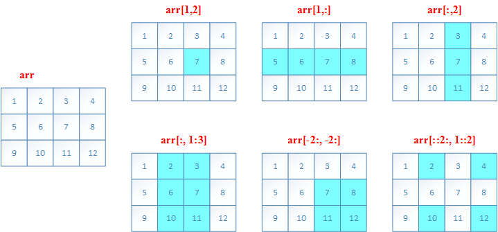
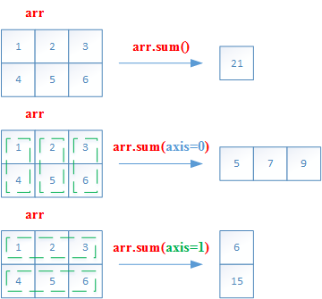
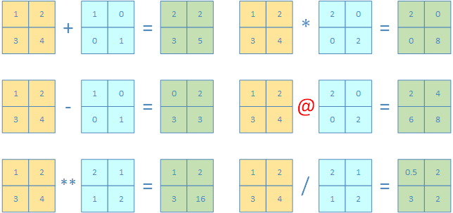
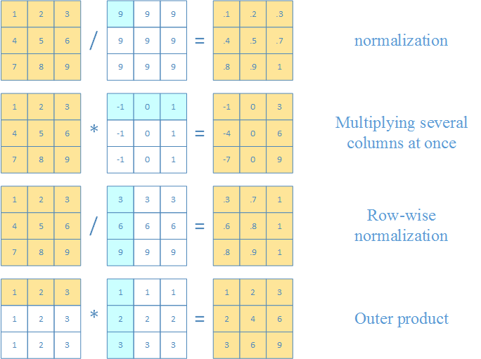
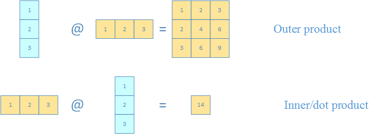

# NumPy Notes

This is the note for article [A Visual Intro to NumPy and Data Representation](https://jalammar.github.io/visual-numpy/), by [Jay Alammar](https://jalammar.github.io/about/)

Chinese version can be found at [**Numpy和数据展示的可视化介绍**](http://www.junphy.com/wordpress/index.php/2019/10/24/visual-numpy/)


Also, it takes some notes for another article [NumPy Illustrated: The Visual Guide to NumPy](https://medium.com/better-programming/numpy-illustrated-the-visual-guide-to-numpy-3b1d4976de1d), and the a Chinese version of it can be found at [**图解 | NumPy可视化指南**](https://www.yanxishe.com/TextTranslation/3198), another version is at [**一图胜千言，超形象图解NumPy教程！**](https://zhuanlan.zhihu.com/p/504917890)


[Big-O Cheat Sheet](https://www.bigocheatsheet.com/)

[Python Time Complexity](https://wiki.python.org/moin/TimeComplexity)


# NumPy Illustrated: The Visual Guide to NumPy


## 1. Vectors, the 1D Arrays

### 初始化**Numpy array**用到的函数

|        函数        |                             参数                             |
| :----------------: | :----------------------------------------------------------: |
| `np.array(pylist)` |            使用Python list来初始化一个Numpy array            |
|    `np.zeros()`    |               `shape, dtype=float, order='C'`                |
|    `np.ones()`     |                `shape, dtype=None, order='C'`                |
|    `np.empty()`    |               `shape, dtype=float, order='C'`                |
|    `np.full()`     |          `shape, fill_value, dtype=None, order='C'`          |
| `np.zeros_like()`  |      `a, dtype=None, order='K', subok=True, shape=None`      |
|  `np.ones_like()`  |      `a, dtype=None, order='K', subok=True, shape=None`      |
| `np.empty_like()`  |  `prototype, dtype=None, order='K', subok=True, shape=None`  |
|  `np.full_like()`  | `a, fill_value, dtype=None, order='K', subok=True, shape=None` |


### 使用单调序列初始化Numpy array

|      函数       |                             参数                             |
| :-------------: | :----------------------------------------------------------: |
|  `np.arange()`  |             `[start,] stop[, step,], dtype=None`             |
| `np.linspace()` | `start, stop, num=50, endpoint=True, retstep=False, dtype=None, axis=0` |


### 创建随机数组

- 旧式创建方法（deprecated）

| 函数                | 参数                                   |
| ------------------- | -------------------------------------- |
| `np.random.randint` | `low, high=None, size=None, dtype=int` |
| `np.random.rand`    | `d0, d1, ..., dn`                      |
| `np.random.uniform` | `low=0.0, high=1.0, size=None`         |

- 新式创建方法

**首先创建对象**：`rng = np.random.default_rng()`

| 函数           | 参数                                                        |
| -------------- | ----------------------------------------------------------- |
| `rng.integers` | `low, high=None, size=None, dtype=np.int64, endpoint=False` |
| `rng.random`   | `size=None, dtype=np.float64, out=None`                     |
| `rng.uniform`  | `low=0.0, high=1.0, size=None`                              |


## 2. Vector indexing

### 基本索引操作

可以指定单个索引，索引范围，反向索引，以及数组索引

定义数组

```python
>>> a = np.arange(1, 6)
>>> a
array([1, 2, 3, 4, 5])
```

操作及效果

|   索引操作   |        结果        |            效果            |
| :----------: | :----------------: | :------------------------: |
|    `a[1]`    |        `2`         |          返回view          |
|   `a[2:4]`   |  `array([3, 4])`   |          返回view          |
|   `a[-2:]`   |  `array([4, 5])`   |          返回view          |
|   `a[::2]`   | `array([1, 3, 5])` |          返回view          |
| `a[[1,3,4]]` | `array([2, 4, 5])` | fancy indexing，返回新数组 |

Python list vs Numpy list

|        Python List        |        Numpy List         |
| :-----------------------: | :-----------------------: |
|      `a = [1, 2, 3]`      | `a = np.array([1, 2, 3])` |
|   `b = a` **(no copy)**   |    b = a **(no copy)**    |
|   `c = a[:]` **(copy)**   | `c = a[:]` **(no copy)**  |
| `d = a.copy()` **(copy)** | `d = a.copy()` **(copy)** |


### Boolean索引

定义数组：`a = np.array([1, 2, 3, 4, 5, 6, 7, 6, 5, 4, 3, 2, 1])`

逻辑比较（返回一个Boolean数组）

```python
>>> a > 5
array([False, False, False, False, False,  True,  True,  True, False,
       False, False, False, False])
```

`any`和`all`函数

```python
>>> np.any(a > 5)
True

>>> np.all(a > 5)
False
```

利用Boolean数组索引

```python
>>> a[a > 5]
array([6, 7, 6])

>>> a[(a >= 3) & (a <= 5)]
array([3, 4, 5, 5, 4, 3])
```


`np.where`和`np.clip`函数

|     函数     |                             参数                             | 作用                                                         |
| :----------: | :----------------------------------------------------------: | ------------------------------------------------------------ |
| `np.where()` | `condition, [x, y]`<br />`condition `: array_like, bool<br/> | If `condition` is `true`, yield `x`, otherwise yield `y`.<br /> If `x` or `y` 都没有指定，返回原先数组中的值 |
| `np.clip()`  |            `a, a_min, a_max, out=None, **kwargs`             | 指定值的范围`[a_min, a_max]`，<br />小于`a_min`的赋值为`a_min`，大于`a_max`的赋值`a_max` |


## 3. Vector operations

### 基本操作：vector之间的加减乘除整除

```python
# 定义两个数组
>>> a = np.array([4, 8])
>>> b = np.array([2, 5])
# 加
>>> a + b
array([ 6, 13])
# 减
>>> a - b
array([2, 3])
# 乘
>>> a * b
array([ 8, 40])
# 除
>>> a / b
array([2. , 1.6])
# 整除
>>> a // b
array([2, 1], dtype=int32)
# 乘方
>>> a ** b
array([   16, 32768], dtype=int32)
```


### 基本操作：vector与scalar之间的加减乘除整除

```python
# 定义数组
>>> c = np.array([1, 2])
# 加
>>> c + 3
array([4, 5])
# 减
>>> c - 3
array([-2, -1])
# 乘
>>> c * 3
array([3, 6])
# 除
>>> c / 3
array([0.33333333, 0.66666667])
# 整除
>>> c // 2
array([0, 1], dtype=int32)
# 乘方
>>> c ** 2
array([1, 4], dtype=int32)
```


### 截断近似函数

`np.floor`向下取整（round to negative infinity, -$\infty$）

```python
>>> np.floor([1.1, 1.5, 1.9, 2.5])
array([1., 1., 1., 2.])
```

`np.ceil`向上取整（round to negative infinity, +$\infty$）

```python
>>> np.ceil([1.1, 1.5, 1.9, 2.5])
array([2., 2., 2., 3.])
```

`np.round`向最近的整数截断（around to nearest integer）

```python
>>> np.round([1.1, 1.5, 1.9, 2.5])
array([1., 2., 2., 2.])
```

### 一些数学函数

```python
# 开方
>>> np.sqrt([4, 9])
array([2., 3.])
# 以e为底的幂乘
>>> np.exp([1, 2])
array([2.71828183, 7.3890561 ])
# 以e为底的对数（the logrithm of np.e to base e）
>>> np.log([np.e, np.e**2])
array([1., 2.])
# 点积
>>> np.dot([1,2], [3,4])
11
# 点积的另一种写法
>>> np.array([1,2]) @ np.array([3,4])
11
# 叉积
>>> np.cross([2, 0, 0], [0, 3, 0])
array([0, 0, 6])
# 正弦
>>> np.sin([np.pi, np.pi/2])
array([1.2246468e-16, 1.0000000e+00])
# 反正弦
>>> np.arcsin([0, 1])
array([0.        , 1.57079633])
# 平方和的开方
>>> np.hypot([3,5], [4,12])
array([ 5., 13.])
```

一些三角函数

| 三角函数 | 反三角函数 | 双曲函数 | 反双曲函数 |
| :------: | :--------: | :------: | :--------: |
|  `sin`   |  `arcsin`  |  `sinh`  | `arcsinh`  |
|  `cos`   |  `arccos`  |  `cosh`  | `arccosh`  |
|  `tan`   |  `arctan`  |  `tanh`  | `arctanh`  |


双曲正弦函数：$\sinh{x}$


$$
\sinh{x} = \frac{e^x - e^{-x}}{2}
$$


双曲余弦函数：$\cosh{x}$
$$
\cosh{x} = \frac{e^x + e^{-x}}{2}
$$


双曲正切函数：$\tanh{x}$
$$
\tanh{x} = \frac{e^x - e^{-x}}{e^x + e^{-x}}
$$

### 基本的统计函数

```python
# 最大值
>>> np.max([1, 2, 3])
3
# 最大值
>>> np.array([1, 2, 3]).max()
3
# 最大值的索引
>>> np.array([1, 2, 3]).argmax()
2
# 最小值
>>> np.array([1, 2, 3]).min()
1
# 最小值的索引
>>> np.array([1, 2, 3]).argmin()
0
# 求和
>>> np.array([1, 2, 3]).sum()
6
# 求平均
>>> np.array([1, 2, 3]).mean()
2.0
# 标准差
>>> np.array([1, 2, 3]).var()
0.6666666666666666
# 方差
>>> np.array([1, 2, 3]).std()
0.816496580927726
```

### 排序函数

|       Python List        | Numpy Arrays |           Effect           |
| :----------------------: | :----------: | :------------------------: |
|        `a.sort()`        |  `a.sort()`  |       sort in place        |
|       `sorted(a)`        | `np.sort(a)` | return a new sorted array  |
|     `a.sort(key=f)`      |      -       |       sort with key        |
| `a.sort(reversed=False)` |      -       | ascending/descending order |


## 4. Searching for an element in a vector

### Python list search - index method

Python `list`有`index`方法，而Numpy没有

`a.index(x [, i [, j]])`

这里`x`是要查找的元素，`i`和`j`分别是指定区间的上下限，如果没有找到，会`raise exception`

```python
>>> a = [12, 0, -1, 78, 99]
>>> a.index(78)
3
>>> a.index(78, 4)
Traceback (most recent call last):
  File "<pyshell#6>", line 1, in <module>
    a.index(78, 4)
ValueError: 78 is not in list
```

### Numpy list search

Numpy中有三种办法查找某个元素

`np.where`

```python
>>> a = [12, 0, -1, 78, 99]
>>> np.where(a == 78)[0][0]
3

```

`next` + `np.ndenumerate`（这种需要`Numba`来加速，否则就和上面的`np.where`一样，比较慢）

```python
>>> a = [12, 0, -1, 78, 99]
>>> next(i[0] for i, v in np.ndenumerate(a) if v == 78)
3
```

`np.searchsorted`

```python
>>> a = [12, 0, -1, 78, 99]
>>> b = np.sort(a)
>>> b
array([-1,  0, 12, 78, 99])
>>> np.searchsorted(b, 78)
3
```


## 5. Comparing floats

`np.allclose(a, b)`用于容忍误差之内的浮点比较

but, **there is no silver bullet!**

|             表达式             |  结果   |
| :----------------------------: | :-----: |
|       `0.1 + 0.2 == 0.3`       | `False` |
| `np.allclose(0.1 + 0.2, 0.3)`  | `True`  |
| `math.isclose(0.1 + 0.2, 0.3)` | `True`  |


|           表达式           |  结果   |
| :------------------------: | :-----: |
|       `1e-9 == 2e-9`       | `False` |
| `np.allclose(1e-9, 2e-9)`  | `True`  |
| `math.isclose(1e-9, 2e-9)` | `False` |


|               表达式               |  结果   |
| :--------------------------------: | :-----: |
|       `0.1 + 0.2 - 0.3 == 0`       | `True`  |
| `np.allclose(0.1 + 0.2 - 0.3, 0)`  | `True`  |
| `math.isclose(0.1 + 0.2 - 0.3, 0)` | `False` |

**注意**

- `np.allclose`假定所有比较数字的尺度为1。

  比如，如果在纳秒级别上，则需要将默认`atol`参数除以1e9：`np.allclose(1e-9,2e-9, atol=1e-17)==False`。

- `math.isclose`不对要比较的数字做任何假设，而是需要用户提供一个合理的`abs_tol`值（`np.allclose`默认的`atol`值为`1e-8`）
- 一些问题见如下链接
  -  [floating-point guide](https://floating-point-gui.de/errors/comparison/)
  - NumPy [issue](https://github.com/numpy/numpy/issues/10161) on GitHub.


## 6. Matrices, the 2D Array

### 基本概念

- 现在在Numpy中，**matrix** 和 **2D Array** 是指同一个概念，可以相互替换使用（interchangeably）
- 在Numpy中，原先的class `matrix`已经不再使用（deprecated）

定义一个Numpy 2D array：`a = np.array([[1, 2, 3], [4, 5, 6]])`

- 它的`.shape`属性返回一个元组，共有两个元素，第一个是**行数**，第二个是**列数**
- `len(a)`返回的是2D array的**行数**

```python
>>> a = np.array([[1, 2, 3], [4, 5, 6]])
>>> a.dtype
dtype('int32')
>>> a.shape
(2, 3)
>>> len(a)
2
>>> a.shape[0]
2
```

### 常用函数

之前的`zeros`，`ones`，`full`，`empty`还有`eye`都可以用来生成2D array

需要注意的是，指定2D array的元组要用括号`()`括起来，表示第一个参数，因为第二个参数是留给`dtype`的

```python
>>> np.zeros((3, 2))
array([[0., 0.],
       [0., 0.],
       [0., 0.]])
>>> np.ones((3, 2))
array([[1., 1.],
       [1., 1.],
       [1., 1.]])
>>> np.full((3, 2), 7)
array([[7, 7],
       [7, 7],
       [7, 7]])
>>> np.empty((3, 2))
array([[1., 1.],
       [1., 1.],
       [1., 1.]])
>>> np.eye(3, 3)
array([[1., 0., 0.],
       [0., 1., 0.],
       [0., 0., 1.]])
>>> np.eye(3)
array([[1., 0., 0.],
       [0., 1., 0.],
       [0., 0., 1.]])
```

还有`random`函数

```python
# x服从[0, 10)上的均匀分布（整数）
>>> np.random.randint(0, 10, [3, 2])
array([[7, 1],
       [6, 6],
       [2, 1]])
# x服从[0, 1)上的均匀分布
>>> np.random.rand(3, 2)
array([[0.1518058 , 0.47967987],
       [0.0242219 , 0.46161326],
       [0.64206284, 0.02072145]])
# x服从[0, 1)上的均匀分布（浮点数）
>>> np.random.uniform(1, 10, [3, 2])
array([[4.60676287, 4.64315581],
       [9.56576352, 2.2958745 ],
       [2.18304639, 5.9622002 ]])
```

`np.random.randn`，x服从标准正态分布，$ N(\mu, \sigma^2), \mu = 0, \sigma = 1 $

```python
# x服从标准正态分布
>>> np.random.randn(3, 2)
array([[-0.95367737, -0.35999719],
       [-0.27186541,  1.10111502],
       [-0.36303053,  0.5372727 ]])
```

`np.random.normal`，x服从正态分布，$ N(\mu, \sigma^2), \mu = 10, \sigma = 2 $

```python
# x服从正态分布
>>> np.random.normal(10, 2, [3, 2])
array([[10.06207497,  9.45178632],
       [ 9.02901148, 10.92862084],
       [12.53682855, 10.20647998]])
```

### 二维数组的索引（切片slice）

和一维数组的slice类似例子如下

```python
>>> a = np.array([[1,2,3,4], [5,6,7,8], [9,10,11,12]])
>>> a[1,2]
7
>>> a[1,:]
array([5, 6, 7, 8])
>>> a[:,2]
array([ 3,  7, 11])
>>> a[:,1:3]
array([[ 2,  3],
       [ 6,  7],
       [10, 11]])
>>> a[-2:,-2:]
array([[ 7,  8],
       [11, 12]])
>>> a[::2, 1::2]
array([[ 2,  4],
       [10, 12]])
```





## 7. The axis argument

### 轴参数（axis argument）

- Numpy引入`axis`参数，以便实现跨行或跨列操作
- `axis`参数的值实际上是维度数量。（第一维`axis=0`，第二维`axis=1`，以此类推）
- 二维数组中，`axis=0`表示列方向，`axis=1`表示行方向

|   ##axis   |          方向          |
| :--------: | :--------------------: |
| `axis = 0` | **列**方向（即所有行） |
| `axis = 1` | **行**方向（即所有列） |

以`sum`为例子

```python
>>> a = np.array([[1,2,3], [4, 5,6]])
>>> a.sum()
21
>>> a.sum(axis=0)
array([5, 7, 9])
>>> a.sum(axis=1)
array([ 6, 15])
```





### 矩阵的算术运算

- 2D Array支持数组逐个元素之间的运算：`+`，`-`，`*`， `/`，`//`，`**`
- 2D Array也支持外积（outer product）

```python
>>> np.array([[1,2],[3,4]]) + np.array([[1,0],[0,1]])
array([[2, 2],
       [3, 5]])
>>> np.array([[1,2],[3,4]]) - np.array([[1,0],[0,1]])
array([[0, 2],
       [3, 3]])
>>> np.array([[1,2],[3,4]]) ** np.array([[2,1],[1,2]])
array([[ 1,  2],
       [ 3, 16]], dtype=int32)
>>> np.array([[1,2],[3,4]]) * np.array([[2,0],[0,2]])
array([[2, 0],
       [0, 8]])
>>> np.array([[1,2],[3,4]]) @ np.array([[2,0],[0,2]])
array([[2, 4],
       [6, 8]])
>>> np.array([[1,2],[3,4]]) / np.array([[2,1],[1,2]])
array([[0.5, 2. ],
       [3. , 2. ]])
```





Numpy通过标量的广播机制（broadcasting from scalar），可以实现以下混合运算

- 向量和矩阵之间
- 两个向量之间

```python
>>> a = np.array([[1,2,3], [4, 5,6], [7,8,9]])
>>> a / 9
array([[0.11111111, 0.22222222, 0.33333333],
       [0.44444444, 0.55555556, 0.66666667],
       [0.77777778, 0.88888889, 1.        ]])
>>> a * np.array([-1, 0, 1])
array([[-1,  0,  3],
       [-4,  0,  6],
       [-7,  0,  9]])
>>> a / np.array([[3],[6],[9]])
array([[0.33333333, 0.66666667, 1.        ],
       [0.66666667, 0.83333333, 1.        ],
       [0.77777778, 0.88888889, 1.        ]])
>>> np.array([1, 2, 3]) * np.array([[1], [2], [3]])		   
array([[1, 2, 3],
       [2, 4, 6],
       [3, 6, 9]])
```




### 点积和叉积（内积和外积）

```python
>>> np.array([[1],[2],[3]]) @ np.array([[1,2,3]])				   
array([[1, 2, 3],
       [2, 4, 6],
       [3, 6, 9]])

>>> np.array([1,2,3]) @ np.array([[1],[2],[3]])				   
array([14])
```



